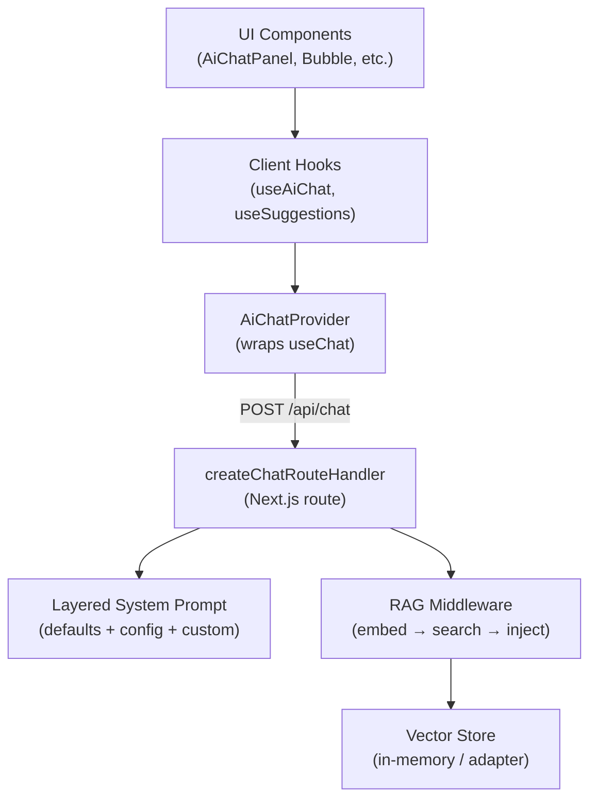
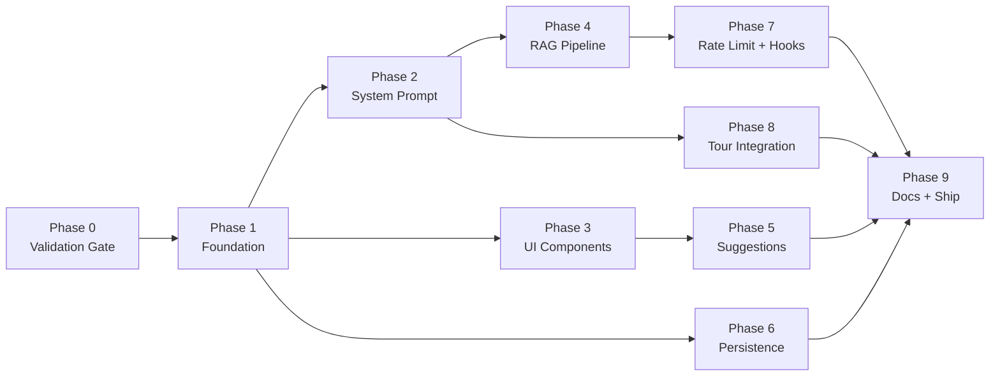

# @tour-kit/ai — Implementation Plan

**Project:** Drop-in RAG Q&A chat widget for React apps, part of the tour-kit ecosystem
**Owner:** Domi
**Start Date:** Week of March 24, 2026
**Target Completion:** 6 weeks (May 2, 2026)
**Total Estimated Effort:** 78–105h

---

## Project Vision

`@tour-kit/ai` is a headless-friendly, shadcn-style AI chat widget that answers product questions grounded in user-provided documentation. It ships three tiers of context strategy (CAG → RAG in-memory → RAG external) so teams of any size can add intelligent in-product help without building custom AI infrastructure. The guiding constraint is **simplicity**: the 80% case (CAG with < 50K tokens) should require zero infrastructure beyond an LLM API key.

---

## System Architecture



---

## Project Structure

```
packages/ai/
├── src/
│   ├── types/
│   │   ├── config.ts
│   │   ├── document.ts
│   │   ├── adapter.ts
│   │   ├── events.ts
│   │   └── index.ts
│   ├── context/
│   │   ├── ai-chat-context.ts
│   │   └── ai-chat-provider.tsx
│   ├── hooks/
│   │   ├── use-ai-chat.ts
│   │   ├── use-tour-assistant.ts
│   │   ├── use-suggestions.ts
│   │   └── use-persistence.ts
│   ├── components/
│   │   ├── ai-chat-panel.tsx
│   │   ├── ai-chat-bubble.tsx
│   │   ├── ai-chat-message.tsx
│   │   ├── ai-chat-input.tsx
│   │   ├── ai-chat-suggestions.tsx
│   │   ├── headless/
│   │   │   ├── headless-chat-panel.tsx
│   │   │   ├── headless-chat-message.tsx
│   │   │   ├── headless-chat-input.tsx
│   │   │   ├── headless-chat-suggestions.tsx
│   │   │   └── index.ts
│   │   └── ui/
│   │       ├── chat-panel.variants.ts
│   │       ├── chat-message.variants.ts
│   │       └── ...
│   ├── core/
│   │   ├── markdown-renderer.tsx
│   │   ├── suggestion-engine.ts
│   │   ├── rate-limiter.ts
│   │   └── analytics-bridge.ts
│   ├── server/
│   │   ├── route-handler.ts
│   │   ├── rag-middleware.ts
│   │   ├── system-prompt.ts
│   │   ├── retriever.ts
│   │   ├── vector-store.ts
│   │   ├── embedding.ts
│   │   ├── rate-limiter.ts
│   │   └── index.ts
│   ├── lib/
│   │   ├── unified-slot.tsx
│   │   ├── ui-library-context.tsx
│   │   └── utils.ts
│   ├── styles/
│   │   ├── variables.css
│   │   └── components.css
│   └── index.ts
├── package.json
├── tsconfig.json
├── tsup.config.ts
├── CLAUDE.md
├── CHANGELOG.md
└── README.md
```

---

## Phase Breakdown

### Phase 0: Validation Gate (Days 1–2)

**Goal:** Confirm AI SDK 6.x streaming, middleware composition, and in-memory vector search work as expected in the tour-kit monorepo build system.

| # | Task | Hours | Output |
|---|------|-------|--------|
| 0.1 | Scaffold `packages/ai/` with tsup config (3 entry points), tsconfig, package.json | 1–2h | Working build producing ESM + CJS |
| 0.2 | Spike: `streamText` + `toUIMessageStreamResponse` in a test route handler | 1–2h | Token-by-token streaming confirmed in Next.js example app |
| 0.3 | Spike: `wrapLanguageModel` + `LanguageModelV3Middleware` with `transformParams` | 1–2h | Middleware injects context into prompt |
| 0.4 | Spike: `embed` + `cosineSimilarity` in-memory with 50 test documents | 1h | Cosine similarity search returns relevant results |
| 0.5 | Go/no-go decision documented | 0.5h | `plan/phase-0-status.json` |

**Exit Criteria:**
- [ ] `pnpm --filter @tour-kit/ai build` produces 3 entry points (index, server, headless) with no errors
- [ ] Streaming response renders token-by-token in browser
- [ ] Middleware successfully injects retrieved context into LLM prompt
- [ ] In-memory vector search returns top-3 relevant docs from 50-doc corpus
- [ ] Decision: proceed / adjust / abort

**Deliverables:** `packages/ai/`, spike scripts, `plan/phase-0-status.json`

---

### Phase 1: Foundation — Types + Provider + Route Handler with CAG (Days 3–6)

**Goal:** Basic chat working end-to-end with context-stuffing strategy. User provides documents, they go in the system prompt, LLM streams a response.

| # | Task | Hours | Dependencies | Output |
|---|------|-------|-------------|--------|
| 1.1 | Define all TypeScript types (`config.ts`, `document.ts`, `adapter.ts`, `events.ts`) | 2–3h | — | Type files with full interfaces |
| 1.2 | Implement `AiChatProvider` wrapping `useChat` from `@ai-sdk/react` | 2–3h | 1.1 | Provider managing chat lifecycle |
| 1.3 | Implement `useAiChat` hook (thin wrapper exposing chat state + actions) | 2–3h | 1.2 | Working hook with `sendMessage`, `stop`, `reload` |
| 1.4 | Implement `createChatRouteHandler()` with CAG (context-stuffing) strategy | 3–4h | 1.1 | Route handler factory, documents in system prompt |
| 1.5 | Integration test: provider → route handler → streaming response | 2h | 1.3, 1.4 | E2E chat flow verified |
| 1.6 | Unit tests for types and provider | 1–2h | 1.1–1.3 | > 80% coverage on Phase 1 code |

**Exit Criteria:**
- [ ] `useAiChat().sendMessage({ text: "hello" })` → streamed response visible in console
- [ ] `createChatRouteHandler({ context: { strategy: 'context-stuffing', documents } })` returns POST handler
- [ ] `status` transitions: `ready` → `submitted` → `streaming` → `ready`
- [ ] All unit tests pass, coverage > 80% for Phase 1 files

**Deliverables:** `types/`, `context/`, `hooks/use-ai-chat.ts`, `server/route-handler.ts`, tests

---

### Phase 2: System Prompt + Instructions Config (Days 7–8)

**Goal:** Layered system prompt with library defaults (grounding, refusal, citation, safety) + structured config + custom instructions.

| # | Task | Hours | Dependencies | Output |
|---|------|-------|-------------|--------|
| 2.1 | Implement `createSystemPrompt()` with 3-layer assembly | 2–3h | Phase 1 | Prompt builder with defaults + config + custom |
| 2.2 | Wire system prompt into `createChatRouteHandler` | 1h | 2.1 | `instructions` config applies to route handler |
| 2.3 | Add configurable error messages + `AiChatStrings` support | 1–2h | Phase 1 | All UI strings overridable |
| 2.4 | Unit tests for prompt builder (tone variations, boundaries, override mode) | 1–2h | 2.1 | Tests confirm all layer combinations |

**Exit Criteria:**
- [ ] `createSystemPrompt({ productName: 'Acme', tone: 'friendly' })` produces prompt containing "Acme" with friendly tone markers
- [ ] `override: true` skips Layer 1 defaults entirely
- [ ] `boundaries: ['Only answer about X']` appears in generated prompt
- [ ] Tests cover all 3 layers independently and combined

**Deliverables:** `server/system-prompt.ts`, updated `route-handler.ts`, tests

---

### Phase 3: UI Components + Markdown Renderer (Days 9–14)

**Goal:** shadcn-style chat components (styled + headless) with built-in markdown renderer. WCAG 2.1 AA compliant.

| # | Task | Hours | Dependencies | Output |
|---|------|-------|-------------|--------|
| 3.1 | Built-in markdown renderer (~2-3KB): bold, italic, code, lists, links, headings | 3–4h | — | `core/markdown-renderer.tsx` |
| 3.2 | `AiChatMessage` component with markdown rendering, rating callback | 2–3h | 3.1 | Message component with `onRate` |
| 3.3 | `AiChatInput` with send button, disabled state, Enter to send | 2h | Phase 1 | Input component |
| 3.4 | `AiChatPanel` (slideout/popover/inline modes, responsive) | 3–4h | 3.2, 3.3 | Panel with 3 display modes |
| 3.5 | `AiChatBubble` trigger button with unread count, pulse animation | 1–2h | Phase 1 | Bubble trigger |
| 3.6 | `AiChatSuggestions` chip component | 1h | — | Suggestion chips |
| 3.7 | Headless variants (render-prop versions of all components) | 2–3h | 3.2–3.6 | `components/headless/` |
| 3.8 | CVA variant definitions + CSS custom properties | 2h | 3.2–3.6 | `components/ui/`, `styles/` |
| 3.9 | Accessibility: ARIA live region, focus management, keyboard nav, axe-core tests | 2–3h | 3.2–3.6 | WCAG 2.1 AA compliance |
| 3.10 | UnifiedSlot + UI library context (copy from existing packages) | 1h | — | `lib/unified-slot.tsx`, `lib/ui-library-context.tsx` |

**Exit Criteria:**
- [ ] All 5 components render with default styles and accept `className` override
- [ ] Headless variants expose all state via render props
- [ ] Markdown renderer handles: bold, italic, inline code, fenced code blocks, links, lists, headings
- [ ] Markdown renderer gzipped size < 3KB
- [ ] `AiChatPanel` is functional at 320px viewport width
- [ ] axe-core reports 0 violations on chat panel with messages
- [ ] Escape closes panel, Enter sends message, new messages announced to screen readers

**Deliverables:** `components/`, `core/markdown-renderer.tsx`, `styles/`, `lib/`, tests

---

### Phase 4: RAG Pipeline (Days 15–19)

**Goal:** Full retrieval pipeline: chunking, embedding, in-memory vector store, cosine similarity search, RAG middleware, optional rerank.

| # | Task | Hours | Dependencies | Output |
|---|------|-------|-------------|--------|
| 4.1 | `createInMemoryVectorStore()` implementing `VectorStoreAdapter` | 2–3h | Phase 1 types | In-memory vector store |
| 4.2 | `createAiSdkEmbedding()` wrapping AI SDK `embed`/`embedMany` | 1–2h | Phase 1 types | Embedding adapter |
| 4.3 | `createRetriever()` — chunk documents, embed, index, search | 3–4h | 4.1, 4.2 | Retriever with chunking + search |
| 4.4 | `createRAGMiddleware()` — `LanguageModelV3Middleware` with `transformParams` | 2–3h | 4.3 | RAG middleware injecting context |
| 4.5 | Wire RAG strategy into `createChatRouteHandler` | 1–2h | 4.4 | `context: { strategy: 'rag' }` works |
| 4.6 | Integration test: RAG pipeline end-to-end with mock model | 2h | 4.5 | Verified retrieval + response |
| 4.7 | Unit tests: chunking, vector store, retriever, middleware | 2–3h | 4.1–4.4 | > 80% coverage |

**Exit Criteria:**
- [ ] `createRetriever({ documents, embedding }).search("query", 5)` returns ranked results
- [ ] In-memory vector store handles 500 documents with search < 200ms
- [ ] RAG middleware injects retrieved context into LLM prompt via `transformParams`
- [ ] `rerank` option re-orders results when provided
- [ ] All unit tests pass, coverage > 80% for Phase 4 files

**Deliverables:** `server/vector-store.ts`, `server/embedding.ts`, `server/retriever.ts`, `server/rag-middleware.ts`, tests

---

### Phase 5: Suggestions (Days 20–21)

**Goal:** Static suggestions from config + dynamic AI-generated suggestions after each response.

| # | Task | Hours | Dependencies | Output |
|---|------|-------|-------------|--------|
| 5.1 | `useSuggestions` hook (static + dynamic, with cache TTL) | 2–3h | Phase 1, Phase 3 | Suggestions hook |
| 5.2 | Suggestion engine — LLM call to generate follow-up suggestions | 2–3h | Phase 2 | `core/suggestion-engine.ts` |
| 5.3 | Wire suggestions into `AiChatSuggestions` component | 1h | 5.1, Phase 3 | Suggestions render and dispatch messages |
| 5.4 | Unit tests for suggestions hook and engine | 1–2h | 5.1, 5.2 | Tests with mock LLM responses |

**Exit Criteria:**
- [ ] `useSuggestions().suggestions` returns static suggestions immediately
- [ ] After AI response, dynamic suggestions are generated and cached for `cacheTtl` ms
- [ ] `useSuggestions().select("suggestion")` sends the suggestion as a chat message
- [ ] `useSuggestions().refresh()` regenerates dynamic suggestions

**Deliverables:** `hooks/use-suggestions.ts`, `core/suggestion-engine.ts`, tests

---

### Phase 6: Persistence (Days 22–23)

**Goal:** Chat history survives page reload via localStorage or custom server adapter.

| # | Task | Hours | Dependencies | Output |
|---|------|-------|-------------|--------|
| 6.1 | `usePersistence` hook — localStorage adapter | 2h | Phase 1 | Persistence hook |
| 6.2 | `PersistenceAdapter` interface + wiring into `AiChatProvider` | 1–2h | 6.1 | Server-side adapter support |
| 6.3 | Auto-save on message change, auto-load on mount | 1h | 6.1, 6.2 | Transparent persistence |
| 6.4 | Unit tests: save, load, clear, adapter fallback | 1–2h | 6.1–6.3 | Tests with mock storage |

**Exit Criteria:**
- [ ] `persistence: 'local'` saves messages to localStorage on every change
- [ ] Page reload restores previous chat messages
- [ ] `persistence: { adapter }` calls adapter's `save`/`load`/`clear` methods
- [ ] Clearing chat calls `adapter.clear()` and removes stored messages

**Deliverables:** `hooks/use-persistence.ts`, updated `ai-chat-provider.tsx`, tests

---

### Phase 7: Rate Limiting + Hooks + Events (Days 24–27)

**Goal:** Client-side and server-side rate limiting, guardrail hooks, event tracking, optional analytics bridge.

| # | Task | Hours | Dependencies | Output |
|---|------|-------|-------------|--------|
| 7.1 | Client-side rate limiter (sliding window, configurable) | 2h | Phase 1 | `core/rate-limiter.ts` |
| 7.2 | Server-side rate limiter with `RateLimitStore` adapter | 2–3h | Phase 1 | `server/rate-limiter.ts` |
| 7.3 | `beforeSend` hook — filter/transform user messages before processing | 1–2h | Phase 1 | Hook in route handler |
| 7.4 | `beforeResponse` hook — filter/transform AI response before streaming | 1–2h | Phase 1 | Hook in route handler |
| 7.5 | `onEvent` callback — emit all 7 event types on client and server | 2h | Phase 1 | Event emission |
| 7.6 | Optional `createAnalyticsBridge()` for `@tour-kit/analytics` | 1h | 7.5 | `core/analytics-bridge.ts` |
| 7.7 | Unit tests for rate limiter, hooks, events | 2–3h | 7.1–7.6 | > 80% coverage |

**Exit Criteria:**
- [ ] Client rate limiter blocks messages after `maxMessages` in `windowMs`, resets after window expires
- [ ] Server rate limiter returns 429 with `Retry-After` header when limit exceeded
- [ ] `beforeSend` returning `null` blocks the message
- [ ] `beforeResponse` can modify the response string
- [ ] All 7 event types fire at correct moments (verified by test spy)
- [ ] `createAnalyticsBridge()` forwards events to `useAnalyticsOptional()`

**Deliverables:** `core/rate-limiter.ts`, `server/rate-limiter.ts`, hooks in route handler, `core/analytics-bridge.ts`, tests

---

### Phase 8: Tour-Kit Integration (Days 28–29)

**Goal:** Optional `useTourAssistant` hook that enriches chat with tour context when `@tour-kit/core` is present.

| # | Task | Hours | Dependencies | Output |
|---|------|-------|-------------|--------|
| 8.1 | `useTourAssistant` hook — extends `useAiChat` with tour context | 2–3h | Phase 1, Phase 2 | Tour-aware chat hook |
| 8.2 | `TourAssistantContext` assembly — read active tour, step, completed tours, checklist | 1–2h | 8.1 | Context object from tour-kit state |
| 8.3 | Tour context injection into system prompt when `tourContext: true` | 1–2h | 8.2 | LLM receives current tour/step context |
| 8.4 | `askAboutStep()` and `askForHelp()` convenience methods | 1h | 8.1 | Pre-built tour-aware prompts |
| 8.5 | Tests with mock `@tour-kit/core` provider | 1–2h | 8.1–8.4 | Tour integration verified |

**Exit Criteria:**
- [ ] `useTourAssistant().tourContext.activeTour` reflects current tour state
- [ ] `askAboutStep()` sends a message asking about the current step
- [ ] Tour context appears in system prompt sent to LLM
- [ ] Package works normally when `@tour-kit/core` is not installed (graceful fallback)
- [ ] Tests pass with mocked tour provider

**Deliverables:** `hooks/use-tour-assistant.ts`, tests

---

### Phase 9: Documentation + Examples + Final Quality (Days 30–33)

**Goal:** Ship-ready: docs, example apps, test coverage > 80%, bundle size budgets met.

| # | Task | Hours | Dependencies | Output |
|---|------|-------|-------------|--------|
| 9.1 | CLAUDE.md for `packages/ai/` | 1h | All | Package-specific dev guidance |
| 9.2 | Documentation pages (Fumadocs MDX) — API reference, guides, examples | 4–5h | All | `apps/docs/content/docs/ai/` |
| 9.3 | Example: standalone CAG chat in Vite example app | 2h | Phase 1, 3 | Working example |
| 9.4 | Example: RAG chat with tour-kit integration in Next.js example app | 2–3h | Phase 4, 8 | Working example |
| 9.5 | Fill test coverage gaps to > 80% across all files | 3–4h | All | Coverage report |
| 9.6 | Bundle size verification: client < 15KB, server < 8KB, markdown < 3KB | 1h | All | `size-limit` config |
| 9.7 | SSR safety check — no `window`/`document` in server path | 1h | All | Next.js build with zero hydration errors |
| 9.8 | Changeset + README | 1h | All | Release-ready |

**Exit Criteria:**
- [ ] `apps/docs/` has AI package docs with at least: overview, quick start, CAG guide, RAG guide, API reference
- [ ] Both example apps build and run with working chat
- [ ] `vitest --coverage` reports > 80% line coverage for `packages/ai/`
- [ ] `size-limit` passes: client < 15KB, server < 8KB, markdown renderer < 3KB (gzipped)
- [ ] `pnpm build` succeeds with zero TypeScript errors
- [ ] No hydration errors in Next.js example app

**Deliverables:** Docs, examples, coverage report, size-limit config, changeset

---

## Hour Estimates Summary

| Phase | Description | Min Hours | Max Hours |
|-------|-------------|-----------|-----------|
| Phase 0 | Validation Gate | 4h | 7h |
| Phase 1 | Foundation (Types + Provider + CAG) | 12h | 15h |
| Phase 2 | System Prompt + Instructions | 5h | 8h |
| Phase 3 | UI Components + Markdown | 18h | 24h |
| Phase 4 | RAG Pipeline | 13h | 17h |
| Phase 5 | Suggestions | 6h | 9h |
| Phase 6 | Persistence | 5h | 7h |
| Phase 7 | Rate Limiting + Hooks + Events | 10h | 13h |
| Phase 8 | Tour-Kit Integration | 6h | 10h |
| Phase 9 | Docs + Examples + Quality | 14h | 17h |
| **Total** | | **93h** | **127h** |

---

## Week-by-Week Timeline

| Week | Dates | Phase | Focus |
|------|-------|-------|-------|
| Week 1 | Mar 24–28 | Phase 0 + Phase 1 | Validation + foundation (types, provider, CAG route handler) |
| Week 2 | Mar 31–Apr 4 | Phase 2 + Phase 3 (start) | System prompt + begin UI components |
| Week 3 | Apr 7–11 | Phase 3 (finish) + Phase 4 (start) | Finish components + begin RAG pipeline |
| Week 4 | Apr 14–18 | Phase 4 (finish) + Phase 5 + Phase 6 | RAG pipeline + suggestions + persistence |
| Week 5 | Apr 21–25 | Phase 7 + Phase 8 | Rate limiting + hooks + tour integration |
| Week 6 | Apr 28–May 2 | Phase 9 | Docs, examples, coverage, bundle check, release prep |

---

## Milestone Gates

| Gate | Condition | Exit Criteria |
|------|-----------|---------------|
| M0 | End of Phase 0 | `streamText` streams token-by-token, middleware injects context, in-memory vector search returns top-3 from 50 docs — all within tour-kit monorepo build |
| M1 | End of Phase 1 | `useAiChat().sendMessage()` → streamed response via `createChatRouteHandler` with CAG strategy. Status transitions verified. Unit tests > 80%. |
| M2 | End of Phase 2 | `createSystemPrompt()` produces correct 3-layer prompt. `override: true` skips defaults. |
| M3 | End of Phase 3 | All 5 styled + 4 headless components render. Markdown renderer < 3KB gzipped. axe-core 0 violations. Responsive at 320px. |
| M4 | End of Phase 4 | `createRetriever().search()` returns ranked results. In-memory store handles 500 docs with search < 200ms. RAG middleware injects context. |
| M5 | End of Phase 5+6 | Suggestions (static + dynamic) work. Chat persists across page reload. |
| M6 | End of Phase 7+8 | Rate limiting blocks at threshold. Hooks modify messages. All events fire. Tour context injected when `@tour-kit/core` present. |
| M7 | End of Phase 9 | Docs published. Examples build. Coverage > 80%. Bundle sizes within budget. Zero hydration errors. |

---

## Risk Register

| Risk | Likelihood | Impact | Mitigation |
|------|-----------|--------|------------|
| AI SDK 6.x breaking changes or v7 release | Low | Medium | Pin `ai@^6.0.0` as peer dep. Use only stable APIs confirmed via Context7. Abstract AI SDK calls behind internal wrappers (`createAiSdkEmbedding`, `createRAGMiddleware`). Phase 0 validates all API surfaces. |
| LLM hallucinating incorrect information | Medium | High | Layer 1 system prompt always includes grounding/refusal instructions. RAG `minScore` filters low-relevance results. `beforeResponse` hook enables user-defined validation. Documented as a known limitation. |
| Bundle size exceeds budget (client < 15KB) | Medium | Medium | Client entry imports only `@ai-sdk/react` hooks. Built-in markdown renderer replaces `react-markdown` (~30KB saving). Server code in separate entry point — tree-shaken. Measured with `size-limit` in CI at Phase 3 and Phase 9. |
| In-memory vector store insufficient for large datasets | Medium | Low | Explicitly scoped to < 500 docs. `VectorStoreAdapter` interface for Pinecone/pgvector. CAG as zero-infrastructure alternative. Phase 0 validates performance. |
| Rate limiting / cost runaway from AI API calls | Medium | Medium | Client-side sliding window (default 10/min). Server-side rate limiter with pluggable `RateLimitStore`. `maxDuration: 30` prevents hung connections. Both layers tested in Phase 7. |
| Content too small for RAG, too large for context window | Low | Low | Three-tier strategy: CAG < 50K tokens, RAG in-memory < 500 docs, RAG external 500+. `createChatRouteHandler` validates content size vs strategy. |
| Markdown renderer edge cases cause XSS or broken rendering | Medium | High | No `dangerouslySetInnerHTML` — renderer produces React elements directly. Fuzz test with adversarial markdown. Links force `rel="noopener noreferrer"`. |
| useChat API differences between AI SDK 6.x subversions | Low | Medium | Phase 0 spike confirms exact `useChat` contract. Wrapper hook (`useAiChat`) insulates consumers from `useChat` changes. |

---

## ROI / Value Analysis

### Investment to Build

| Item | Cost | Notes |
|------|------|-------|
| Engineering time | ~93–127h | Solo developer over 6 weeks |
| AI API costs (development/testing) | ~$20–40 | Embedding + LLM calls during development |
| Infrastructure | $0/mo | No infrastructure — runs on user's existing Next.js app |
| **Total setup** | **~$30 + your time** | |

### Returns (DX Improvement — Library Package)

| Metric | Before (custom build) | After (@tour-kit/ai) |
|--------|----------------------|---------------------|
| Time to add AI chat to a product | 2–4 weeks | 1–2 hours (CAG), 1 day (RAG) |
| Lines of code for basic setup | 500–1000+ | 15–30 (config + route handler) |
| Docs utilization rate | Low (users don't search) | High (AI surfaces relevant docs) |
| Support ticket volume | ~15% of users need help | ~5% (AI resolves in-context) |

**Break-even in developer-hours:** When 2 teams adopt `@tour-kit/ai` instead of building custom AI chat (saving ~60h each), the 93–127h investment is recovered. For the tour-kit ecosystem, it adds a high-value package that differentiates the library.

---

## Dependency Graph



**Parallelizable pairs (if team):**
- Phase 5 + Phase 6 (independent after Phase 3 / Phase 1)
- Phase 7 + Phase 8 (independent after Phase 4 / Phase 2)
