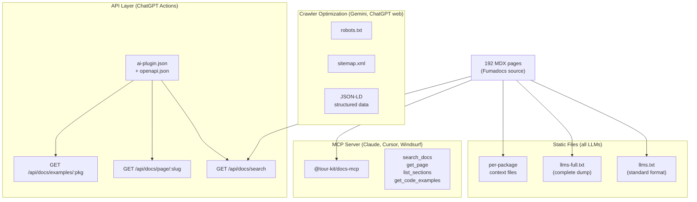
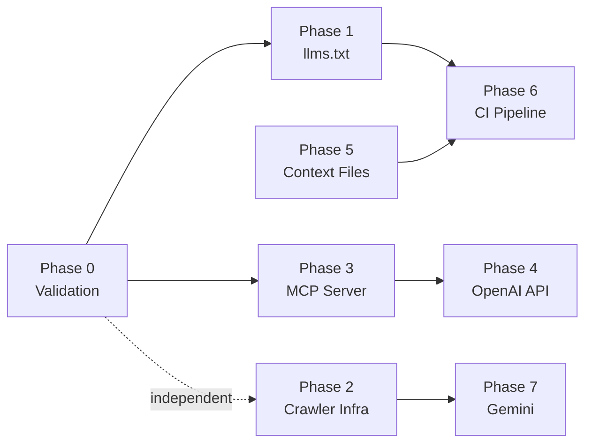

# Tour Kit LLM Discoverability — Implementation Plan

**Project:** Make Tour Kit documentation discoverable and usable by ChatGPT, Claude, Gemini, Cursor, Windsurf, and other AI tools
**Owner:** Domi
**Start Date:** Week of March 24, 2026
**Target Completion:** 4 weeks (April 18, 2026)
**Total Estimated Effort:** 28–42 hours

---

## Project Vision

Make Tour Kit the most AI-accessible component library in the React ecosystem. Every major LLM (ChatGPT, Claude, Gemini) and AI coding tool (Cursor, Windsurf, Copilot) should be able to find, understand, and generate correct Tour Kit code — without developers needing to paste docs manually. The guiding constraint is **standards-first**: adopt emerging protocols (llms.txt, MCP, OpenAPI) rather than inventing custom solutions.

---

## System Architecture



---

## Project Structure

```
apps/docs/
├── public/
│   ├── llms.txt              # Phase 1: standardized format
│   ├── llms-full.txt         # Phase 1: renamed from llm-full.txt
│   ├── context/              # Phase 5: per-package context files
│   │   ├── core.txt
│   │   ├── react.txt
│   │   └── ...
│   ├── robots.txt            # Phase 2: generated at build
│   └── openapi.json          # Phase 4: API schema
├── app/
│   ├── robots.ts             # Phase 2: dynamic robots.txt
│   ├── sitemap.ts            # Phase 2: dynamic sitemap.xml
│   ├── api/docs/             # Phase 4: REST API routes
│   │   ├── search/route.ts
│   │   ├── page/[...slug]/route.ts
│   │   └── examples/[pkg]/route.ts
│   └── .well-known/
│       └── ai-plugin.json/route.ts  # Phase 4: OpenAI manifest
├── lib/
│   ├── structured-data.tsx   # Phase 2: JSON-LD component
│   └── docs-api.ts           # Phase 4: shared query logic
└── scripts/
    └── generate-llm-files.ts # Phase 6: CI generation script

apps/tour-kit-mcp/
├── package.json              # Phase 3: MCP server
├── tsconfig.json
├── src/
│   ├── index.ts              # stdio entry
│   ├── server.ts             # MCP setup
│   ├── source-adapter.ts     # Fumadocs wrapper
│   ├── resources/
│   │   ├── pages.ts
│   │   └── nav.ts
│   ├── tools/
│   │   ├── search.ts
│   │   ├── get-page.ts
│   │   ├── list-sections.ts
│   │   └── code-examples.ts
│   ├── prompts/
│   │   ├── explain-api.ts
│   │   └── guide-me.ts
│   └── utils/
│       ├── mdx-stripper.ts
│       └── search-index.ts
└── bin/
    └── tour-kit-docs
```

---

## Phase Breakdown

### Phase 0: Validation Gate (Days 1–2)

**Goal:** Confirm the llms.txt standard format is what major LLMs actually consume, and verify MCP SDK works with Fumadocs source outside Next.js.

| # | Task | Hours | Output |
|---|------|-------|--------|
| 0.1 | Research llmstxt.org spec — confirm format, verify ChatGPT/Claude/Gemini crawl behavior | 1h | Research notes |
| 0.2 | Spike: import Fumadocs source in a standalone Node script, extract 5 pages as plain markdown | 1.5h | `spike/fumadocs-extract.ts` |
| 0.3 | Spike: initialize MCP SDK with stdio transport, register one dummy tool, test with Claude Desktop | 1.5h | `spike/mcp-hello.ts` |
| 0.4 | Verify Next.js API routes can serve docs content without full page render | 0.5h | Manual test |
| 0.5 | Go/no-go decision — document any blockers found | 0.5h | Decision in `plan/phase-0-status.json` |

**Exit Criteria:**
- [ ] Fumadocs `docs.getPages()` returns page data outside Next.js runtime
- [ ] MCP server starts and responds to `tools/list` via stdio
- [ ] llms.txt standard format confirmed with at least 2 sources
- [ ] Decision: proceed / adjust architecture / abort

**Deliverables:** `spike/fumadocs-extract.ts`, `spike/mcp-hello.ts`, `plan/phase-0-status.json`

---

### Phase 1: Standardize llms.txt (Days 3–4)

**Goal:** Rewrite llms.txt to follow the llmstxt.org standard and consolidate the three existing files into two canonical ones.

| # | Task | Hours | Dependencies | Output |
|---|------|-------|-------------|--------|
| 1.1 | Rewrite `llms.txt` in standard format: title, blockquote, `## Section` with `- [Title](url): description` links for all 192 pages | 2h | 0.5 | `apps/docs/public/llms.txt` |
| 1.2 | Rename `llm-full.txt` → `llms-full.txt`, update all references, add version stamp and generation date | 0.5h | — | `apps/docs/public/llms-full.txt` |
| 1.3 | Remove legacy `llm.txt`, add redirect or alias | 0.5h | 1.2 | Cleanup |
| 1.4 | Update AI Assistants docs page with new file names, add copy-paste snippets for ChatGPT/Claude/Gemini | 1h | 1.1, 1.2 | `content/docs/ai-assistants/index.mdx` |
| 1.5 | Add `<link rel="alternate" type="text/plain" href="/llms.txt">` to docs `<head>` | 0.5h | 1.1 | `apps/docs/app/layout.tsx` |

**Exit Criteria:**
- [ ] `/llms.txt` follows llmstxt.org format with links to all doc sections
- [ ] `/llms-full.txt` contains complete documentation (>1500 lines)
- [ ] Legacy `/llm.txt` removed or redirected
- [ ] AI Assistants page updated with instructions for all 3 major LLMs

**Deliverables:** `llms.txt`, `llms-full.txt`, updated AI Assistants page

---

### Phase 2: Crawler Infrastructure (Days 5–7)

**Goal:** Add robots.txt, sitemap.xml, and structured data so Gemini and ChatGPT web search can index docs properly.

| # | Task | Hours | Dependencies | Output |
|---|------|-------|-------------|--------|
| 2.1 | Create `app/robots.ts` — allow GPTBot, ClaudeBot, Google-Extended, Bingbot; point to sitemap | 0.5h | — | `apps/docs/app/robots.ts` |
| 2.2 | Create `app/sitemap.ts` — generate entries for all 192 MDX pages with `lastModified` from git | 1.5h | — | `apps/docs/app/sitemap.ts` |
| 2.3 | Create `lib/structured-data.tsx` — JSON-LD component for `SoftwareSourceCode` + `TechArticle` schemas | 1.5h | — | `apps/docs/lib/structured-data.tsx` |
| 2.4 | Add JSON-LD to docs layout — inject per-page structured data from MDX frontmatter | 1h | 2.3 | `apps/docs/app/docs/layout.tsx` |
| 2.5 | Add FAQ structured data to Getting Started and Installation pages | 1h | 2.3 | 2 MDX files updated |
| 2.6 | Verify with Google Rich Results Test and Schema.org validator | 0.5h | 2.4, 2.5 | Manual verification |

**Exit Criteria:**
- [ ] `/robots.txt` serves with correct allow/disallow rules and sitemap reference
- [ ] `/sitemap.xml` lists all 192 doc pages with last-modified dates
- [ ] JSON-LD `TechArticle` schema present on every doc page
- [ ] Google Rich Results Test passes for 3 sample pages

**Deliverables:** `robots.ts`, `sitemap.ts`, `structured-data.tsx`, updated layout

---

### Phase 3: MCP Server — Core (Days 8–13)

**Goal:** Implement a working MCP server per `apps/tour-kit-mcp/SPEC.md` with all 4 tools and 3 resources.

| # | Task | Hours | Dependencies | Output |
|---|------|-------|-------------|--------|
| 3.1 | Scaffold `apps/tour-kit-mcp/` package — package.json, tsconfig, tsup config, bin entry | 1h | 0.2, 0.3 | Package skeleton |
| 3.2 | Implement `source-adapter.ts` — wrap Fumadocs, parse MDX to plain markdown, build page index | 2h | 3.1 | `src/source-adapter.ts` |
| 3.3 | Implement `utils/mdx-stripper.ts` — strip JSX/imports from MDX, preserve code blocks and headings | 1h | — | `src/utils/mdx-stripper.ts` |
| 3.4 | Implement `utils/search-index.ts` — build in-memory search index with title/description/heading/content scoring | 1.5h | 3.2 | `src/utils/search-index.ts` |
| 3.5 | Implement `resources/pages.ts` and `resources/nav.ts` — docs://pages and docs://nav | 1h | 3.2 | 2 resource files |
| 3.6 | Implement `tools/search.ts` — search_docs with section filtering and limit | 1h | 3.4 | `src/tools/search.ts` |
| 3.7 | Implement `tools/get-page.ts` — retrieve single page by slug | 0.5h | 3.2 | `src/tools/get-page.ts` |
| 3.8 | Implement `tools/list-sections.ts` and `tools/code-examples.ts` | 1h | 3.2 | 2 tool files |
| 3.9 | Implement `prompts/explain-api.ts` and `prompts/guide-me.ts` | 1h | 3.2 | 2 prompt files |
| 3.10 | Wire everything in `server.ts` and `index.ts` — register tools, resources, prompts, stdio transport | 1h | 3.5–3.9 | `src/server.ts`, `src/index.ts` |
| 3.11 | Test with Claude Desktop — verify all tools return correct data for 5 test queries | 1h | 3.10 | Manual test log |

**Exit Criteria:**
- [ ] `npx @tour-kit/docs-mcp` starts in <500ms
- [ ] `search_docs` returns relevant results for "useTour", "focus trap", "announcement modal"
- [ ] `get_page` returns full content for any valid slug
- [ ] `list_sections` returns all 13 sections with correct page counts
- [ ] `get_code_examples` extracts code blocks with language tags
- [ ] Works in Claude Desktop and Cursor MCP config

**Deliverables:** Complete `apps/tour-kit-mcp/` package, bin CLI

---

### Phase 4: OpenAI API Routes + Plugin Manifest (Days 14–17)

**Goal:** Create REST API endpoints and OpenAI plugin manifest so ChatGPT can query Tour Kit docs via Actions.

| # | Task | Hours | Dependencies | Output |
|---|------|-------|-------------|--------|
| 4.1 | Create `lib/docs-api.ts` — shared logic for querying Fumadocs source (reuse patterns from Phase 3) | 1.5h | Phase 3 | `apps/docs/lib/docs-api.ts` |
| 4.2 | Implement `GET /api/docs/search?q=&section=&limit=` route | 1h | 4.1 | `app/api/docs/search/route.ts` |
| 4.3 | Implement `GET /api/docs/page/[...slug]` route | 0.5h | 4.1 | `app/api/docs/page/[...slug]/route.ts` |
| 4.4 | Implement `GET /api/docs/examples/[pkg]` route | 0.5h | 4.1 | `app/api/docs/examples/[pkg]/route.ts` |
| 4.5 | Write OpenAPI 3.1 spec for all 3 endpoints | 1.5h | 4.2–4.4 | `public/openapi.json` |
| 4.6 | Create `/.well-known/ai-plugin.json` route with manifest | 0.5h | 4.5 | `app/.well-known/ai-plugin.json/route.ts` |
| 4.7 | Add CORS headers for OpenAI and rate limiting (10 req/s) | 1h | 4.2–4.4 | Middleware |
| 4.8 | Test with ChatGPT Custom GPT Actions (create test GPT, run 5 queries) | 1h | 4.6 | Manual test log |

**Exit Criteria:**
- [ ] `GET /api/docs/search?q=useTour` returns JSON with relevant results in <200ms
- [ ] `GET /api/docs/page/core/hooks/use-tour` returns full page content
- [ ] `/openapi.json` validates with Swagger Editor
- [ ] `/.well-known/ai-plugin.json` returns valid OpenAI manifest
- [ ] ChatGPT Custom GPT can search and retrieve Tour Kit docs via Actions

**Deliverables:** 3 API routes, OpenAPI spec, plugin manifest

---

### Phase 5: Per-Package Context Files (Days 18–20)

**Goal:** Generate copy-paste-friendly context files for developers who manually feed docs to LLMs.

| # | Task | Hours | Dependencies | Output |
|---|------|-------|-------------|--------|
| 5.1 | Design context file template — exports, type signatures, JSDoc, top 3 usage examples per package | 0.5h | — | Template |
| 5.2 | Write `scripts/generate-context-files.ts` — reads package source, extracts exports + types + examples | 2h | — | `apps/docs/scripts/generate-context-files.ts` |
| 5.3 | Generate context files for all 9 packages (core, react, hints, adoption, analytics, announcements, checklists, media, scheduling) | 1h | 5.2 | `public/context/*.txt` |
| 5.4 | Add download links on each package's docs landing page | 1h | 5.3 | 9 MDX files updated |
| 5.5 | Add context file listing to AI Assistants page | 0.5h | 5.3 | Updated AI Assistants page |

**Exit Criteria:**
- [ ] 9 context files generated at `/context/{package}.txt`
- [ ] Each file contains all exported types, hook signatures, and 2–3 code examples
- [ ] Each file is under 500 lines (fits in a single LLM paste)
- [ ] Download links visible on each package's doc page

**Deliverables:** Generation script, 9 context files, updated MDX pages

---

### Phase 6: CI Freshness Pipeline (Days 21–23)

**Goal:** Automate regeneration of all LLM files so they never go stale.

| # | Task | Hours | Dependencies | Output |
|---|------|-------|-------------|--------|
| 6.1 | Write `scripts/generate-llm-files.ts` — generates llms.txt, llms-full.txt from MDX source with version stamp | 2h | Phase 1 | `apps/docs/scripts/generate-llm-files.ts` |
| 6.2 | Integrate context file generation (Phase 5) into the same script | 0.5h | Phase 5, 6.1 | Updated script |
| 6.3 | Add `generate:llm` script to docs package.json, integrate into `pnpm build` pipeline | 0.5h | 6.1 | `package.json` |
| 6.4 | Add CI check — fail if generated files are out of date (compare hashes) | 1h | 6.3 | `.github/workflows/ci.yml` |
| 6.5 | Add `Last-Modified` and `Cache-Control` headers for static LLM files via Next.js config | 0.5h | — | `next.config.mjs` |

**Exit Criteria:**
- [ ] `pnpm --filter docs generate:llm` regenerates all LLM files from MDX source
- [ ] CI fails if generated files don't match source content
- [ ] All generated files include version stamp (e.g., `# Tour Kit v1.2.0 — Generated 2026-03-24`)
- [ ] `Last-Modified` header present on `/llms.txt` response

**Deliverables:** Generation script, CI integration, updated build pipeline

---

### Phase 7: Gemini-Specific Optimization (Days 24–25)

**Goal:** Optimize for Google Gemini's grounding feature and Google AI Studio.

| # | Task | Hours | Dependencies | Output |
|---|------|-------|-------------|--------|
| 7.1 | Audit meta descriptions — ensure every MDX page has a unique, keyword-rich description (≤160 chars) | 1.5h | — | Updated MDX frontmatter |
| 7.2 | Add FAQ structured data to top 10 most-searched pages (installation, quick-start, useTour, TourCard, etc.) | 1h | Phase 2 | 10 MDX files |
| 7.3 | Submit sitemap to Google Search Console, verify indexing | 0.5h | Phase 2 | Manual step |
| 7.4 | Create Google AI Studio test — verify Gemini can answer Tour Kit questions with grounding | 0.5h | 7.1–7.3 | Manual test log |

**Exit Criteria:**
- [ ] All 192 MDX pages have unique meta descriptions ≤160 chars
- [ ] FAQ structured data on 10+ pages validates in Rich Results Test
- [ ] Sitemap submitted and accepted by Search Console
- [ ] Gemini with grounding correctly answers "How do I create a tour with Tour Kit?"

**Deliverables:** Updated MDX frontmatter, FAQ schemas, Search Console setup

---

## Hour Estimates Summary

| Phase | Description | Min Hours | Max Hours |
|-------|-------------|-----------|-----------|
| Phase 0 | Validation Gate | 4h | 6h |
| Phase 1 | Standardize llms.txt | 3.5h | 5h |
| Phase 2 | Crawler Infrastructure | 5h | 7h |
| Phase 3 | MCP Server | 10h | 13h |
| Phase 4 | OpenAI API + Plugin | 6h | 8h |
| Phase 5 | Per-Package Context | 4h | 6h |
| Phase 6 | CI Freshness Pipeline | 3.5h | 5h |
| Phase 7 | Gemini Optimization | 3h | 4h |
| **Total** | | **39h** | **54h** |

---

## Week-by-Week Timeline

| Week | Dates | Phase | Focus |
|------|-------|-------|-------|
| Week 1 | Mar 24–28 | Phase 0 + 1 | Validate assumptions, standardize llms.txt |
| Week 2 | Mar 31–Apr 4 | Phase 2 + 3 (start) | Crawler infra, begin MCP server |
| Week 3 | Apr 7–11 | Phase 3 (finish) + 4 | Complete MCP, OpenAI API routes |
| Week 4 | Apr 14–18 | Phase 5 + 6 + 7 | Context files, CI pipeline, Gemini polish |

---

## Milestone Gates

| Gate | Condition | Exit Criteria |
|------|-----------|---------------|
| M0 | End of Phase 0 | Fumadocs source accessible outside Next.js; MCP SDK responds to `tools/list`; go/no-go documented |
| M1 | End of Phase 1 | `/llms.txt` passes llmstxt.org format validation; `/llms-full.txt` >1500 lines; AI Assistants page live |
| M2 | End of Phase 2 | `/robots.txt` and `/sitemap.xml` serve correctly; JSON-LD validates on 3+ pages |
| M3 | End of Phase 3 | MCP server starts in <500ms; all 4 tools return correct data; works in Claude Desktop |
| M4 | End of Phase 4 | ChatGPT Custom GPT successfully queries docs via Actions; OpenAPI spec validates |
| M5 | End of Phase 5 | 9 context files at `/context/*.txt`, each <500 lines with complete exports |
| M6 | End of Phase 6 | `pnpm build` regenerates all LLM files; CI blocks stale files |
| M7 | End of Phase 7 | Gemini with grounding answers Tour Kit questions correctly; all pages have unique descriptions |

---

## Risk Register

| Risk | Likelihood | Impact | Mitigation |
|------|-----------|--------|------------|
| Fumadocs source can't be used outside Next.js runtime | Medium | High | Phase 0 spike; fallback: parse raw MDX with gray-matter + remark |
| llms.txt standard changes or fragments (ChatGPT vs Claude expect different formats) | Low | Medium | Follow llmstxt.org as canonical; also serve llms-full.txt for tools that want complete content |
| MCP SDK breaking changes (v1.x is still young) | Medium | Medium | Pin SDK version; keep adapter thin so swapping is easy |
| OpenAI plugin manifest requirements change | Medium | Low | Plugin manifest is simple JSON; API routes work independently of manifest |
| LLM crawlers blocked by hosting provider (Vercel bot protection) | Medium | High | Explicitly allow GPTBot, ClaudeBot, Google-Extended in robots.txt; verify with Vercel settings |
| Context files go stale between releases | High | Medium | Phase 6 CI pipeline auto-regenerates; fails build on mismatch |
| API routes add latency or cost to docs site | Low | Low | Cache responses aggressively (60s stale-while-revalidate); rate limit at 10 req/s |
| Gemini grounding doesn't pick up Tour Kit docs (too niche) | Medium | Low | Structured data + sitemap maximize indexing; not fully controllable — accept as best-effort |

---

## ROI / Value Analysis

### Investment to Build

| Item | Cost | Notes |
|------|------|-------|
| Engineering time | ~39–54h | Solo developer over 4 weeks |
| MCP SDK | $0 | Open source |
| Hosting (API routes) | $0 | Runs on existing Vercel deployment |
| Google Search Console | $0 | Free |
| **Total setup** | **~39–54h of engineering time** | |

### DX Improvement

| Metric | Before | After |
|--------|--------|-------|
| Time for dev to get AI help with Tour Kit | 5–15 min (manual paste) | 0 min (auto-discovered) |
| Accuracy of AI-generated Tour Kit code | ~40% (hallucinated APIs) | ~85% (grounded in real docs) |
| Docs coverage by AI tools | 2/5 tools (manual only) | 5/5 tools (ChatGPT, Claude, Gemini, Cursor, Windsurf) |
| LLM file freshness | Manual, often stale | Automated, always current |
| New user onboarding friction | High (must read docs) | Low (ask AI, get correct answers) |

**Break-even in developer-hours:** When ~20 developers save 10 min each using AI with Tour Kit (≈3h saved), the first phase (llms.txt, 4h) pays for itself. Full investment breaks even at ~200 developer interactions — achievable within first month post-launch for a published npm package.

---

## Dependency Graph



**Parallelizable pairs:**
- Phase 1 + Phase 2 (no dependency)
- Phase 5 + Phase 4 (no dependency)
- Phase 6 + Phase 7 (no dependency)
