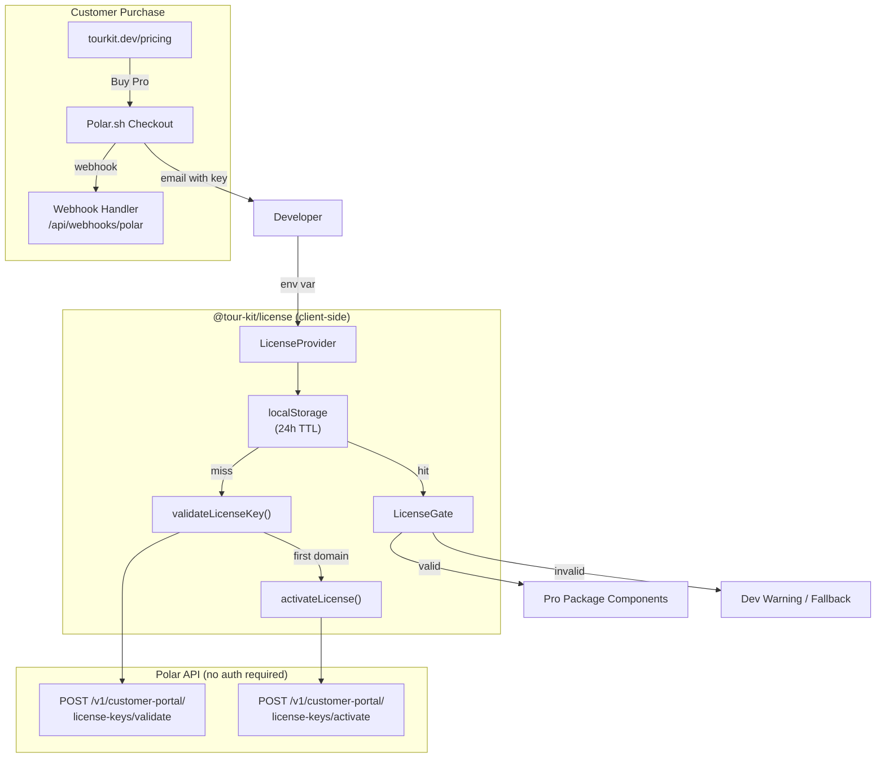
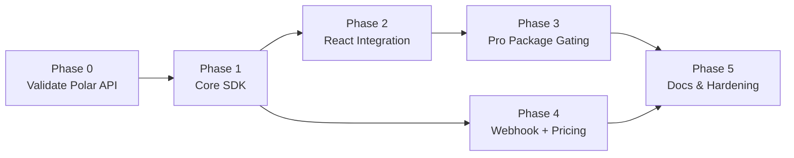

# Tour Kit Licensing System — Implementation Plan

**Project:** Replace JWT-based licensing with Polar.sh-backed license key validation, activation, and gating for Tour Kit Pro
**Owner:** DomiDex
**Start Date:** Week of March 31, 2026
**Target Completion:** 3 weeks (April 18, 2026)
**Total Estimated Effort:** 28–38 hours

---

## Project Vision

Build a zero-backend licensing system for Tour Kit Pro that validates license keys against Polar.sh's API, activates per-domain (up to 5 sites), caches results for 24h, and gates 7 extended packages behind a `<LicenseGate>` component. The guiding constraint is **zero bundle impact on free-tier users** — free packages (`core`, `react`, `hints`) must never import `@tour-kit/license`.

---

## System Architecture



---

## Project Structure

```
packages/license/
├── src/
│   ├── index.ts                    # Public API re-exports
│   ├── headless.ts                 # Headless exports (no React)
│   ├── types/
│   │   └── index.ts                # LicenseState, PolarResponse, LicenseCache, etc.
│   ├── lib/
│   │   ├── polar-client.ts         # Raw fetch wrappers: validate, activate, deactivate
│   │   ├── cache.ts                # localStorage read/write with TTL
│   │   ├── domain.ts               # Dev domain detection, getCurrentDomain()
│   │   └── schemas.ts              # Zod schemas for Polar API responses
│   ├── context/
│   │   └── license-context.ts      # LicenseContext + LicenseProvider
│   ├── components/
│   │   ├── license-gate.tsx         # <LicenseGate require="pro">
│   │   └── license-warning.tsx      # Dev-mode warning banner
│   ├── hooks/
│   │   ├── use-license.ts           # useLicense() — context consumer
│   │   └── use-is-pro.ts           # useIsPro() — boolean shortcut
│   └── __tests__/
│       ├── polar-client.test.ts     # API call tests (mocked fetch)
│       ├── cache.test.ts            # localStorage TTL tests
│       ├── domain.test.ts           # Dev detection tests
│       ├── license-provider.test.tsx # Provider integration tests
│       ├── license-gate.test.tsx     # Gate rendering tests
│       └── hooks.test.tsx           # Hook tests
├── package.json
├── tsconfig.json
├── tsup.config.ts
├── CLAUDE.md
└── README.md
```

**Webhook handler** (in docs site):
```
apps/docs/app/api/webhooks/polar/route.ts
```

---

## Phase Breakdown

### Phase 0: Polar API Validation Gate (Days 1–2)

**Goal:** Prove Polar's license key API works end-to-end before engineering the SDK.

| # | Task | Hours | Dependencies | Output |
|---|------|-------|-------------|--------|
| 0.1 | Create Polar sandbox account, create test product with license key benefit (prefix `TOURKIT`, 5 activations, perpetual) | 0.5h | — | Polar sandbox configured |
| 0.2 | Write a standalone script (`scripts/polar-validation-test.ts`) that validates a test key via `fetch()` against sandbox API | 1h | 0.1 | Working fetch → validate response |
| 0.3 | Test activation: activate for `test.example.com`, verify activation count increments, deactivate, verify count decrements | 1h | 0.2 | Confirmed activate/deactivate cycle |
| 0.4 | Measure validation latency (10 calls, record p50/p95) — must be < 500ms p95 | 0.5h | 0.2 | Latency report in script output |
| 0.5 | Go/no-go decision document | 0.5h | 0.3, 0.4 | `plan/phase-0-status.json` |

**Exit Criteria:**
- [ ] Polar sandbox validate endpoint returns correct `status: 'granted'` for valid key
- [ ] Activation consumes exactly 1 slot, deactivation frees it
- [ ] p95 validation latency < 500ms
- [ ] **Decision: proceed** (or abort if Polar API is unreliable/undocumented)

**Deliverables:** `scripts/polar-validation-test.ts`, `plan/phase-0-status.json`

---

### Phase 1: Core License SDK (Days 3–6)

**Goal:** Build the framework-agnostic license validation, activation, caching, and domain detection layer.

| # | Task | Hours | Dependencies | Output |
|---|------|-------|-------------|--------|
| 1.1 | Define TypeScript types: `LicenseState`, `LicenseCache`, `LicenseError`, `PolarValidateResponse`, `PolarActivateResponse` — remove old JWT types (`LicensePayload`, `LicensePackage`) | 1.5h | Phase 0 | `src/types/index.ts` |
| 1.2 | Write Zod schemas for Polar API responses (validate + activate) | 1h | 1.1 | `src/lib/schemas.ts` |
| 1.3 | Implement `polar-client.ts`: `validateKey()`, `activateKey()`, `deactivateKey()` using raw `fetch()` — no `@polar-sh/sdk` | 1.5h | 1.2 | `src/lib/polar-client.ts` |
| 1.4 | Implement `cache.ts`: `readCache()`, `writeCache()`, `clearCache()` with 24h TTL, domain-scoped keys | 1h | 1.1 | `src/lib/cache.ts` |
| 1.5 | Implement `domain.ts`: `getCurrentDomain()`, `isDevEnvironment()` (detect localhost, 127.0.0.1, *.local) | 0.5h | — | `src/lib/domain.ts` |
| 1.6 | Implement public `validateLicenseKey()` orchestrator: cache check → Polar validate → auto-activate if first domain → cache write | 1.5h | 1.3, 1.4, 1.5 | `src/lib/polar-client.ts` (extended) |
| 1.7 | Remove `jose` dependency, delete old `utils/validate.ts` JWT code | 0.5h | 1.3 | `package.json` updated |
| 1.8 | Write unit tests for polar-client (mock fetch), cache (mock localStorage), domain detection | 2h | 1.3–1.6 | `src/__tests__/polar-client.test.ts`, `cache.test.ts`, `domain.test.ts` |
| 1.9 | Update `headless.ts` exports (types + functions, no React) | 0.5h | 1.1–1.6 | `src/headless.ts` |

**Exit Criteria:**
- [ ] `validateLicenseKey()` returns correct `LicenseState` for valid key, invalid key, and revoked key
- [ ] Cache returns stored result within TTL, re-validates after TTL expires
- [ ] `isDevEnvironment()` returns `true` for localhost/127.0.0.1/*.local
- [ ] `jose` removed from `package.json`, no JWT code remains
- [ ] All 3 test files pass with >80% coverage of `src/lib/`

**Deliverables:** `src/lib/polar-client.ts`, `src/lib/cache.ts`, `src/lib/domain.ts`, `src/lib/schemas.ts`, `src/types/index.ts`, `src/headless.ts`

---

### Phase 2: React Integration (Days 7–10)

**Goal:** Build LicenseProvider, LicenseGate, useLicense, and useIsPro — the React API consumers use.

| # | Task | Hours | Dependencies | Output |
|---|------|-------|-------------|--------|
| 2.1 | Implement `LicenseContext` and `LicenseProvider`: validates on mount, caches, provides context, handles loading/error states | 2h | Phase 1 | `src/context/license-context.ts` |
| 2.2 | Implement dev-mode bypass in provider: skip activation on localhost, return `{ valid: true, tier: 'pro' }` | 0.5h | 2.1 | In `license-context.ts` |
| 2.3 | Implement `useLicense()` hook with context enforcement (throw if used outside provider) | 0.5h | 2.1 | `src/hooks/use-license.ts` |
| 2.4 | Implement `useIsPro()` convenience hook | 0.5h | 2.3 | `src/hooks/use-is-pro.ts` |
| 2.5 | Implement `<LicenseGate>` component: renders children if licensed, fallback otherwise | 1h | 2.3 | `src/components/license-gate.tsx` |
| 2.6 | Implement `<LicenseWarning>` dev-mode console warning component | 0.5h | 2.3 | `src/components/license-warning.tsx` |
| 2.7 | Update `src/index.ts` main exports (all React + types) | 0.5h | 2.1–2.6 | `src/index.ts` |
| 2.8 | Update `tsup.config.ts` for dual entry points (`index.ts` + `headless.ts`) | 0.5h | 2.7, 1.9 | `tsup.config.ts` |
| 2.9 | Write tests: LicenseProvider (mock fetch, verify context), LicenseGate (render/fallback), hooks | 2h | 2.1–2.6 | `src/__tests__/license-provider.test.tsx`, `license-gate.test.tsx`, `hooks.test.tsx` |
| 2.10 | Verify bundle size < 3KB gzipped (run `pnpm build --filter=@tour-kit/license` and check output) | 0.5h | 2.8 | Build output log |

**Exit Criteria:**
- [ ] `<LicenseProvider>` validates key on mount and provides `LicenseState` via context
- [ ] `<LicenseGate require="pro">` renders children when licensed, fallback when not
- [ ] `useLicense()` throws outside provider, returns state inside
- [ ] `useIsPro()` returns `true` for pro tier, `false` otherwise
- [ ] Dev mode (localhost) bypasses activation and returns valid
- [ ] Bundle size: `@tour-kit/license` < 3KB gzipped
- [ ] All React tests pass with >80% coverage

**Deliverables:** `src/context/license-context.ts`, `src/components/license-gate.tsx`, `src/components/license-warning.tsx`, `src/hooks/use-license.ts`, `src/hooks/use-is-pro.ts`

---

### Phase 3: Pro Package Integration (Days 11–13)

**Goal:** Wire license checks into all 7 extended packages so they gracefully degrade without a Pro license.

| # | Task | Hours | Dependencies | Output |
|---|------|-------|-------------|--------|
| 3.1 | Add `@tour-kit/license` as optional peer dependency to all 7 extended packages: analytics, announcements, checklists, adoption, media, scheduling, ai | 1h | Phase 2 | 7× `package.json` updated |
| 3.2 | Create shared `useLicenseCheck()` pattern — try-catch import, return `{ valid: true }` if license package not installed (free-tier zero-impact) | 1h | 3.1 | Pattern documented, util in each package |
| 3.3 | Integrate license gate into `@tour-kit/analytics` provider — dev warning + graceful passthrough | 0.5h | 3.2 | `packages/analytics/src/...` |
| 3.4 | Integrate license gate into `@tour-kit/announcements` provider | 0.5h | 3.2 | `packages/announcements/src/...` |
| 3.5 | Integrate license gate into `@tour-kit/checklists` provider | 0.5h | 3.2 | `packages/checklists/src/...` |
| 3.6 | Integrate license gate into `@tour-kit/adoption` provider | 0.5h | 3.2 | `packages/adoption/src/...` |
| 3.7 | Integrate license gate into `@tour-kit/media` provider | 0.5h | 3.2 | `packages/media/src/...` |
| 3.8 | Integrate license gate into `@tour-kit/scheduling` provider | 0.5h | 3.2 | `packages/scheduling/src/...` |
| 3.9 | Integrate license gate into `@tour-kit/ai` provider | 0.5h | 3.2 | `packages/ai/src/...` |
| 3.10 | Write integration test: render each pro package WITHOUT license key → verify no crash, dev warning logged | 1.5h | 3.3–3.9 | 7× integration tests |
| 3.11 | Verify free packages (`core`, `react`, `hints`) have zero imports from `@tour-kit/license` — grep + bundle check | 0.5h | 3.3–3.9 | Verification log |

**Exit Criteria:**
- [ ] All 7 pro packages check license via `useLicense()` in their providers
- [ ] Without a license: components render children (passthrough), log dev warning — no crash, no blank screen
- [ ] With a valid license: components render normally
- [ ] Free packages (`core`, `react`, `hints`) bundle size unchanged — zero license imports
- [ ] All 7 integration tests pass

**Deliverables:** 7× updated provider files, 7× integration tests

---

### Phase 4: Webhook Handler + Docs Pricing Page (Days 14–16)

**Goal:** Build the server-side webhook handler and pricing page for tourkit.dev.

| # | Task | Hours | Dependencies | Output |
|---|------|-------|-------------|--------|
| 4.1 | Implement webhook route `apps/docs/app/api/webhooks/polar/route.ts` — use `standard-webhooks` npm package (or `@polar-sh/sdk/webhooks` `validateEvent()`) to verify HMAC-SHA256 signature against headers `webhook-id`, `webhook-timestamp`, `webhook-signature`. Handle `benefit_grant.created` and `benefit_grant.revoked` events. Secret is base64-encoded with `whsec_` prefix. | 2h | Phase 0 | `route.ts` |
| 4.2 | Add `POLAR_WEBHOOK_SECRET` to docs site env config, add to `.env.example` | 0.5h | 4.1 | `.env.example` updated |
| 4.3 | ~~Build pricing page~~ **DONE** — `apps/docs/app/pricing/page.tsx` + `components/landing/pricing.tsx` already created with Free vs Pro cards, comparison table, FAQ, and nav link | 0h | — | `page.tsx` (exists) |
| 4.4 | Update Polar checkout link in pricing component once Polar product is created (currently placeholder URL) | 0.5h | 0.1 | Config in pricing page |
| 4.5 | Write webhook handler tests (mock Standard Webhooks signature verification) | 1h | 4.1 | `__tests__/webhook.test.ts` |
| 4.6 | Test webhook locally: use Polar sandbox webhook test event, verify handler responds 200 | 0.5h | 4.1, 4.5 | Manual verification |

**Exit Criteria:**
- [ ] Webhook handler verifies Standard Webhooks HMAC-SHA256 signature correctly
- [ ] Invalid signatures return 401
- [ ] `benefit_grant.created` logs sale, `benefit_grant.revoked` logs revocation
- [ ] Pricing page renders Free vs Pro comparison with checkout link
- [ ] Webhook tests pass

**Deliverables:** `apps/docs/app/api/webhooks/polar/route.ts`, `apps/docs/app/pricing/page.tsx`

---

### Phase 5: Documentation, Examples & Hardening (Days 17–19)

**Goal:** Write user-facing docs, update examples, and run final quality checks.

| # | Task | Hours | Dependencies | Output |
|---|------|-------|-------------|--------|
| 5.1 | Write `packages/license/CLAUDE.md` with domain-specific guidance | 0.5h | Phase 2 | `CLAUDE.md` |
| 5.2 | Update `packages/license/README.md` with new Polar-based API, installation, usage | 1h | Phase 2 | `README.md` |
| 5.3 | Write docs page: `apps/docs/content/docs/licensing/index.mdx` — setup guide, env config, provider usage, FAQ | 1.5h | Phase 2 | MDX file |
| 5.4 | Update Next.js example app to include `LicenseProvider` wrapping pro features | 1h | Phase 3 | `examples/next-app/` |
| 5.5 | Update Vite example app to include `LicenseProvider` wrapping pro features | 1h | Phase 3 | `examples/vite-app/` |
| 5.6 | Run full build: `pnpm build` — verify all packages compile, no type errors | 0.5h | All phases | Build log |
| 5.7 | Run full test suite: `pnpm test` — verify >80% coverage on license package | 0.5h | All phases | Test report |
| 5.8 | Final bundle size check: `@tour-kit/license` < 3KB gzipped, free packages unchanged | 0.5h | 5.6 | Bundle report |
| 5.9 | Create changeset documenting breaking changes (removed `publicKey` prop, new `organizationId` prop, new key format) | 0.5h | All phases | `.changeset/*.md` |

**Exit Criteria:**
- [ ] `packages/license/CLAUDE.md` exists with Polar integration guidance
- [ ] Docs page covers: installation, env setup, provider config, LicenseGate usage, FAQ
- [ ] Both example apps demonstrate license integration
- [ ] Full monorepo build passes with zero type errors
- [ ] License package test coverage > 80%
- [ ] Bundle size: license < 3KB, free packages unchanged
- [ ] Changeset created for breaking changes

**Deliverables:** `CLAUDE.md`, `README.md`, docs MDX, updated examples, changeset

---

## Hour Estimates Summary

| Phase | Description | Min Hours | Max Hours |
|-------|-------------|-----------|-----------|
| Phase 0 | Polar API Validation Gate | 3h | 4h |
| Phase 1 | Core License SDK | 8h | 11h |
| Phase 2 | React Integration | 7h | 9h |
| Phase 3 | Pro Package Integration | 6h | 8h |
| Phase 4 | Webhook + Pricing Page | 5h | 7h |
| Phase 5 | Docs, Examples & Hardening | 6h | 7h |
| **Total** | | **35h** | **46h** |

---

## Week-by-Week Timeline

| Week | Dates | Phase | Focus |
|------|-------|-------|-------|
| Week 1 | Mar 31 – Apr 4 | Phase 0 + Phase 1 | Validate Polar API, build core SDK |
| Week 2 | Apr 7 – Apr 11 | Phase 2 + Phase 3 | React components, pro package gating |
| Week 3 | Apr 14 – Apr 18 | Phase 4 + Phase 5 | Webhook, pricing, docs, hardening |

Assumes ~15h/week of productive engineering.

---

## Milestone Gates

| Gate | Condition | Exit Criteria |
|------|-----------|---------------|
| M0 | End of Phase 0 | Polar sandbox validate returns `status: 'granted'`, activate/deactivate cycle works, p95 latency < 500ms |
| M1 | End of Phase 1 | `validateLicenseKey()` passes all unit tests, `jose` fully removed, headless exports work |
| M2 | End of Phase 2 | `<LicenseProvider>` + `<LicenseGate>` render correctly, bundle < 3KB gzipped |
| M3 | End of Phase 3 | All 7 pro packages degrade gracefully without license, free packages have 0 license imports |
| M4 | End of Phase 4 | Webhook verifies signatures and handles events, pricing page live |
| M5 | End of Phase 5 | Full build passes, >80% test coverage, docs complete, changeset created |

---

## Risk Register

| # | Risk | Likelihood | Impact | Mitigation |
|---|------|-----------|--------|------------|
| 1 | Polar API down → new users can't validate | Low | High | 24h localStorage cache protects existing users. New activations fail gracefully with dev warning, never hard block. Extended outage (>24h): static fallback validates key format only (`TOURKIT-XXXX` pattern check). |
| 2 | License key leaked / shared publicly | Medium | Medium | Activation limit = 5 domains. Excess activations rejected by Polar. Customer self-serve deactivate via Polar portal. |
| 3 | Bundle size creep from Polar SDK | Medium | Medium | Do NOT bundle `@polar-sh/sdk`. Use raw `fetch()` to 3 endpoints. Total added code: ~200 lines. Enforced via bundle size gate < 3KB. |
| 4 | Piracy via patching `useLicense()` to return `{ valid: true }` | High | Low | Accept this. Target customer (product teams) values updates/support. Console watermark for unlicensed pro usage — social enforcement. |
| 5 | localhost/dev environment consumes activation slot | High | Medium | `isDevEnvironment()` auto-detects `localhost`, `127.0.0.1`, `*.local`, `*.test` — skips activation, always returns valid in dev. |
| 6 | Standard Webhooks signature verification is wrong → webhook handler rejects valid events | Medium | Medium | Phase 0 validates webhook signing with Polar sandbox test events. Signed content = `{webhook-id}.{webhook-timestamp}.{raw_body}`. Secret is base64-encoded with `whsec_` prefix — strip prefix, base64-decode, then HMAC-SHA256. Signature header format: `v1,{base64(hmac)}`. Use `standard-webhooks` npm package or `@polar-sh/sdk/webhooks` `validateEvent()` to avoid hand-rolling. |
| 7 | Breaking changes block existing users during migration | Low | High | Changeset documents all breaking changes. `publicKey` → `organizationId` prop swap is the only breaking provider change. Types keep same shape (`LicenseState`, `LicenseTier`). |

---

## ROI / Value Analysis

### Investment to Build

| Item | Cost | Notes |
|------|------|-------|
| Engineering time | ~35–46h | 3 weeks of solo development |
| Polar.sh | $0 | Free for open-source, they take payment processing fees |
| Infrastructure | $0/mo | No backend — Polar handles everything, webhook runs on existing docs site |
| **Total setup** | **~40h of engineering time** | |

### Returns (Conservative — 300 licenses Year 1)

| Timeframe | Licenses Sold | Revenue | Cumulative |
|-----------|--------------|---------|------------|
| Month 1 | 10–20 | $990–$1,980 | $990–$1,980 |
| Month 3 | 40–80 | $3,960–$7,920 | $3,960–$7,920 |
| Month 6 | 100–250 | $9,900–$24,750 | $9,900–$24,750 |
| Year 1 | 300–800 | $29,700–$79,200 | **$29,700–$79,200** |

**Break-even:** At $99/license, 1 sale covers ~2.5h of engineering time. Break-even at ~15–18 sales (~$1,500–$1,800), likely within Month 1–2.

**Marginal cost per sale:** ~$4.36 per $99 sale (Polar takes 4% + $0.40 per transaction). Net revenue per sale: ~$94.64.

---

## Dependency Graph



**Parallelizable:** Phase 3 and Phase 4 can run in parallel after Phase 2 and Phase 1 respectively (if working with a second contributor).

---

## Self-Consistency Check

- [x] Every milestone has a measurable exit criterion (latency numbers, bundle sizes, test coverage %)
- [x] No phase depends on a deliverable from a phase that comes after it
- [x] Phase 0 is a validation gate that can abort the project without wasted engineering
- [x] Total hours (35–46h) are realistic for 3 weeks at ~15h/week
- [x] All 5 risks from the spec appear in the risk register (risks 1–5 map directly, plus 2 additional)

---

## Research Validation (March 26, 2026)

All technical assumptions in this plan were verified against live documentation.

### Polar API Endpoints — Confirmed

| Endpoint | Method | Auth Required | Status |
|----------|--------|--------------|--------|
| `/v1/customer-portal/license-keys/validate` | POST | None (public) | Confirmed |
| `/v1/customer-portal/license-keys/activate` | POST | None (public) | Confirmed |
| `/v1/customer-portal/license-keys/deactivate` | POST | None (public) | Confirmed |

**Validate request** (confirmed fields): `key` (required), `organization_id` (required), `activation_id` (optional), `benefit_id` (optional), `customer_id` (optional), `increment_usage` (optional int), `conditions` (optional object, max 50 key-value pairs).

**Validate response** (confirmed): Returns `ValidatedLicenseKey` with `id`, `status` (enum: `granted` | `revoked` | `disabled`), `limit_activations`, `usage`, `limit_usage`, `validations`, `expires_at`, `activation` (object or null), `customer`, `key`, `display_key`.

**Activate request** (confirmed): `key` (required), `organization_id` (required), `label` (required), `conditions` (optional), `meta` (optional). Returns `LicenseKeyActivationRead` with `id`, `license_key_id`, `label`, `meta`. Error 403 when activation limit reached.

**Deactivate request** (confirmed): `key` (required), `organization_id` (required), `activation_id` (required). Returns 204 No Content.

### Webhook Signing — Confirmed (Standard Webhooks Spec)

| Detail | Confirmed Value |
|--------|----------------|
| Algorithm | HMAC-SHA256 |
| Headers | `webhook-id`, `webhook-timestamp`, `webhook-signature` |
| Signed content | `{webhook-id}.{webhook-timestamp}.{raw_body}` |
| Secret format | Base64-encoded, prefixed with `whsec_` |
| Signature format | `v1,{base64(hmac)}` (space-delimited list for key rotation) |
| SDK helper | `@polar-sh/sdk/webhooks` → `validateEvent()` |
| Relevant events | `benefit_grant.created`, `benefit_grant.revoked` |
| Retry policy | Up to 10 retries, exponential backoff, 10s timeout |

**Critical implementation note:** Strip the `whsec_` prefix, then base64-decode the secret before computing HMAC. This is a common source of verification bugs.

### Polar Pricing — Confirmed

| Detail | Value |
|--------|-------|
| Transaction fee | 4% + $0.40 per transaction |
| Monthly minimum | None |
| Setup fee | None |
| License key features | Custom prefix, activation limits, customer self-serve portal, automatic revocation |
| One-time purchase support | Yes (`is_recurring: false`) |

### Assumptions Validated

1. **No SDK bundling needed** — All 3 license endpoints are public (no auth), raw `fetch()` is sufficient
2. **Webhook signing uses Standard Webhooks** — Not plain HMAC; specific header format with `webhook-id.timestamp.body` concatenation
3. **Activation limit enforcement** — Polar returns 403 `NotPermitted` when limit reached (confirmed in API docs)
4. **Customer self-serve deactivation** — Built into Polar customer portal, no custom admin UI needed
5. **Key format** — UUID4 with optional custom prefix (e.g., `TOURKIT_<uuid>`)

### Corrections Applied to Plan

1. **Webhook signature** — Updated Risk #6 and Task 4.1 with exact Standard Webhooks construction details and recommended `standard-webhooks` npm package
2. **Polar fee** — Updated ROI section: net revenue is ~$94.64/sale (not $99) after 4% + $0.40 fee
3. **API paths** — Updated architecture diagram with full confirmed paths (`/v1/customer-portal/...`)
4. **Pricing page** — Task 4.3 marked as DONE (already built during this session)
