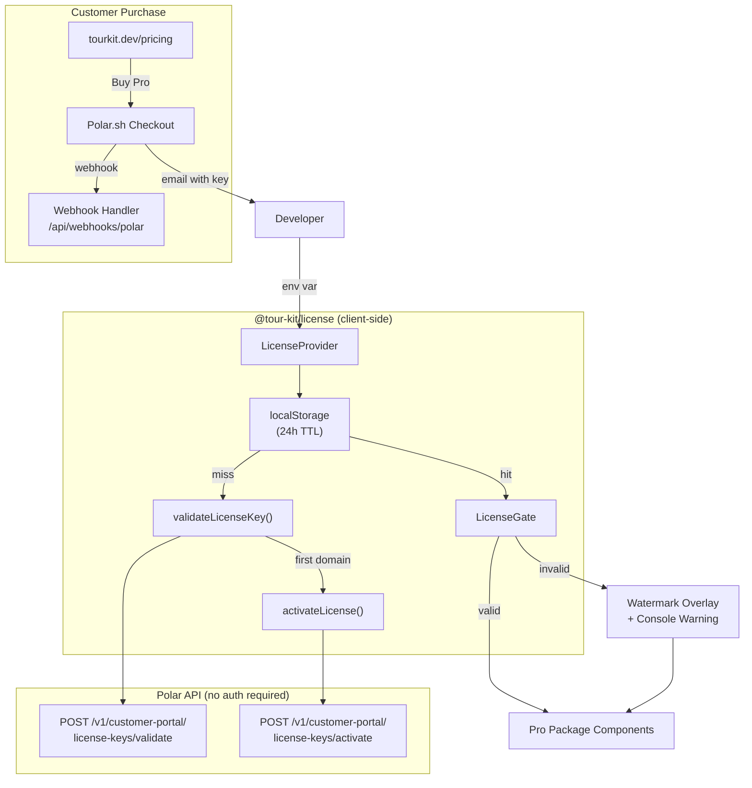
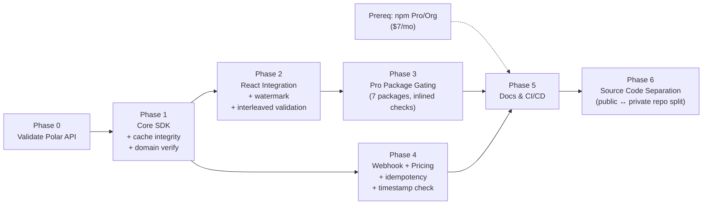

# Tour Kit Licensing System — Implementation Plan

**Project:** Replace JWT-based licensing with Polar.sh-backed license key validation, activation, and gating for Tour Kit Pro
**Owner:** DomiDex
**Start Date:** Week of March 31, 2026
**Target Completion:** 4 weeks (April 25, 2026)
**Total Estimated Effort:** 47–60 hours

---

## Project Vision

Build a zero-backend licensing system for Tour Kit Pro that validates license keys against Polar.sh's API, activates per-domain (up to 5 sites), caches results for 24h, and gates 7 extended packages (plus `@tour-kit/license` itself) behind a `<LicenseGate>` component with visible watermark enforcement. The guiding constraint is **zero bundle impact on free-tier users** — free packages (`core`, `react`, `hints`) must never import `@tour-kit/license`.

### Prerequisites

| Requirement | Why | Action |
|------------|-----|--------|
| **npm Pro or Org plan** ($7/mo) | Required to publish `@tour-kit/*` scoped packages with `access: restricted` | Sign up before Phase 5 publish step |
| **Polar.sh account** (sandbox first, then production) | License key API, checkout, webhook delivery | Create in Phase 0 |
| **`TOUR_KIT_LICENSE_KEY` env var convention** | Standardized env var name consumers use to pass their license key to `<LicenseProvider>` | Document in Phase 5 |
| **`NPM_TOKEN` in CI/CD** | GitHub Actions / Vercel / other CI needs an npm auth token to `npm install` restricted packages | Add to CI secrets before first consumer ships |
| **`POLAR_WEBHOOK_SECRET` env var** | Webhook signature verification in docs site API route | Add in Phase 4 |

---

## System Architecture



---

## Project Structure

```
packages/license/
├── src/
│   ├── index.ts                    # Public API re-exports
│   ├── headless.ts                 # Headless exports (no React)
│   ├── types/
│   │   └── index.ts                # LicenseState, PolarResponse, LicenseCache, etc.
│   ├── lib/
│   │   ├── polar-client.ts         # Raw fetch wrappers: validate, activate, deactivate
│   │   ├── cache.ts                # localStorage read/write with TTL + Zod integrity check
│   │   ├── domain.ts               # Dev domain detection, getCurrentDomain(), validateDomainAtRender()
│   │   └── schemas.ts              # Zod schemas for Polar API responses + cache shape
│   ├── context/
│   │   └── license-context.ts      # LicenseContext + LicenseProvider
│   ├── components/
│   │   ├── license-gate.tsx         # <LicenseGate require="pro"> — interleaved validation
│   │   ├── license-watermark.tsx    # <LicenseWatermark> — visible overlay on unlicensed usage
│   │   └── license-warning.tsx      # Dev-mode console warning component
│   ├── hooks/
│   │   ├── use-license.ts           # useLicense() — context consumer
│   │   └── use-is-pro.ts           # useIsPro() — boolean shortcut
│   └── __tests__/
│       ├── polar-client.test.ts     # API call tests (mocked fetch)
│       ├── cache.test.ts            # localStorage TTL + integrity tests
│       ├── domain.test.ts           # Dev detection + render-time verification tests
│       ├── license-provider.test.tsx # Provider integration tests
│       ├── license-gate.test.tsx     # Gate rendering tests
│       ├── license-watermark.test.tsx # Watermark visibility tests
│       └── hooks.test.tsx           # Hook tests
├── package.json
├── tsconfig.json
├── tsup.config.ts
├── LICENSE.md                       # Proprietary license
├── CLAUDE.md
└── README.md
```

**Webhook handler** (in docs site):
```
apps/docs/app/api/webhooks/polar/route.ts
```

---

## Phase Breakdown

### Phase 0: Polar API Validation Gate (Days 1–2)

**Goal:** Prove Polar's license key API works end-to-end before engineering the SDK.

| # | Task | Hours | Dependencies | Output |
|---|------|-------|-------------|--------|
| 0.1 | Create Polar sandbox account, create test product with license key benefit (prefix `TOURKIT`, 5 activations, perpetual) | 0.5h | — | Polar sandbox configured |
| 0.2 | Write a standalone script (`scripts/polar-validation-test.ts`) that validates a test key via `fetch()` against sandbox API | 1h | 0.1 | Working fetch → validate response |
| 0.3 | Test activation: activate for `test.example.com`, verify activation count increments, deactivate, verify count decrements | 1h | 0.2 | Confirmed activate/deactivate cycle |
| 0.4 | Measure validation latency (10 calls, record p50/p95) — must be < 500ms p95 | 0.5h | 0.2 | Latency report in script output |
| 0.5 | Go/no-go decision document | 0.5h | 0.3, 0.4 | `plan/phase-0-status.json` |

**Exit Criteria:**
- [ ] Polar sandbox validate endpoint returns correct `status: 'granted'` for valid key
- [ ] Activation consumes exactly 1 slot, deactivation frees it
- [ ] p95 validation latency < 500ms
- [ ] **Decision: proceed** (or abort if Polar API is unreliable/undocumented)

**Deliverables:** `scripts/polar-validation-test.ts`, `plan/phase-0-status.json`

---

### Phase 1: Core License SDK (Days 3–6)

**Goal:** Build the framework-agnostic license validation, activation, caching, and domain detection layer.

| # | Task | Hours | Dependencies | Output |
|---|------|-------|-------------|--------|
| 1.1 | Define TypeScript types: `LicenseState`, `LicenseCache`, `LicenseError`, `PolarValidateResponse`, `PolarActivateResponse` — remove old JWT types (`LicensePayload`, `LicensePackage`) | 1.5h | Phase 0 | `src/types/index.ts` |
| 1.2 | Write Zod schemas for Polar API responses (validate + activate) | 1h | 1.1 | `src/lib/schemas.ts` |
| 1.3 | Implement `polar-client.ts`: `validateKey()`, `activateKey()`, `deactivateKey()` using raw `fetch()` — no `@polar-sh/sdk` | 1.5h | 1.2 | `src/lib/polar-client.ts` |
| 1.4 | Implement `cache.ts`: `readCache()`, `writeCache()`, `clearCache()` with 24h TTL, domain-scoped keys | 1h | 1.1 | `src/lib/cache.ts` |
| 1.5 | Implement `domain.ts`: `getCurrentDomain()`, `isDevEnvironment()` (detect localhost, 127.0.0.1, *.local) | 0.5h | — | `src/lib/domain.ts` |
| 1.6 | Implement public `validateLicenseKey()` orchestrator: cache check → Polar validate → auto-activate if first domain → cache write | 1.5h | 1.3, 1.4, 1.5 | `src/lib/polar-client.ts` (extended) |
| 1.7 | Remove `jose` dependency, delete old `utils/validate.ts` JWT code | 0.5h | 1.3 | `package.json` updated |
| 1.8 | Write unit tests for polar-client (mock fetch), cache (mock localStorage), domain detection | 2h | 1.3–1.6 | `src/__tests__/polar-client.test.ts`, `cache.test.ts`, `domain.test.ts` |
| 1.9 | Update `headless.ts` exports (types + functions, no React) | 0.5h | 1.1–1.6 | `src/headless.ts` |
| 1.10 | Implement render-time domain verification — `validateDomainAtRender()` compares `window.location.hostname` against stored activation label. Log mismatches to console (soft enforcement, no hard block). | 1h | 1.5 | `src/lib/domain.ts` (extended) |
| 1.11 | Implement cache integrity validation — `readCache()` must Zod-parse cached data using `LicenseCacheSchema`. On parse failure, clear corrupted cache and force re-validation against Polar API. | 1h | 1.2, 1.4 | `src/lib/cache.ts` + `src/lib/schemas.ts` (extended) |

**Exit Criteria:**
- [ ] `validateLicenseKey()` returns correct `LicenseState` for valid key, invalid key, and revoked key
- [ ] Cache returns stored result within TTL, re-validates after TTL expires
- [ ] Corrupted/tampered cache entries are detected via Zod parse and cleared automatically
- [ ] `validateDomainAtRender()` logs warning when hostname mismatches activation label
- [ ] `isDevEnvironment()` returns `true` for localhost/127.0.0.1/*.local
- [ ] `jose` removed from `package.json`, no JWT code remains
- [ ] All 3 test files pass with >80% coverage of `src/lib/`

**Deliverables:** `src/lib/polar-client.ts`, `src/lib/cache.ts`, `src/lib/domain.ts`, `src/lib/schemas.ts`, `src/types/index.ts`, `src/headless.ts`

---

### Phase 2: React Integration (Days 7–10)

**Goal:** Build LicenseProvider, LicenseGate, useLicense, and useIsPro — the React API consumers use.

| # | Task | Hours | Dependencies | Output |
|---|------|-------|-------------|--------|
| 2.1 | Implement `LicenseContext` and `LicenseProvider`: validates on mount, caches, provides context, handles loading/error states | 2h | Phase 1 | `src/context/license-context.ts` |
| 2.2 | Implement dev-mode bypass in provider: skip activation on localhost, return `{ valid: true, tier: 'pro' }` | 0.5h | 2.1 | In `license-context.ts` |
| 2.3 | Implement `useLicense()` hook with context enforcement (throw if used outside provider) | 0.5h | 2.1 | `src/hooks/use-license.ts` |
| 2.4 | Implement `useIsPro()` convenience hook | 0.5h | 2.3 | `src/hooks/use-is-pro.ts` |
| 2.5 | Implement `<LicenseGate>` component: renders children if licensed, fallback otherwise | 1h | 2.3 | `src/components/license-gate.tsx` |
| 2.6 | Implement `<LicenseWarning>` dev-mode console warning component | 0.5h | 2.3 | `src/components/license-warning.tsx` |
| 2.7 | Update `src/index.ts` main exports (all React + types) | 0.5h | 2.1–2.6 | `src/index.ts` |
| 2.8 | Update `tsup.config.ts` for dual entry points (`index.ts` + `headless.ts`) | 0.5h | 2.7, 1.9 | `tsup.config.ts` |
| 2.9 | Write tests: LicenseProvider (mock fetch, verify context), LicenseGate (render/fallback), hooks | 2h | 2.1–2.6 | `src/__tests__/license-provider.test.tsx`, `license-gate.test.tsx`, `hooks.test.tsx` |
| 2.10 | Verify bundle size < 3KB gzipped (run `pnpm build --filter=@tour-kit/license` and check output) | 0.5h | 2.8 | Build output log |
| 2.11 | Implement `<LicenseWatermark>` — semi-transparent overlay with "UNLICENSED" text rendered on pro components when no valid license. Uses inline styles + high z-index + `pointer-events: none` to resist CSS overrides. Follows AG Grid/MUI X watermark pattern. | 1.5h | 2.3 | `src/components/license-watermark.tsx` |
| 2.12 | Interleave license validation with `<LicenseGate>` render logic — license state must provide a render key consumed inside the component tree (not a simple boolean wrapper). Removing the license check must break the component's rendering, not just remove a condition. | 1h | 2.5 | `src/components/license-gate.tsx` (refactored) |

**Exit Criteria:**
- [ ] `<LicenseProvider>` validates key on mount and provides `LicenseState` via context
- [ ] `<LicenseGate require="pro">` renders children when licensed, watermark overlay when not
- [ ] `<LicenseWatermark>` renders visible "UNLICENSED" overlay that survives basic CSS overrides
- [ ] Removing license check from `<LicenseGate>` breaks component rendering (interleaved validation)
- [ ] `useLicense()` throws outside provider, returns state inside
- [ ] `useIsPro()` returns `true` for pro tier, `false` otherwise
- [ ] Dev mode (localhost) bypasses activation and returns valid
- [ ] Bundle size: `@tour-kit/license` < 3KB gzipped
- [ ] All React tests pass with >80% coverage

**Deliverables:** `src/context/license-context.ts`, `src/components/license-gate.tsx`, `src/components/license-watermark.tsx`, `src/components/license-warning.tsx`, `src/hooks/use-license.ts`, `src/hooks/use-is-pro.ts`

---

### Phase 3: Pro Package Integration (Days 11–13)

**Goal:** Wire license checks into all 7 extended packages (not counting `license` itself) so they show watermark + dev warning without a Pro license. Components still render and function — soft enforcement, never a blank screen.

| # | Task | Hours | Dependencies | Output |
|---|------|-------|-------------|--------|
| 3.1 | Add `@tour-kit/license` as optional peer dependency to all 7 extended packages: analytics, announcements, checklists, adoption, media, scheduling, ai | 1h | Phase 2 | 7× `package.json` updated |
| 3.2 | Create shared `useLicenseCheck()` pattern — try-catch import, return `{ valid: true }` if license package not installed (free-tier zero-impact). When license is invalid: each pro package renders its own inline watermark + console warning. **The watermark code lives in the pro package itself, not in `@tour-kit/license`** — so swapping out the license package with a fake doesn't remove watermarks. | 1h | 3.1 | Pattern documented, util in each package |
| 3.3 | Integrate license check into `@tour-kit/analytics` provider — watermark + dev warning on unlicensed, full function either way | 0.5h | 3.2 | `packages/analytics/src/...` |
| 3.4 | Integrate license check into `@tour-kit/announcements` provider | 0.5h | 3.2 | `packages/announcements/src/...` |
| 3.5 | Integrate license check into `@tour-kit/checklists` provider | 0.5h | 3.2 | `packages/checklists/src/...` |
| 3.6 | Integrate license check into `@tour-kit/adoption` provider | 0.5h | 3.2 | `packages/adoption/src/...` |
| 3.7 | Integrate license check into `@tour-kit/media` provider | 0.5h | 3.2 | `packages/media/src/...` |
| 3.8 | Integrate license check into `@tour-kit/scheduling` provider | 0.5h | 3.2 | `packages/scheduling/src/...` |
| 3.9 | Integrate license check into `@tour-kit/ai` provider | 0.5h | 3.2 | `packages/ai/src/...` |
| 3.10 | Write integration test: render each pro package WITHOUT license key → verify (a) no crash, (b) watermark visible, (c) dev warning logged, (d) component still functions | 1.5h | 3.3–3.9 | 7× integration tests |
| 3.11 | Verify free packages (`core`, `react`, `hints`) have zero imports from `@tour-kit/license` — grep + bundle analysis | 0.5h | 3.3–3.9 | Verification log |

**Exit Criteria:**
- [ ] All 7 pro packages check license via `useLicenseCheck()` in their providers
- [ ] Without a license: components render with `<LicenseWatermark>` overlay + console warning — **no crash, no blank screen, components still function**
- [ ] With a valid license: components render normally, no watermark
- [ ] Free packages (`core`, `react`, `hints`) bundle size unchanged — zero license imports
- [ ] All 7 integration tests pass

**Deliverables:** 7× updated provider files, 7× integration tests

---

### Phase 4: Webhook Handler + Docs Pricing Page (Days 14–16)

**Goal:** Build the server-side webhook handler and pricing page for tourkit.dev.

| # | Task | Hours | Dependencies | Output |
|---|------|-------|-------------|--------|
| 4.1 | Implement webhook route `apps/docs/app/api/webhooks/polar/route.ts` — **preferred: use `@polar-sh/nextjs` `Webhooks()` wrapper** for automatic signature validation + granular event handlers. Alternative: use `@polar-sh/sdk/webhooks` `validateEvent(body, headers, secret)` manually. Handle `benefit_grant.created`, `benefit_grant.updated`, and `benefit_grant.revoked` events. Return **HTTP 202** (not 200). Respond within **2 seconds** — process async. No redirects (301/302 count as failures). Secret is base64-encoded (`whsec_` prefix, SDK handles decoding). | 2h | Phase 0 | `route.ts` |
| 4.2 | Add `POLAR_WEBHOOK_SECRET` to docs site env config, add to `.env.example` | 0.5h | 4.1 | `.env.example` updated |
| 4.3 | ~~Build pricing page~~ **DONE** — `apps/docs/app/pricing/page.tsx` + `components/landing/pricing.tsx` already created with Free vs Pro cards, comparison table, FAQ, and nav link | 0h | — | `page.tsx` (exists) |
| 4.4 | Update Polar checkout link in pricing component once Polar product is created (currently placeholder URL) | 0.5h | 0.1 | Config in pricing page |
| 4.5 | Write webhook handler tests (mock Standard Webhooks signature verification) | 1h | 4.1 | `__tests__/webhook.test.ts` |
| 4.6 | Test webhook locally: use Polar sandbox webhook test event, verify handler responds 202 within 2s | 0.5h | 4.1, 4.5 | Manual verification |
| 4.7 | Implement webhook idempotency — deduplicate `webhook-id` values using an in-memory `Map<string, number>` with 10-minute TTL. Return 202 (not error) for duplicates to prevent Polar retries. | 0.5h | 4.1 | In `route.ts` |
| 4.8 | Add timestamp tolerance validation — reject webhooks with `webhook-timestamp` older than 5 minutes (Standard Webhooks default). Return 403. Log rejected attempts for monitoring. Note: if using `@polar-sh/nextjs` or `@polar-sh/sdk/webhooks`, the SDK handles timestamp validation automatically. | 0.5h | 4.1 | In `route.ts` |

**Exit Criteria:**
- [ ] Webhook handler verifies signatures via `@polar-sh/nextjs` `Webhooks()` or `@polar-sh/sdk/webhooks` `validateEvent()`
- [ ] Invalid signatures return 403
- [ ] Replayed webhooks (duplicate `webhook-id`) return 202 without re-processing
- [ ] Stale webhooks (timestamp > 5 min old) return 403
- [ ] Handler responds within 2 seconds (no synchronous heavy processing)
- [ ] Handler returns HTTP 202 (not 200) on success
- [ ] `benefit_grant.created` logs sale, `benefit_grant.updated` logs changes, `benefit_grant.revoked` logs revocation
- [ ] Pricing page renders Free vs Pro comparison with checkout link
- [ ] Webhook tests pass (including replay + stale timestamp cases)

**Deliverables:** `apps/docs/app/api/webhooks/polar/route.ts`, `apps/docs/app/pricing/page.tsx`

---

### Phase 5: Documentation, Examples & Hardening (Days 17–19)

**Goal:** Write user-facing docs, update examples, and run final quality checks.

| # | Task | Hours | Dependencies | Output |
|---|------|-------|-------------|--------|
| 5.1 | Write `packages/license/CLAUDE.md` with domain-specific guidance | 0.5h | Phase 2 | `CLAUDE.md` |
| 5.2 | Update `packages/license/README.md` with new Polar-based API, installation, usage | 1h | Phase 2 | `README.md` |
| 5.3 | Write docs page: `apps/docs/content/docs/licensing/index.mdx` — setup guide, `TOUR_KIT_LICENSE_KEY` env var, `<LicenseProvider>` usage, watermark behavior, CI/CD setup (`NPM_TOKEN`), FAQ | 1.5h | Phase 2 | MDX file |
| 5.4 | Update Next.js example app to include `LicenseProvider` wrapping pro features, `.env.example` with `TOUR_KIT_LICENSE_KEY` | 1h | Phase 3 | `examples/next-app/` |
| 5.5 | Update Vite example app to include `LicenseProvider` wrapping pro features, `.env.example` with `VITE_TOUR_KIT_LICENSE_KEY` | 1h | Phase 3 | `examples/vite-app/` |
| 5.6 | Run full build: `pnpm build` — verify all packages compile, no type errors | 0.5h | All phases | Build log |
| 5.7 | Run full test suite: `pnpm test` — verify >80% coverage on license package | 0.5h | All phases | Test report |
| 5.8 | Final bundle size check: `@tour-kit/license` < 3KB gzipped, free packages unchanged | 0.5h | 5.6 | Bundle report |
| 5.9 | Create changeset documenting breaking changes (removed `publicKey` prop, new `organizationId` prop, new key format) | 0.5h | All phases | `.changeset/*.md` |
| 5.10 | Update GitHub Actions workflow — add `NPM_TOKEN` secret for installing restricted packages in CI. Add `.npmrc` template: `//registry.npmjs.org/:_authToken=${NPM_TOKEN}` | 0.5h | All phases | `.github/workflows/`, `.npmrc` |
| 5.11 | Verify npm Pro/Org plan is active, test `npm publish --dry-run` for one restricted package to confirm access | 0.5h | npm account | Manual verification |

**Exit Criteria:**
- [ ] `packages/license/CLAUDE.md` exists with Polar integration guidance
- [ ] Docs page covers: installation, `TOUR_KIT_LICENSE_KEY` env var, provider config, LicenseGate + watermark behavior, CI/CD `NPM_TOKEN` setup, FAQ
- [ ] Both example apps demonstrate license integration with `.env.example`
- [ ] Full monorepo build passes with zero type errors
- [ ] License package test coverage > 80%
- [ ] Bundle size: license < 3KB, free packages unchanged
- [ ] Changeset created for breaking changes
- [ ] CI can install restricted packages via `NPM_TOKEN`
- [ ] `npm publish --dry-run` succeeds for restricted package

**Deliverables:** `CLAUDE.md`, `README.md`, docs MDX, updated examples, changeset, CI config

---

### Phase 6: Source Code Separation (Days 20–21)

**Goal:** Move all pro packages and the license package out of the public repo into a private `tour-kit-pro` repo. Ensure the public repo contains zero proprietary source code. Fix npm access — all 8 pro packages are currently published as **public** and must be switched to **restricted**.

#### Current State (as of March 30, 2026)

| Item | Status |
|------|--------|
| `DomiDex/tour-kit` | **PUBLIC** GitHub repo — pro source exposed |
| `DomiDex/tour-kit-pro` | **Does not exist yet** |
| npm Pro/Org plan | Active |
| Pro packages on npm | **All PUBLIC** — anyone can `npm install` them |
| Published versions | adoption@0.0.1, ai@0.0.0, analytics@0.1.0, announcements@0.1.0, checklists@0.1.0, license@0.0.1, media@0.1.0, scheduling@0.1.0 |
| Free packages on npm | core@0.3.0, react@0.4.1, hints@0.4.1 |
| Pro `package.json` deps | Use `workspace:*` — must change to published npm versions |

#### Step 1: Fix npm Access (URGENT — do first)

All 8 pro packages are publicly installable right now. Switch them to restricted **before** anything else.

| # | Task | Hours | Dependencies | Output |
|---|------|-------|-------------|--------|
| 6.0a | Run `npm access restricted @tour-kit/adoption @tour-kit/ai @tour-kit/analytics @tour-kit/announcements @tour-kit/checklists @tour-kit/license @tour-kit/media @tour-kit/scheduling` | 0.25h | npm Pro plan active | 8 packages now restricted |
| 6.0b | Verify: `npm access get status @tour-kit/announcements` returns `restricted` for all 8 | 0.25h | 6.0a | Confirmed |

#### Step 2: Create Private Repo & Move Source

| # | Task | Hours | Dependencies | Output |
|---|------|-------|-------------|--------|
| 6.1 | Create private GitHub repo: `gh repo create DomiDex/tour-kit-pro --private` | 0.25h | — | Repo created |
| 6.2 | Clone and initialize as pnpm monorepo with Turborepo. Copy root configs (`tsconfig.json`, `turbo.json`, `pnpm-workspace.yaml`, `.npmrc`) from public repo and adapt. | 0.5h | 6.1 | Monorepo scaffolded |
| 6.3 | Copy all 8 pro package directories into `tour-kit-pro/packages/`: `license`, `adoption`, `ai`, `analytics`, `announcements`, `checklists`, `media`, `scheduling` | 0.5h | 6.2 | 8 packages copied |
| 6.4 | Update all pro `package.json` deps — replace `workspace:*` references with published npm versions: `"@tour-kit/core": "^0.3.0"`, `"@tour-kit/react": "^0.4.1"`, `"@tour-kit/hints": "^0.4.1"`. Also fix cross-pro deps (e.g., announcements→scheduling, adoption→analytics). | 0.5h | 6.3 | 8× `package.json` updated |
| 6.5 | Run `pnpm install && pnpm build` in `tour-kit-pro` — verify all 8 packages compile against published npm versions of core/react/hints | 0.5h | 6.4 | Build log — all green |
| 6.6 | Run `pnpm test` in `tour-kit-pro` (if tests exist) — verify tests pass against npm deps | 0.25h | 6.5 | Test results |

#### Step 3: Clean Public Repo

| # | Task | Hours | Dependencies | Output |
|---|------|-------|-------------|--------|
| 6.7 | Delete pro package directories from public repo: `rm -rf packages/{adoption,ai,analytics,announcements,checklists,license,media,scheduling}` | 0.25h | 6.5 | Directories removed |
| 6.8 | Verify `pnpm-workspace.yaml` wildcard (`packages/*`) auto-adjusts — only `core`, `react`, `hints` remain. No config change needed. | 0.1h | 6.7 | Verified |
| 6.9 | Run `pnpm install && pnpm build && pnpm typecheck` in public repo — verify free packages still build | 0.25h | 6.7 | Build log — all green |
| 6.10 | Update docs site if it imports pro packages — replace with "Pro package" placeholders or conditional imports | 0.5h | 6.7 | Docs site builds |
| 6.11 | Commit and push: `"chore: remove pro packages — moved to private repo"` | 0.1h | 6.9, 6.10 | Public repo cleaned |

#### Step 4: CI/CD & Release Config in Private Repo

| # | Task | Hours | Dependencies | Output |
|---|------|-------|-------------|--------|
| 6.12 | Configure Changesets in `tour-kit-pro`: `.changeset/config.json` with `"access": "restricted"`, linked pro packages, `updateInternalDependencies: "patch"` | 0.25h | 6.3 | `.changeset/config.json` |
| 6.13 | Set up GitHub Actions: `.github/workflows/ci.yml` (build + test on PR) and `.github/workflows/release.yml` (Changesets publish with `--access restricted`) — see **Release Workflow** section | 1h | 6.5 | Workflows committed |
| 6.14 | Add `NPM_TOKEN` secret to `DomiDex/tour-kit-pro` GitHub repo settings | 0.1h | 6.13 | Secret configured |
| 6.15 | Dry-run full release: `pnpm changeset` → `pnpm version-packages` → `pnpm build` → `npm publish --dry-run --access restricted` for all 8 packages | 0.5h | 6.12, 6.13 | Verification log |

#### Step 5: Verify & Document

| # | Task | Hours | Dependencies | Output |
|---|------|-------|-------------|--------|
| 6.16 | Verify public repo at HEAD contains zero pro source: `git ls-files packages/{adoption,ai,analytics,announcements,checklists,license,media,scheduling}` returns empty | 0.1h | 6.11 | Confirmed |
| 6.17 | Verify npm access: `npm access get status` returns `restricted` for all 8 pro packages | 0.1h | 6.0b | Confirmed |
| 6.18 | Update public repo README — reference pro packages as npm-installable (not source-available), link to docs pricing page | 0.25h | 6.11 | README updated |
| 6.19 | Update CLAUDE.md in both repos — public repo removes pro package references from Architecture section, private repo gets its own CLAUDE.md | 0.25h | 6.11 | Both CLAUDE.md updated |
| 6.20 | Push `tour-kit-pro` to GitHub: `git push -u origin main` | 0.1h | 6.15 | Private repo live |

**Exit Criteria:**
- [ ] `DomiDex/tour-kit-pro` is a **private** GitHub repo with all 8 pro packages
- [ ] All 8 pro packages build and pass tests in the private repo against published npm core/react/hints
- [ ] Public `DomiDex/tour-kit` repo contains **zero** pro package source code at HEAD
- [ ] Pro packages depend on `@tour-kit/core: "^0.3.0"` via npm (not `workspace:*`)
- [ ] **All 8 pro packages are `restricted` on npm** (not public)
- [ ] GitHub Actions in private repo can build + publish restricted npm packages
- [ ] Changesets configured with `access: restricted` in private repo
- [ ] Full release dry-run succeeds for all 8 pro packages
- [ ] Public repo still builds and passes all free-package tests
- [ ] Cross-pro deps resolved (announcements→scheduling, adoption→analytics use npm versions)

**Deliverables:** Private repo with CI/CD, Changesets config, cleaned public repo, npm access fixed

---

## Release Workflow

### Two independent release pipelines

With the public/private repo split, releases must be coordinated but are independent pipelines:

```
PUBLIC REPO (DomiDex/tour-kit)          PRIVATE REPO (DomiDex/tour-kit-pro)
──────────────────────────────          ───────────────────────────────────
1. pnpm changeset                       1. pnpm changeset
2. Push → PR "chore: version packages"  2. Push → PR "chore: version packages"
3. Merge PR → Changesets action:        3. Merge PR → Changesets action:
   • pnpm version-packages                 • pnpm version-packages
   • pnpm build --filter='./packages/*'    • pnpm build --filter='./packages/*'
   • pnpm release (npm publish --access    • pnpm release (npm publish --access
     public for core/react/hints)            restricted for all 8 pro packages)
```

### Release order matters

```
Free packages MUST publish first ──► Then pro packages can update their dep range
```

**Why:** Pro packages depend on `@tour-kit/core` via npm (e.g., `"@tour-kit/core": "^0.2.0"`). If core bumps to `0.3.0`, pro packages must:
1. Wait for `0.3.0` to be published on npm
2. Update their `package.json` dep to `^0.3.0`
3. Run their own release

### Changesets configuration

**Public repo** (existing — no changes needed):
```json
{
  "linked": [["@tour-kit/core", "@tour-kit/react", "@tour-kit/hints"]],
  "access": "public",
  "baseBranch": "main"
}
```

**Private repo** (new):
```json
{
  "linked": [[
    "@tour-kit/license",
    "@tour-kit/adoption",
    "@tour-kit/analytics",
    "@tour-kit/announcements",
    "@tour-kit/checklists",
    "@tour-kit/media",
    "@tour-kit/scheduling",
    "@tour-kit/ai"
  ]],
  "access": "restricted",
  "baseBranch": "main",
  "updateInternalDependencies": "patch"
}
```

**Key difference:** `"access": "restricted"` tells Changesets to pass `--access restricted` to `npm publish`.

### Private repo release.yml

```yaml
name: Release

on:
  push:
    branches: [main]

concurrency: ${{ github.workflow }}-${{ github.ref }}

jobs:
  release:
    runs-on: ubuntu-latest
    timeout-minutes: 15
    permissions:
      contents: write
      pull-requests: write
      id-token: write
    steps:
      - uses: actions/checkout@v4

      - uses: pnpm/action-setup@v3
        with:
          version: 9

      - uses: actions/setup-node@v4
        with:
          node-version: 20
          cache: 'pnpm'
          registry-url: 'https://registry.npmjs.org'

      - run: pnpm install --frozen-lockfile

      - run: pnpm build --filter='./packages/*'

      - name: Create Release Pull Request or Publish
        uses: changesets/action@v1
        with:
          version: pnpm version-packages
          publish: pnpm release
          title: 'chore: version pro packages'
          commit: 'chore: version pro packages'
        env:
          GITHUB_TOKEN: ${{ secrets.GITHUB_TOKEN }}
          NPM_TOKEN: ${{ secrets.NPM_TOKEN }}
          NODE_AUTH_TOKEN: ${{ secrets.NPM_TOKEN }}
```

**Required GitHub secret:** `NPM_TOKEN` — an npm automation token with publish access to the `@tour-kit` scope. Must be from an npm account with a Pro or Org plan.

### Version coordination between repos

| Scenario | Action |
|----------|--------|
| **Core-only change** (bug fix, new hook) | Publish free packages only. Pro packages continue working — their `^0.x.0` range allows patch/minor bumps. |
| **Core breaking change** (major bump) | 1. Publish core `1.0.0`. 2. Update pro packages' dep to `^1.0.0`. 3. Publish pro packages. |
| **Pro-only change** (new feature in analytics) | Publish pro packages only. Free packages are unaffected. |
| **Coordinated release** (new core API used by pro packages) | 1. Publish free packages first. 2. Update pro packages to use new API + bump dep range. 3. Publish pro packages. |

### npm account requirements

| Requirement | Detail |
|------------|--------|
| **npm Pro or Org plan** | $7/mo — required for `@tour-kit` scope with `access: restricted` |
| **Automation token** | Generate at npmjs.com → Access Tokens → Automation. Do NOT use a publish token (requires 2FA interaction). |
| **Scope ownership** | The `@tour-kit` npm scope must be owned by the account/org. Verify with `npm org ls @tour-kit` or `npm profile get`. |
| **2FA** | Enable on the npm account but use Automation token type (bypasses 2FA for CI). |

---

## Hour Estimates Summary

| Phase | Description | Min Hours | Max Hours |
|-------|-------------|-----------|-----------|
| Phase 0 | Polar API Validation Gate | 3h | 4h |
| Phase 1 | Core License SDK (+domain verify, cache integrity) | 10h | 13h |
| Phase 2 | React Integration (+watermark, interleaved validation) | 9h | 12h |
| Phase 3 | Pro Package Integration (inlined validation per package) | 6h | 8h |
| Phase 4 | Webhook + Pricing (+idempotency, timestamp validation) | 6h | 8h |
| Phase 5 | Docs, Examples & Hardening | 7h | 8h |
| Phase 6 | Source Code Separation + npm Access Fix + Release Workflow | 6h | 7h |
| **Total** | | **47h** | **60h** |

---

## Week-by-Week Timeline

| Week | Dates | Phase | Focus | Hours |
|------|-------|-------|-------|-------|
| Week 1 | Mar 31 – Apr 4 | Phase 0 + Phase 1 | Validate Polar API, build core SDK + security hardening (cache integrity, domain verify) | ~13–17h |
| Week 2 | Apr 7 – Apr 11 | Phase 2 + Phase 3 | React components (watermark, interleaved validation), pro package gating | ~15–20h |
| Week 3 | Apr 14 – Apr 18 | Phase 4 + Phase 5 | Webhook (idempotency, timestamp check), pricing, docs, CI/CD | ~13–16h |
| Week 4 | Apr 21 – Apr 25 | Phase 6 | npm access fix (urgent), source code separation — move pro packages to private repo, clean public repo, CI/CD setup | ~6–7h |

Assumes ~15h/week of productive engineering. Week 4 is lighter — mostly repo restructuring and npm access fixes.

---

## Milestone Gates

| Gate | Condition | Exit Criteria |
|------|-----------|---------------|
| M0 | End of Phase 0 | Polar sandbox validate returns `status: 'granted'`, activate/deactivate cycle works, p95 latency < 500ms |
| M1 | End of Phase 1 | `validateLicenseKey()` passes all unit tests, `jose` fully removed, headless exports work, cache Zod integrity check works, domain render-time verification logs mismatches |
| M2 | End of Phase 2 | `<LicenseProvider>` + `<LicenseGate>` render correctly, `<LicenseWatermark>` visible on unlicensed usage, interleaved validation in place, bundle < 3KB gzipped |
| M3 | End of Phase 3 | All 7 pro packages show watermark when unlicensed (no crash), free packages have 0 license imports |
| M4 | End of Phase 4 | Webhook verifies signatures via SDK (not hand-rolled), returns 202, responds < 2s, rejects replays + stale timestamps, handles `benefit_grant.created`/`updated`/`revoked`, pricing page live |
| M5 | End of Phase 5 | Full build passes, >80% test coverage, docs cover `TOUR_KIT_LICENSE_KEY` env var setup, changeset created |
| M6 | End of Phase 6 | Pro packages in private repo, public repo contains zero pro source at HEAD, both repos build independently, CI/CD publishes from private repo, **all 8 pro packages restricted on npm** |

---

## Risk Register

| # | Risk | Likelihood | Impact | Mitigation |
|---|------|-----------|--------|------------|
| 1 | Polar API down → new users can't validate | Low | High | 24h localStorage cache protects existing users. New activations fail gracefully with dev warning, never hard block. Extended outage (>24h): static fallback validates key format only (`TOURKIT-XXXX` pattern check). |
| 2 | License key leaked / shared publicly | Medium | Medium | Activation limit = 5 domains. Excess activations rejected by Polar. Customer self-serve deactivate via Polar portal. |
| 3 | Bundle size creep from Polar SDK | Medium | Medium | Do NOT bundle `@polar-sh/sdk`. Use raw `fetch()` to 3 endpoints. Total added code: ~200 lines. Enforced via bundle size gate < 3KB. |
| 4 | Piracy via patching `useLicense()` to return `{ valid: true }` | High | Low | Accept this — industry standard. AG Grid, MUI X Pro, Syncfusion all use soft enforcement. Target customer (product teams) values updates/support/compliance. Mitigations: (a) visible watermark overlay on unlicensed components, (b) console warnings with package name attribution, (c) interleave validation logic with render logic so naive patching breaks rendering, (d) legal terms in LICENSE.md. |
| 5 | localhost/dev environment consumes activation slot | High | Medium | `isDevEnvironment()` auto-detects `localhost`, `127.0.0.1`, `*.local`, `*.test` — skips activation, always returns valid in dev. |
| 6 | Standard Webhooks signature verification is wrong → webhook handler rejects valid events | Medium | Medium | Phase 0 validates webhook signing with Polar sandbox test events. **Preferred:** use `@polar-sh/nextjs` `Webhooks()` wrapper (handles everything automatically). **Alternative:** use `@polar-sh/sdk/webhooks` `validateEvent(body, headers, secret)`. SDK handles base64 decoding of `whsec_`-prefixed secret automatically. Do NOT hand-roll verification. Return HTTP 202 (not 200). Respond within 2s — redirects (301/302) count as failures. No dead letter queue — exhausted retries = permanent event loss. |
| 7 | Breaking changes block existing users during migration | Low | High | Changeset documents all breaking changes. `publicKey` → `organizationId` prop swap is the only breaking provider change. Types keep same shape (`LicenseState`, `LicenseTier`). |
| 8 | Domain label spoofing — activation label is client-supplied, Polar does not verify actual deployment domain | Medium | Medium | Accept as inherent Polar limitation. Mitigate by: (a) validating `window.location.hostname` at render time (not just at activation), (b) comparing render-time domain against stored activation label, (c) logging mismatches to analytics. Determined attackers can still spoof, but this catches casual abuse. |
| 9 | npm restricted package redistribution — once a paying user downloads, they can share the tarball | High | Medium | npm `restricted` access is a convenience gate, not copy protection. Mitigate by: (a) license key validation at runtime (Polar activation check), (b) visible watermark on unlicensed usage, (c) proprietary LICENSE.md with clear legal terms, (d) activation limit of 5 domains caps blast radius. |
| 10 | Webhook replay attacks — attacker replays a valid `benefit_grant.created` event | Low | Low | `standard-webhooks` enforces 5-minute timestamp tolerance. Additional mitigation: deduplicate using `webhook-id` header — store processed IDs in a short-lived cache (e.g., in-memory Set or KV store with TTL matching tolerance window). |
| 11 | localStorage cache tampering — attacker modifies cached license state | Medium | Low | Cache is a performance optimization, not a security boundary. On cache hit, validate the cached data structure (Zod parse). On any cache anomaly, re-validate against Polar API. Never trust cache for activation — only for "is this key still valid?" checks between 24h refreshes. |
| 12 | **Public GitHub repo exposes all pro package source code** — anyone can read, fork, and remove license checks without even buying | **High** | **High** | **CRITICAL.** npm `restricted` is meaningless when source is on public GitHub. Mitigation: move pro packages + license package to a **separate private repo** (`tour-kit-pro`). Free packages (`core`, `react`, `hints`) remain in the public repo. Pro packages are published to npm from the private repo only. See **Source Code Separation** section below. |
| 13 | Fake `@tour-kit/license` replacement — hacker creates a package that exports `useLicense = () => ({ valid: true })` and swaps it in via npm alias or module resolution | High | Medium | Mitigate by: (a) pro packages inline a lightweight validation check (not solely dependent on the license package), (b) watermark rendering is part of the pro package code itself (not delegated to license package), (c) `@tour-kit/license` is in a private repo so the API surface to fake is not fully documented. |
| 14 | **Polar API rate limit hit** — customer-portal endpoints limited to 3 req/sec globally, 500 req/min per org (production), 100 req/min (sandbox) | Medium | High | 24h localStorage cache TTL is essential — not optional. Without cache, a popular app could exceed 3 req/sec on page loads. Cache ensures validation calls happen at most once per 24h per domain. Sandbox rate limit (100 req/min) may be tight during Phase 0 testing — space out validation test calls. |
| 15 | **Webhook events permanently lost** — Polar has no dead letter queue. After 10 retries with exponential backoff, events are gone. Endpoint auto-disables after 10 consecutive failures. | Low | High | (a) Webhook handler must respond within 2s (10s timeout), process async. (b) Return HTTP 202 immediately, queue processing. (c) Monitor webhook endpoint health — Polar sends email on auto-disable. (d) No redirects — endpoint must respond directly. (e) Disable Cloudflare Bot Fight Mode on webhook subdomain. |

---

## Security Hardening Strategy (Validated March 28, 2026)

### CRITICAL: Source Code Separation

**Problem discovered:** The GitHub repo `DomiDex/tour-kit` is **PUBLIC**. All pro package source code (adoption, analytics, announcements, checklists, media, scheduling, ai, license) is readable by anyone. npm `restricted` access is meaningless when the full source is on GitHub.

**Solution: Two-repo architecture.**

```
PUBLIC REPO: DomiDex/tour-kit (GitHub public)
├── packages/core/          ← MIT, open source
├── packages/react/         ← MIT, open source
├── packages/hints/         ← MIT, open source
├── apps/docs/              ← docs site
└── examples/               ← example apps

PRIVATE REPO: DomiDex/tour-kit-pro (GitHub private)
├── packages/license/       ← proprietary, npm restricted
├── packages/adoption/      ← proprietary, npm restricted
├── packages/analytics/     ← proprietary, npm restricted
├── packages/announcements/ ← proprietary, npm restricted
├── packages/checklists/    ← proprietary, npm restricted
├── packages/media/         ← proprietary, npm restricted
├── packages/scheduling/    ← proprietary, npm restricted
├── packages/ai/            ← proprietary, npm restricted
└── turbo.json              ← builds pro packages, references core via npm
```

**How it works:**
- `tour-kit-pro` depends on `@tour-kit/core` as a regular npm dependency (published from the public repo)
- Pro packages are built and published to npm from the private repo only
- CI/CD in the private repo has `NPM_TOKEN` for publishing restricted packages
- The public repo never contains pro source code — `.gitignore` excludes pro package directories
- Free packages continue to be developed and published from the public repo

**Why this is necessary:**
- AG Grid and MUI X can afford to publish source publicly because they have massive brand recognition and legal teams
- Tour Kit is pre-launch — publishing source before establishing a customer base gives pirates the code before you have paying customers to lose
- Once the customer base is established (6–12 months), you can revisit whether to open the source (like AG Grid does)

### Industry Benchmark

| Library | Source Visible | npm Access | Enforcement | Revenue Stage |
|---------|--------------|------------|-------------|---------------|
| **AG Grid Enterprise** | Yes (GitHub) | Public | Watermark + legal | Mature ($100M+) |
| **MUI X Pro/Premium** | Yes (GitHub) | Public | Watermark + legal | Mature ($50M+) |
| **Syncfusion** | No (private) | Public | Modal popup + legal | Mature |
| **GoJS** | No (proprietary) | Public | Domain-locked key + watermark | Mature |
| **Telerik/Kendo UI** | No (private) | Public | License file + legal | Mature |
| **Tour Kit Pro (this plan)** | **No (private repo)** | **Restricted** | Polar.sh key + watermark + legal | **Pre-launch** |

**Key insight:** The libraries that publish source publicly (AG Grid, MUI X) are mature products with established revenue and legal teams. Pre-launch products should keep source private.

### Defense-in-Depth Layers

```
Layer 0: Source code separation (private repo)
  └─ Pro source never visible on public GitHub
  └─ Prevents: reading, forking, removing license checks before purchase
  └─ Bypassed by: paying customer leaks source (mitigated by Layers 1–5)

Layer 1: npm restricted access
  └─ Prevents unauthorized npm install
  └─ Requires npm Pro/Org plan ($7/mo)
  └─ Bypassed by: token sharing, tarball redistribution

Layer 2: Polar.sh activation limits (5 domains)
  └─ Server-side enforcement, cannot be client-patched
  └─ Caps blast radius of key sharing
  └─ Bypassed by: domain label spoofing (mitigated by render-time hostname check)

Layer 3: Runtime license validation (inlined per package)
  └─ Each pro package has its own validation logic — NOT solely dependent on @tour-kit/license
  └─ Watermark rendering is in the pro package itself, not in the license package
  └─ Swapping out @tour-kit/license with a fake doesn't remove the watermark
  └─ Bypassed by: patching each pro package individually (much harder than one package)

Layer 4: Visible watermark on unlicensed usage
  └─ Makes piracy visible to stakeholders (managers, clients, auditors)
  └─ Social enforcement — the person who bypassed is not the person who gets audited
  └─ Bypassed by: CSS override (extremely obvious, legal liability)

Layer 5: Legal enforcement (proprietary LICENSE.md)
  └─ Clear terms: no redistribution, per-domain activation
  └─ Enterprise customers buy for compliance, not because they can't bypass
  └─ Ultimate backstop — international IP law
```

### Hardening Tasks (Integrated Into Phases)

All security hardening tasks are now embedded in their respective phase task tables:

| Task | Phase | Purpose |
|------|-------|---------|
| 1.10 `validateDomainAtRender()` | Phase 1 | Catches domain label spoofing at render time |
| 1.11 Cache Zod integrity | Phase 1 | Detects localStorage tampering |
| 2.11 `<LicenseWatermark>` | Phase 2 | Visible overlay on unlicensed usage (AG Grid/MUI X pattern) |
| 2.12 Interleaved validation | Phase 2 | Naive patching breaks rendering |
| 4.7 Webhook idempotency | Phase 4 | Prevents replay attacks |
| 4.8 Timestamp tolerance | Phase 4 | Rejects stale webhook events |

### What We Deliberately Do NOT Do

| Approach | Why We Skip It |
|----------|---------------|
| **Code obfuscation** | No major React library uses it. Annoys legitimate users, delays pirates by minutes, increases bundle size, breaks source maps. |
| **Server-side feature gating** | Requires a backend. Our constraint is zero-backend. Polar handles the server side. |
| **Custom private npm registry (Keygen.sh)** | Adds install friction. npm restricted (native npm feature) + Polar activation is equivalent protection with better DX. |
| **Hardware/machine fingerprinting** | Doesn't work in browsers. Only relevant for Electron/desktop apps. |
| **Anti-tamper / integrity checks** | Trivially bypassed in JS. False sense of security. Better to invest in watermarking. |
| **Publishing pro source on public GitHub** | Pre-launch products should not expose source. AG Grid/MUI X can afford it due to mature revenue + legal teams. Revisit after 6–12 months of revenue. |

---

## ROI / Value Analysis

### Investment to Build

| Item | Cost | Notes |
|------|------|-------|
| Engineering time | ~47–60h | 4 weeks of solo development |
| Polar.sh | $0 | Free for open-source, they take payment processing fees |
| npm Pro/Org plan | $7/mo | Required for restricted scoped packages |
| Infrastructure | $0/mo | No backend — Polar handles everything, webhook runs on existing docs site |
| **Total setup** | **~47–60h of engineering + $7/mo npm** | |

### Returns (Conservative — 300 licenses Year 1)

| Timeframe | Licenses Sold | Revenue | Cumulative |
|-----------|--------------|---------|------------|
| Month 1 | 10–20 | $990–$1,980 | $990–$1,980 |
| Month 3 | 40–80 | $3,960–$7,920 | $3,960–$7,920 |
| Month 6 | 100–250 | $9,900–$24,750 | $9,900–$24,750 |
| Year 1 | 300–800 | $29,700–$79,200 | **$29,700–$79,200** |

**Break-even:** At $99/license, 1 sale covers ~2.5h of engineering time. Break-even at ~15–18 sales (~$1,500–$1,800), likely within Month 1–2.

**Marginal cost per sale:** ~$4.36 per $99 sale (Polar takes 4% + $0.40 per transaction). Net revenue per sale: ~$94.64.

---

## Dependency Graph



**Parallelizable:** Phase 3 and Phase 4 can run in parallel after Phase 2 and Phase 1 respectively (if working with a second contributor).

**Prerequisites:**
- npm Pro/Org plan must be active before Phase 5 publish step. Can be set up any time during Weeks 1–2.
- Phase 6 is the final step — only run after everything works in the monorepo. It's a structural migration, not a feature change.

---

## Self-Consistency Check

- [x] Every milestone has a measurable exit criterion (latency numbers, bundle sizes, test coverage %)
- [x] No phase depends on a deliverable from a phase that comes after it
- [x] Phase 0 is a validation gate that can abort the project without wasted engineering
- [x] Total hours (47–60h) are realistic for 4 weeks at ~15h/week (adjusted for security hardening + repo separation)
- [x] Risk register covers 15 risks (7 original + 6 security additions + 2 from March 30 validation: rate limits, webhook event loss)
- [x] Security strategy validated against AG Grid, MUI X, Syncfusion, GoJS, Telerik patterns (March 28, 2026)
- [x] Defense-in-depth: 5 layers from npm access gate to legal enforcement
- [x] npm packages configured: 3 free (MIT/public), 8 pro (proprietary/restricted)
- [x] Phase 6 updated: npm access fix (6.0a/6.0b) added as urgent first step — all 8 pro packages currently public on npm
- [x] Published versions verified: core@0.3.0, react@0.4.1, hints@0.4.1, pro packages at 0.0.0–0.1.0
- [x] Cross-pro dependency resolution added (announcements→scheduling, adoption→analytics)
- [x] Explicit "what we don't do" section prevents scope creep into false-security measures
- [x] All hardening tasks integrated into phase task tables (no orphaned tasks)
- [x] Prerequisites section lists npm Pro, Polar account, env vars, CI token
- [x] Architecture diagram shows watermark flow (not "fallback")
- [x] Phase 3 enforcement model matches security section (watermark, not passthrough)
- [x] Hour totals consistent across header (47–60h), table (47–60h), and ROI section (47–60h)
- [x] Source code separation (Phase 6) ensures public GitHub repo has zero pro source
- [x] Risk #12 (public repo) and #13 (fake license package) addressed with private repo + inlined validation
- [x] Defense-in-depth has 6 layers (Layer 0: source separation through Layer 5: legal)
- [x] Research re-validated March 30, 2026: Polar API, npm access, Changesets, Standard Webhooks all confirmed
- [x] Rate limits documented: 3 req/sec customer-portal, 500 req/min production — 24h cache TTL mitigates
- [x] Webhook gotchas documented: no dead letter queue, redirects fail, 10s timeout, return 202
- [x] `@polar-sh/nextjs` discovered as simpler alternative for webhook handler (Task 4.1 updated)
- [x] All 8 pro packages confirmed PUBLIC on npm — Phase 6.0a fix is urgent

---

## Research Validation (March 26, 2026) — Updated March 30, 2026

All technical assumptions in this plan were verified against live documentation. Re-validated on March 30, 2026 via Polar docs, npm docs, Standard Webhooks spec, and Changesets docs.

### Polar API Endpoints — Re-confirmed (March 30, 2026)

| Endpoint | Method | Auth Required | Rate Limit | Status |
|----------|--------|--------------|------------|--------|
| `/v1/customer-portal/license-keys/validate` | POST | None (public) | 3 req/sec | Re-confirmed |
| `/v1/customer-portal/license-keys/activate` | POST | None (public) | 3 req/sec | Re-confirmed |
| `/v1/customer-portal/license-keys/deactivate` | POST | None (public) | 3 req/sec | Re-confirmed |
| `/v1/license-keys/validate` | POST | `license_keys:write` | 500 req/min | New — server-side alternative |
| `/v1/license-keys/activate` | POST | `license_keys:write` | 500 req/min | New — server-side alternative |
| `/v1/license-keys/deactivate` | POST | `license_keys:write` | 500 req/min | New — server-side alternative |

**⚠️ NEW: Rate limits discovered.** Customer-portal endpoints are limited to **3 requests/second globally**. Production org-level limit is **500 requests/minute**. Sandbox is **100 requests/minute**. Plan impact: cache TTL of 24h is essential to stay well under limits.

**Validate request** (confirmed fields): `key` (required), `organization_id` (required), `activation_id` (optional), `benefit_id` (optional), `customer_id` (optional), `increment_usage` (optional int), `conditions` (optional object, max 50 key-value pairs).

**Validate response** (confirmed): Returns `ValidatedLicenseKey` with `id`, `organization_id`, `customer_id`, `benefit_id`, `status` (enum: `granted` | `revoked` | `disabled`), `limit_activations`, `usage`, `limit_usage`, `validations`, `created_at`, `modified_at`, `last_validated_at`, `expires_at`, `activation` (object or null), `customer` (LicenseKeyCustomer with email, name, address), `key`, `display_key`.

**Activate request** (confirmed): `key` (required), `organization_id` (required), `label` (required), `conditions` (optional), `meta` (optional). Returns `LicenseKeyActivationRead` with `id`, `license_key_id`, `label`, `meta`, `created_at`, `modified_at`, `license_key` (nested full object). Error **403** when activation limit reached or activations not enabled.

**Deactivate request** (confirmed): `key` (required), `organization_id` (required), `activation_id` (required). Returns 204 No Content.

**Error codes** (confirmed): 404 = key not found (ResourceNotFound), 422 = validation error (HTTPValidationError with field details), 403 = activation limit reached or not supported.

### Webhook Signing — Re-confirmed (March 30, 2026)

| Detail | Confirmed Value | Source |
|--------|----------------|--------|
| Algorithm | HMAC-SHA256 | Standard Webhooks spec |
| Headers | `webhook-id`, `webhook-timestamp`, `webhook-signature` | Polar docs + Hookdeck guide |
| Secret format | Base64-encoded, `whsec_` prefix per Standard Webhooks spec | Polar docs |
| SDK helper | `@polar-sh/sdk/webhooks` → `validateEvent(body, headers, secret)` | Polar delivery docs |
| Relevant events | `benefit_grant.created`, `benefit_grant.updated`, `benefit_grant.revoked` | Polar llms-full.txt |
| Retry policy | Up to **10 retries**, exponential backoff, **10s timeout** | Polar docs |
| Auto-disable | After **10 consecutive failed deliveries** | Polar docs |

**⚠️ NEW: Critical webhook gotchas discovered:**
1. **No dead letter queue** — once 10 retries are exhausted, the event is permanently lost
2. **Redirects (301/302) count as failures** — webhook endpoint must respond directly, no redirects
3. **Cloudflare Bot Fight Mode blocks deliveries** — must disable or use separate subdomain
4. **Events lost when endpoint is disabled** — no automatic preservation of failed deliveries
5. **10s timeout** — Polar recommends responding within **2 seconds** and processing asynchronously
6. **Return HTTP 202** for success (not 200) — this is Polar's documented convention

**⚠️ NEW: `@polar-sh/nextjs` package available.** Provides a `Webhooks()` wrapper with automatic signature validation and granular event handlers (`onOrderCreated`, `onCustomerStateChanged`, etc.). Consider using this instead of raw `@polar-sh/sdk/webhooks` for the Next.js webhook route in Phase 4.

**Express.js verification pattern** (confirmed):
```typescript
import { validateEvent, WebhookVerificationError } from '@polar-sh/sdk/webhooks'
// validateEvent(body: Buffer, headers: Headers, secret: string) → WebhookEvent
// Throws WebhookVerificationError on failure → return 403
// Return 202 on success
```

**Critical implementation note:** The webhook secret is **base64-encoded**. The SDK handles decoding automatically. If implementing custom verification: strip `whsec_` prefix, then base64-decode before computing HMAC. This is the #1 common verification bug.

### npm Access Control — Confirmed (March 30, 2026)

| Detail | Confirmed Value | Source |
|--------|----------------|--------|
| Switch to restricted | `npm access restricted @tour-kit/<pkg>` | npm docs |
| Check current access | `npm access get status @tour-kit/<pkg>` | npm docs |
| Requires | npm Pro or Org plan ($7/mo) for scoped restricted packages | npm docs |
| Automation token | Required for CI — bypasses 2FA, type: "Automation" | npm docs |
| `.npmrc` for CI | `//registry.npmjs.org/:_authToken=${NPM_TOKEN}` | npm docs |

**⚠️ CONFIRMED: All 8 pro packages are currently PUBLIC on npm.** `npm access get status @tour-kit/announcements` returns `public`. Phase 6.0a must run `npm access restricted` on all 8 packages immediately.

### Changesets Configuration — Confirmed (March 30, 2026)

| Config Key | Value | Effect | Source |
|-----------|-------|--------|--------|
| `access` | `"restricted"` | Passes `--access restricted` to `npm publish`. Default for scoped packages. | Changesets docs |
| `linked` | `[["@tour-kit/license", ...all 8 pro]]` | Linked packages share version numbers — when one bumps to 2.0.0, all do. | Changesets docs |
| `updateInternalDependencies` | `"patch"` | Updates dependency ranges on every release (e.g., `^1.0.0` → `^1.0.1`) | Changesets docs |
| `baseBranch` | `"main"` | Branch for change detection comparisons | Changesets docs |

**⚠️ NEW: Per-package override available.** Access can be overridden per-package in `package.json`. Our pro packages already have `"publishConfig": { "access": "restricted" }` — this is a belt-and-suspenders setup with the Changesets `access` config.

### Polar Pricing — Re-confirmed

| Detail | Value |
|--------|-------|
| Transaction fee | 4% + $0.40 per transaction |
| Monthly minimum | None |
| Setup fee | None |
| License key features | Custom prefix, activation limits, customer self-serve portal, automatic revocation |
| One-time purchase support | Yes |
| **Benefit auto-revocation** | License keys auto-revoke when subscriptions cancel (unless one-time purchase) |

### Assumptions Validated

1. ✅ **No SDK bundling needed** — All 3 customer-portal endpoints are public (no auth), raw `fetch()` is sufficient
2. ✅ **Webhook signing uses Standard Webhooks** — Confirmed: `webhook-id`, `webhook-timestamp`, `webhook-signature` headers, base64-encoded `whsec_` secret
3. ✅ **Activation limit enforcement** — Polar returns 403 when limit reached (confirmed)
4. ✅ **Customer self-serve deactivation** — Built into Polar customer portal
5. ✅ **Key format** — UUID4 with optional custom prefix
6. ✅ **npm access restricted command** — `npm access restricted @tour-kit/<pkg>` switches public → restricted
7. ✅ **Changesets restricted publishing** — `"access": "restricted"` in config + per-package `publishConfig`
8. ✅ **`@polar-sh/sdk/webhooks`** — `validateEvent(body, headers, secret)` handles signature verification automatically
9. ⚠️ **Rate limit risk** — Customer-portal endpoints are 3 req/sec. 24h cache TTL is essential.

### Corrections Applied to Plan

1. **Webhook signature** — Updated Risk #6 and Task 4.1 with exact Standard Webhooks construction details. Use `@polar-sh/nextjs` `Webhooks()` or `@polar-sh/sdk/webhooks` `validateEvent()` — do not hand-roll
2. **Polar fee** — Updated ROI section: net revenue is ~$94.64/sale (not $99) after 4% + $0.40 fee
3. **API paths** — Updated architecture diagram with full confirmed paths (`/v1/customer-portal/...`)
4. **Pricing page** — Task 4.3 marked as DONE (already built during this session)
5. **Rate limits added** (March 30) — 3 req/sec on customer-portal, 500 req/min production, 100 req/min sandbox
6. **Webhook gotchas added** (March 30) — no dead letter queue, redirects fail, 10s timeout, return 202 not 200
7. **`@polar-sh/nextjs`** (March 30) — alternative to raw SDK for webhook handler in Next.js (Task 4.1)
8. **npm access fix** (March 30) — Phase 6.0a/6.0b added: all pro packages currently public, must switch to restricted
9. **Changesets belt-and-suspenders** (March 30) — both config-level `access: restricted` and per-package `publishConfig`
10. **`benefit_grant.updated`** (March 30) — additional webhook event discovered, may be useful for subscription changes

### Sources (March 30, 2026 validation)

- [Polar Validate API](https://polar.sh/docs/api-reference/customer-portal/license-keys/validate)
- [Polar Activate API](https://polar.sh/docs/api-reference/customer-portal/license-keys/activate)
- [Polar Webhook Setup](https://polar.sh/docs/integrate/webhooks/endpoints)
- [Polar Webhook Delivery & Security](https://polar.sh/docs/integrate/webhooks/delivery)
- [Polar Full Docs (llms-full.txt)](https://polar.sh/docs/llms-full.txt)
- [Hookdeck: Guide to Polar Webhooks](https://hookdeck.com/webhooks/platforms/guide-to-polar-webhooks-features-and-best-practices)
- [npm access command](https://docs.npmjs.com/cli/v9/commands/npm-access/)
- [npm package visibility](https://docs.npmjs.com/package-scope-access-level-and-visibility/)
- [Changesets config options](https://github.com/changesets/changesets/blob/main/docs/config-file-options.md)
- [Standard Webhooks spec](https://github.com/standard-webhooks/standard-webhooks)
- [@polar-sh/nextjs](https://www.npmjs.com/package/@polar-sh/nextjs)
- [@polar-sh/sdk](https://www.npmjs.com/package/@polar-sh/sdk)
