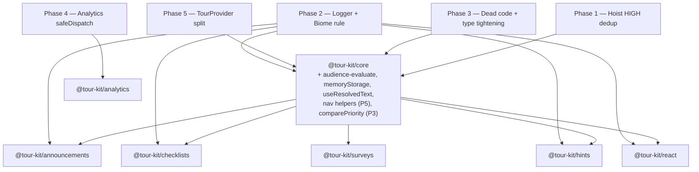
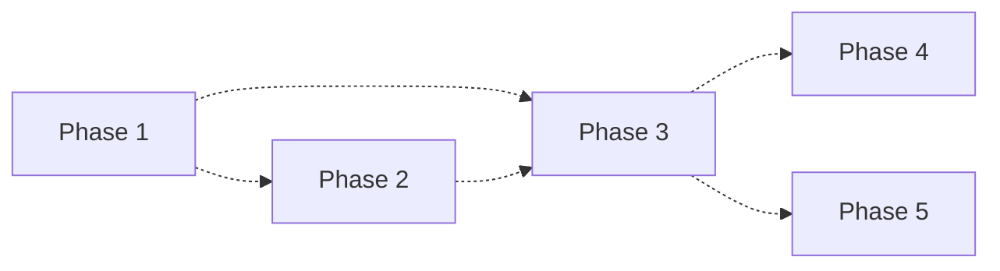

# Tour Kit — Refactor Train Implementation Plan

**Project:** Drain the 13 items in [`docs/refactor-candidates.md`](../../docs/refactor-candidates.md) (4 HIGH / 6 MED / 3 LOW) through 5 mechanical PRs, ordered by leverage and decoupled enough that any one phase can land independently.
**Owner:** @domidex01
**Start Date:** Week of 2026-05-25
**Target Completion:** ~5 weeks (week of 2026-06-29) at ~10 h/week — Phases 1–4 take ~3 weeks combined; Phase 5 is the L-effort outlier.
**Total Estimated Effort:** 36–48 h across 5 phases (≈ 6–8 h × 4 small phases + ≈ 12–16 h for Phase 5).

---

## Project Vision

The refactor candidates document is correct but unactionable as a list. This plan turns its 13 items into 5 sized, sequenced, mergeable PRs that each pay for themselves on day one:

1. **Phase 1 — Helper Hoisting:** absorb all 4 HIGH duplication candidates into `@tour-kit/core` so cross-package "keep in lockstep" comments stop being a contract.
2. **Phase 2 — Logger Migration + Guard Rail:** route every production `console.*` through `logger`, then add a Biome rule so the migration doesn't regress.
3. **Phase 3 — Dead-Code Drop + Type Tightening:** delete the unused manual `calculatePosition` family, consolidate the duplicated priority comparator, and replace the `as unknown as Record<string, unknown>` in `validateTour` with a properly narrowed `HiddenStep`.
4. **Phase 4 — Analytics `safeDispatch`:** collapse the 5 try/catch dispatch blocks in `TourAnalytics` into one helper so adding a new plugin hook is a one-liner.
5. **Phase 5 — TourProvider Split (L):** lift `navigateToStep` and `handleBranchTarget` out of the 1802-line `packages/core/src/context/tour-provider.tsx` into module-level pure functions that close over `dispatch`/`router`/callbacks via a typed `TourEngineContext`, drop 4 of the 6 biome complexity ignores.

The 3 LOW candidates (deprecation cutoff markers, floating-ui middleware helper, codemod cast helper) are **deferred** — tracked but not in the train. They are cosmetic and chase smaller deltas than the cost of orchestrating a PR.

Guiding constraints:

- **No backwards-compat shims for internal helpers.** When core absorbs a helper, the package-level barrels just re-export from core — no parallel implementations. Wherever a re-export already exists (e.g. `packages/announcements/src/core/audience.ts` is already a `@deprecated` shim), the new core helper joins that pattern.
- **No bundle-budget regressions.** Phase 3's dead-code drop frees ~190 lines; Phases 1, 4, and 5 are net-neutral or slightly negative (consolidating duplication shrinks both `core` (which absorbs) and `react/hints/announcements/checklists/surveys` (which delete)). Validate against `pnpm size-limit` after every phase; baseline noise is acknowledged in memory `#198` (size-limit fails on pristine main — reproduce on main before blaming the branch).
- **Each phase ships as one PR with green CI.** No multi-PR sequencing within a phase. If a phase grows beyond a single PR's reasonable diff, split it before merging.

---

## System Architecture



The shape of this train: **core absorbs cross-package primitives in Phases 1, 3 (partial), and 5**. Phase 2's logger migration is a horizontal sweep across every package; Phase 4 lives entirely inside `@tour-kit/analytics`. The 5 phases have no dependencies on each other — they can run in any order — but the recommended sequence below maximises information gain and lowers risk.

---

## Project Structure

```
tasks/refactor-train/
├── big-plan.md                # this file
├── phase-1.md                 # HIGH dedup hoisting
├── phase-1-tests.md           # generated separately by /phase-tests
├── phase-2.md                 # logger migration + biome rule
├── phase-3.md                 # dead-code drop + type tightening + priority comparator
├── phase-4.md                 # analytics safeDispatch
└── phase-5.md                 # TourProvider split (the L)
```

Per-package source paths affected (linked from each phase file):

```
packages/
├── core/
│   ├── src/lib/audience.ts                     # P1 — accept new evaluateAudience
│   ├── src/lib/i18n/use-resolved-text.tsx      # P1 — NEW, promoted
│   ├── src/utils/storage.ts                    # P1 — NEW, exports createMemoryStorage
│   ├── src/utils/position.ts                   # P3 — drop 4 unused exports
│   ├── src/lib/validate-tour.ts                # P3 — drop the `as unknown` cast
│   ├── src/types/step.ts                       # P3 — narrow HiddenStep
│   ├── src/context/tour-provider.tsx           # P5 — extract orchestrators
│   ├── src/lib/navigate-to-step.ts             # P5 — NEW
│   └── src/lib/handle-branch-target.ts         # P5 — NEW
├── react/
│   ├── src/hooks/use-step-filter.tsx           # P1 — delete dup, re-export
│   ├── src/hooks/use-resolved-text.tsx         # P1 — delete dup, re-export
│   └── src/components/card/tour-card.tsx       # P2 — console → logger
├── hints/
│   ├── src/hooks/use-hint-filter.tsx           # P1 — delete dup, re-export
│   └── src/hooks/use-resolved-text.tsx         # P1 — delete dup, re-export
├── announcements/
│   ├── src/hooks/use-filtered-announcements.tsx  # P1 — delete dup, re-export
│   ├── src/lib/use-resolved-text.tsx             # P1 — delete dup, re-export
│   └── src/context/announcements-provider.tsx    # P3 — use comparePriority
├── checklists/
│   └── src/hooks/use-checklist-persistence.ts  # P1 — adopt createMemoryStorage
├── surveys/
│   ├── src/core/audience.ts                    # P1 — delete dup
│   └── src/types/survey.ts                     # P1 — alias AudienceCondition from core
└── analytics/
    └── src/core/tracker.ts                     # P4 — collapse 5 try/catch sites
```

---

## Phase Breakdown

### Phase 1 — Hoist HIGH dedup candidates to core (Days 1–4)

**Goal:** Eliminate the 4 HIGH-priority duplications in one coordinated PR. Each duplication has a "keep in lockstep" comment that's a known-bad maintenance contract; this phase deletes those comments along with the duplicate code.

| #   | Task                                                                                                                | Hours | Output                                                                                       |
| --- | ------------------------------------------------------------------------------------------------------------------- | ----- | -------------------------------------------------------------------------------------------- |
| 1.1 | Promote `evaluateAudience(audience, segments, userContext, caller)` to `packages/core/src/lib/audience.ts`           | 1.5   | New export + one shared module-scope `warnedUnknownSegments` set + `caller`-tagged warning   |
| 1.2 | Delete copies in `react/use-step-filter.tsx`, `hints/use-hint-filter.tsx`, `announcements/use-filtered-announcements.tsx`; import from core | 1   | 3 hooks shrink to a single `evaluateAudience(audience, segments, userContext, 'useX')` call  |
| 1.3 | Promote `useResolvedText` to `packages/core/src/lib/i18n/use-resolved-text.tsx`; re-export from core barrel          | 1     | Single canonical hook + 3 re-export lines                                                    |
| 1.4 | Delete 3 `useResolvedText` copies in react/hints/announcements; replace with `export { useResolvedText } from '@tour-kit/core'` | 0.5   | 3 files reduce to a one-line re-export                                                       |
| 1.5 | Add `createMemoryStorage(): Storage` factory to `packages/core/src/utils/storage.ts`; route `use-route-persistence.ts` through it | 1     | Single closure-based SSR-safe shim, no `as unknown as` casts                                 |
| 1.6 | Delete the cast-laden `memoryStorage` in `checklists/use-checklist-persistence.ts`; import `createMemoryStorage` from core | 0.5   | 6 unsafe `as unknown as` casts deleted                                                       |
| 1.7 | Alias `AudienceCondition` in `packages/surveys/src/types/survey.ts` to the core type; delete `surveys/src/core/audience.ts`'s `matchesCondition`/`getNestedValue`; replace `matchesAudience` body with `export { matchesAudience } from '@tour-kit/core'` | 1     | Surveys stops carrying its own operator switch                                               |
| 1.8 | Verify existing per-package tests still pass; add 1 new core test per hoisted helper to lock the absorbed contract (4 new tests total) | 1     | `pnpm --filter @tour-kit/core test && pnpm --filter @tour-kit/announcements test && pnpm --filter @tour-kit/hints test && pnpm --filter @tour-kit/react test && pnpm --filter @tour-kit/checklists test && pnpm --filter @tour-kit/surveys test` all green |

**Total:** 7.5 h
**Detailed plan:** [`phase-1.md`](./phase-1.md)
**Risk:** MEDIUM — touches 6 packages but the helpers are pure functions/closures; rollback is trivial (`git revert`).

---

### Phase 2 — Logger migration + Biome guard rail (Days 5–7)

**Goal:** Replace every production-path `console.warn`/`console.error` with `logger.warn`/`logger.error`, then add a `noConsole` rule so the migration is permanent. The current state defeats `logger.configure({ level: 'silent' })` — consumers cannot silence half the package output.

| #   | Task                                                                                                                | Hours | Output                                                                                       |
| --- | ------------------------------------------------------------------------------------------------------------------- | ----- | -------------------------------------------------------------------------------------------- |
| 2.1 | Audit current `console.*` sites and classify each as **migrate** (production runtime), **preserve** (CLI / dev-loud / inside `logger`), or **exempt-via-override** | 1     | Classification table in `phase-2.md` covering all ~35 sites                                  |
| 2.2 | Mechanical migration: replace `console.warn` → `logger.warn`, `console.error` → `logger.error` on the migrate list  | 2     | ~17 sites updated; `[tour-kit] ` prefix dropped from messages since `logger` already prefixes |
| 2.3 | Enable `suspicious.noConsole: "error"` in `tooling/biome/biome.json` with `"allow": []` (zero exemptions globally)   | 0.5   | Single rule added                                                                            |
| 2.4 | Add per-file Biome `overrides` to permit `console.*` in: (a) `packages/codemods/src/cli.ts` + `bin/`, (b) `packages/core/src/utils/logger.ts` (the logger itself), (c) `packages/analytics/src/plugins/console.ts`, (d) `packages/ai/src/__spikes__/` (already excluded via `**/__spikes__/**` ignore but reconfirm), (e) any `tsup.config.ts` build scripts | 1     | `overrides` block covers ~5 paths, no `biome-ignore` comments needed                         |
| 2.5 | Add 2 deliberately-loud sites to `overrides` (not migrated): `tour-provider.tsx:1704` (test-bridge warning that must fire regardless of logger level) and `interpolate.ts:22` (driven by an explicit `warnOnMissing` flag) | 0.5   | Documented in `phase-2.md` with rationale                                                    |
| 2.6 | `pnpm lint` runs clean; add a CI grep gate as belt-and-suspenders: `grep -rEn "console\.(warn|error|log|info)" packages/*/src --include="*.ts" --include="*.tsx" | grep -v __tests__ | grep -v "(packages/analytics/src/plugins/console|utils/logger|__spikes__|codemods/src/cli|codemods/src/bin)"` returns 0 lines | 0.5   | Optional script at `scripts/check-console-usage.sh`                                          |

**Total:** 5.5 h
**Detailed plan:** [`phase-2.md`](./phase-2.md)
**Risk:** LOW — mechanical replacement, biome rule prevents regression. Main risk is over-migration of intentionally-loud sites (mitigated by §2.5).

---

### Phase 3 — Dead-code drop + type tightening + priority comparator reuse (Days 8–10)

**Goal:** Three independent MED cleanups that ship as one PR because each is too small to justify its own merge cycle.

| #   | Task                                                                                                                | Hours | Output                                                                                       |
| --- | ------------------------------------------------------------------------------------------------------------------- | ----- | -------------------------------------------------------------------------------------------- |
| 3.1 | Verify zero external consumers of `calculatePosition` / `calculatePositionWithCollision` / `wouldOverflow` / `getFallbackPlacements` via cross-repo grep (this repo + `examples/` + `apps/docs/`) | 0.5   | Confirmed empty caller set (already empty per `refactor-candidates.md` §[MED] evidence)      |
| 3.2 | Delete the 4 exports from `packages/core/src/index.ts:128-132` and `packages/react/src/index.ts:173`; move the function bodies into a non-exported `_position-fallback.ts` retained for the in-file tests, or delete entirely if tests cover them only as smoke | 1     | ~190 LOC dropped from public API                                                             |
| 3.3 | Update `packages/core/src/utils/__tests__/position.test.ts` to import from the internal module, or delete if all assertions are redundant with `@floating-ui/react` coverage | 0.5   | Tests still green                                                                            |
| 3.4 | Replace inline `priorityOrder` literal in `packages/announcements/src/context/announcements-provider.tsx:451-461` with `createComparator(state.queue?.priorityOrder ?? 'priority', schedulerRef.current.config.priorityWeights)` from `packages/announcements/src/core/priority-queue.ts:148` | 0.75  | Single source of truth for priority ordering                                                 |
| 3.5 | Tighten `HiddenStep` in `packages/core/src/types/step.ts` so `target`/`content`/`title`/`placement`/`advanceOn` are typed as `never` (or omitted via `Exclude`/`Omit` from the union) | 1.25  | TS catches the bad shape at the type boundary                                                |
| 3.6 | Refactor `packages/core/src/lib/validate-tour.ts:33` to drop the `as unknown as Record<string, unknown>` cast — now the union narrowing handles it; keep `validateTour` as a runtime guard for **legacy untyped configs only** with a clear comment | 0.75  | Cast eliminated; runtime check survives as a defensive net for users passing `Tour` from an untyped boundary |
| 3.7 | `pnpm typecheck` clean across the workspace (note: dashboard-next baseline failure per memory #203 stays as-is)     | 0.5   | No new type errors introduced                                                                |

**Total:** 5.25 h
**Detailed plan:** [`phase-3.md`](./phase-3.md)
**Risk:** MEDIUM — §3.2 changes the public API. If anyone outside the surveyed scope imports these functions, they break on `pnpm install` of the next minor. Mitigation: ship as a **0.next minor** with a changeset that lists the deletions explicitly (`@tour-kit/core` and `@tour-kit/react` are linked in versioning per `CLAUDE.md`).

---

### Phase 4 — Analytics `safeDispatch` helper (Days 11–12)

**Goal:** Collapse 5 identical try/catch blocks in `packages/analytics/src/core/tracker.ts` (`init`, `identify`, `dispatchEvents`, `flush`, `destroy`) into one private method so adding the next plugin lifecycle hook is a one-liner.

| #   | Task                                                                                                                | Hours | Output                                                                                       |
| --- | ------------------------------------------------------------------------------------------------------------------- | ----- | -------------------------------------------------------------------------------------------- |
| 4.1 | Add a private `safeDispatch<M extends keyof AnalyticsPlugin>(method: M, errorLabel: string, ...args: Parameters<NonNullable<AnalyticsPlugin[M]>>): Promise<void>` to `TourAnalytics` | 1.5   | Single helper handles iteration, `if (this.destroyed) return`, try/catch, debug-gated `logger.error` |
| 4.2 | Replace the 5 inline try/catch blocks at lines 42–49, 64–70, 107–113, 289–295, 309–316 with one-line `safeDispatch` calls | 1     | `init`, `identify`, `dispatchEvents`, `flush`, `destroy` drop ~40 LOC                        |
| 4.3 | Handle the type-narrowing wrinkle: `track` is required on the plugin interface (no `?.`) but `init`/`identify`/`flush`/`destroy` are optional. `safeDispatch` must accept both via a conditional type that picks `Parameters<NonNullable<AnalyticsPlugin[M]>>` | 0.5   | Type signature documented in `phase-4.md`                                                    |
| 4.4 | Add unit tests: a faulty plugin in `track` does not stop downstream plugins from receiving the event; debug=false suppresses the `logger.error`; debug=true emits one log per failure | 1     | New tests in `packages/analytics/src/core/__tests__/tracker.test.ts`                         |
| 4.5 | `pnpm --filter @tour-kit/analytics test && pnpm --filter @tour-kit/analytics build` clean                            | 0.25  | CI green                                                                                     |

**Total:** 4.25 h
**Detailed plan:** [`phase-4.md`](./phase-4.md)
**Risk:** LOW — scoped to one file inside `@tour-kit/analytics`; the helper preserves exact behaviour. The only subtle change is **`safeDispatch` is now async-aware** (uses `await` on optional methods that may or may not return a promise). The current code happens to `await plugin.init?.()` in one site and call `plugin.identify?.()` synchronously in another — `safeDispatch` standardises on awaiting promised return values, which is observable only if a plugin's `identify` returns a rejected promise (today that rejection is silently lost; after this phase it routes through `logger.error`).

---

### Phase 5 — TourProvider split (Days 13–18, L effort)

**Goal:** Extract `navigateToStep` (lines 887–998) and `handleBranchTarget` (lines 1054–1246) from `packages/core/src/context/tour-provider.tsx` into named module-level functions in `lib/navigate-to-step.ts` and `lib/handle-branch-target.ts`. Each takes a single typed `TourEngineContext` argument that bundles `dispatch`, `router`, callbacks (`onStepChange`, `onTourComplete`, etc.), and read-only state snapshots. The provider keeps the React-bound wiring (`useCallback` closures, refs, the flow-restore effect) but the cognitive complexity of the two orchestrators moves out.

| #   | Task                                                                                                                | Hours | Output                                                                                       |
| --- | ------------------------------------------------------------------------------------------------------------------- | ----- | -------------------------------------------------------------------------------------------- |
| 5.1 | Catalogue every closure variable read inside `navigateToStep` (lines 887–998) and `handleBranchTarget` (lines 1054–1246); group as **state-readonly**, **action-callable**, **router**, **callback** | 1.5   | A typed `TourEngineContext` interface in `packages/core/src/lib/tour-engine-context.ts`     |
| 5.2 | Extract `handleBranchTarget` first (smaller blast radius — only called from inside `navigateToStep` and via the `BRANCH_TARGET` reducer route). Cover with unit tests **before** moving. | 3     | New `packages/core/src/lib/handle-branch-target.ts` (~200 LOC) + tests + provider hook updated to call into it |
| 5.3 | Extract `navigateToStep` second; it now calls the already-extracted `handleBranchTarget` via the `TourEngineContext` | 3     | New `packages/core/src/lib/navigate-to-step.ts` (~110 LOC) + tests + provider hook updated   |
| 5.4 | Drop 4 of the 6 `biome-ignore lint/complexity/noExcessiveCognitiveComplexity` comments — keep the 2 inside the reducer (lines 253, 671) since the reducer's switch is a different complexity class and is gated by tests separately | 0.5   | 4 fewer suppressions; rule stays `"warn"` so we see drift                                    |
| 5.5 | Run the full pre-existing tour test suite (`pnpm --filter @tour-kit/core test`) + the integration suite in `examples/dashboard-next` to verify branch + hidden-step navigation behaviour is byte-equivalent | 2     | All existing tests pass without modification                                                 |
| 5.6 | Bundle-size check: `pnpm size-limit --filter @tour-kit/core` does not exceed budget. The extraction is net-neutral on bundle size (same code, different file) but tree-shaking may now flag new dead branches. | 0.5   | size-limit green                                                                             |

**Total:** 10.5 h (could land in two PRs if §5.3 grows — `phase-5.md` documents the cut-point)
**Detailed plan:** [`phase-5.md`](./phase-5.md)
**Risk:** HIGH — `TourProvider` is the single most load-bearing file in the SDK. The extractions are pure refactors (no behaviour change) but the cognitive load on the reviewer is real. Mitigations:

1. Tests-first: §5.2 and §5.3 each open with new direct unit tests against the extracted functions before the provider is rewired.
2. Single-PR scope: one PR per extraction is acceptable if §5.3 grows; the `phase-5.md` plan documents how to split.
3. No type changes: `TourEngineContext` is a new internal type, not a public export.
4. Rollback: each extraction is a single file move + one provider hook update; `git revert` is one-step.

---

## Milestone Gates

- **M1 (end of Phase 1):** 4 HIGH dedup candidates resolved. Verify by `grep -rn "Keep in lockstep\|per-package duplicate so" packages/*/src --include="*.tsx" --include="*.ts"` returns 0 lines.
- **M2 (end of Phase 2):** `pnpm lint` passes with `noConsole: error` enabled. Verify by `grep -rEn "console\.(warn|error|log|info)" packages/*/src --include="*.ts" --include="*.tsx" | grep -v <exempted patterns>` returns 0 lines.
- **M3 (end of Phase 3):** Public API audit shows 4 fewer exports from `@tour-kit/core` and 1 fewer from `@tour-kit/react`; `validateTour` body contains no `as unknown` casts.
- **M4 (end of Phase 4):** `packages/analytics/src/core/tracker.ts` contains exactly one `try { ... } catch` block (inside `safeDispatch`); five call sites read as one-liners.
- **M5 (end of Phase 5):** `wc -l packages/core/src/context/tour-provider.tsx` reports ≤ ~1500 lines (down from 1802) and the file carries ≤ 2 `noExcessiveCognitiveComplexity` ignores (down from 6).

---

## Risk Register

| Risk                                                                                | Severity | Likelihood | Mitigation                                                                                                                                              |
| ----------------------------------------------------------------------------------- | -------- | ---------- | ------------------------------------------------------------------------------------------------------------------------------------------------------- |
| Phase 1's core absorption causes a circular dep (surveys/announcements pull core helpers that import from surveys/announcements) | HIGH     | LOW        | Helpers being absorbed are **pure** (no React, no UI, no per-package types except `AudienceCondition` — and that already lives in core). Verified by reading the function bodies.                                  |
| Phase 3's dead-code drop breaks an undiscovered external consumer (`examples/`, docs samples, README snippets) | MEDIUM   | LOW        | §3.1 explicitly greps the entire repo + docs + examples. If a consumer is found, route the import through `_position-fallback.ts` internally until a major bump.                                                  |
| Phase 5's extraction silently changes behaviour because a closed-over `useRef`'s identity matters | HIGH     | MEDIUM     | §5.1 catalogs every closure read and types them in `TourEngineContext`. The provider passes `engineContextRef.current` (a stable `useRef` value), so identity is preserved. The full existing test suite gates the merge.                                              |
| Phase 2 over-migrates a deliberately-loud `console.warn` (e.g. the test-bridge warning) | MEDIUM   | MEDIUM     | §2.5 explicitly classifies these as "preserve" with rationale in the plan. The Biome `overrides` block exempts the two specific call sites by line / file path.                                                    |
| Phase 5 breaks the dashboard-next baseline beyond memory #203's known typecheck failure | LOW      | LOW        | Verify dashboard-next state against memory #203's exact failure before declaring §5.5 green. Anything else is a new regression.                                                                                       |
| The shared global `warnedUnknownSegments` set introduced in Phase 1 leaks segment names across tests | LOW      | MEDIUM     | Export a `__resetWarnedSegments()` test-only helper from `@tour-kit/core` and call it in `vitest.setup.ts` for the four packages whose tests will see the shared set.                                              |

---

## Dependency Graph



The dashed lines indicate **soft ordering only** — no phase blocks another technically. The recommended sequence (P1 → P2 → P3 → P4 → P5) is purely about information gain: Phase 1's hoisting touches every package, so doing it first gives the broadest test signal; Phase 2's biome rule prevents regression in any subsequent phase; Phase 5's L-effort work is last because reviewer fatigue from Phases 1–4 is real.

---

## Open Questions

1. **Phase 5 cut-point:** if the `navigateToStep` extraction takes longer than 4 hours, do we ship `handleBranchTarget` alone and defer `navigateToStep` to a Phase 5b PR? **Recommendation:** yes — the `phase-5.md` plan documents the exact split.
2. **Phase 1's `caller` argument:** should the warning include the package name (`@tour-kit/react: useStepFilter references segment "X"…`) or just the hook name (`useStepFilter: …`)? **Recommendation:** hook name only — package name is implied by the hook name and the warning is for the dev console where verbosity matters.
3. **Phase 2's `tour-provider.tsx:1704` test-bridge warning** — fire through `logger.warn` (silenceable) or keep as `console.warn` (always loud)? **Recommendation:** keep as `console.warn` with a biome override — the warning's whole job is "do not ship this to production", so making it silenceable defeats the purpose.

---

## Closing the Refactor

After Phase 5 lands, update `docs/refactor-candidates.md` to:

- Strike the 4 HIGHs (resolved in Phase 1) — keep them in the file but mark `[RESOLVED in refactor-train Phase 1, commit <sha>]`.
- Strike the 6 MEDs (resolved in Phases 2–5).
- Demote the 3 LOWs to a single "Deferred — track but not scheduled" section.
- Re-run the underlying audit (the `find` command in the report's header) to see what's surfaced since the last pass.

Memory `#202` already pins the report's location; the post-train state should update the memory body or supersede it with a new entry tagged `refactor-train-2026-06`.
