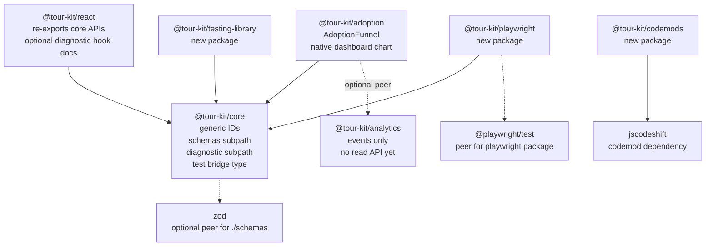

# Sprint 1 - TS-First DX + AdoptionFunnel - Implementation Plan

**Project:** Bundle ideas #34, #91, #32, #85, #86, #84, and #1 into one coherent DX and migration sprint.
**Owner:** domidex01
**Plan revised:** 2026-05-12 after local package analysis
**Start Date:** Week of 2026-05-18
**Target Completion:** 2026-06-05 for the core ship set; 2026-06-12 buffer for codemod stretch scope
**Estimated Effort:** 76-87h for the core DX/funnel/testing ship set; 94-107h with Joyride codemod; 103-118h all-in
**Spec:** [`spec.md`](./spec.md)
**Branch base:** `main` @ 38c89fb in the spec; re-check before kickoff

---

## Executive Summary

The original plan was directionally right but assumed a cleaner package graph than the repository actually has. The current monorepo already has mature `core`, `react`, `adoption`, `analytics`, `license`, `media`, and commercial-feature packages. This sprint should therefore stay additive and package-local: modify `@tour-kit/core`, `@tour-kit/react`, and `@tour-kit/adoption`; add only `@tour-kit/testing-library`, `@tour-kit/playwright`, and `@tour-kit/codemods`.

The biggest plan corrections are:

- `@tour-kit/core` must not import `@tour-kit/license` or `@tour-kit/scheduling`; those would create upward dependencies. Diagnostics in core should expose extension points for package-specific gates instead.
- Zod parity cannot be a naive bidirectional `z.infer<typeof tourSchema> == Tour` assertion because JSON schemas cannot represent React refs, callback functions, or all `ReactNode` values. The schema should validate a JSON-authorable `TourDefinition` subset and use compile-time key coverage tests.
- `@tour-kit/adoption` has aggregate usage state, not queryable event history. Sprint 1 should ship a data-first `<AdoptionFunnel steps={...}>` and a selector for current provider state. Analytics-backed historical funnels require a later event-store API.
- The repo has no type-test harness for `.test-d.ts` files. Phase 0 must add one before Phase 1 and Phase 2 rely on type assertions.
- The existing adoption dashboard uses native CSS charts, not Recharts. Default plan: keep the funnel native and avoid a new chart peer. Add Recharts only if product explicitly chooses that tradeoff.

Recommended scope: ship Phases 0-6 by 2026-06-05, then use the 2026-06-08 to 2026-06-12 buffer for the Joyride codemod (Phase 7a). Treat Shepherd and Driver.js codemods (Phase 7b) as stretch work or a point release.

---

## Package Analysis

| Area | Current repo fact | Planning impact |
| --- | --- | --- |
| Workspace | `pnpm-workspace.yaml` includes `packages/*`, `apps/*`, `tooling/*`, `examples/*`; excludes `apps/smoke`. Root `package.json` also has a `workspaces.catalog` copy. | Use `pnpm-workspace.yaml` as the source of truth and avoid editing two catalogs unless deliberately normalizing them. |
| Root tooling | Turbo runs `build`, `test`, `typecheck`, `bench`, `e2e`. Root `tsconfig.json` only paths/references `core`, `react`, and `hints`. | New packages need package-local `tsconfig`, `vitest.config.ts`, and `tsup.config.ts`; do not rely on root path aliases. |
| `@tour-kit/core` | Version `0.11.0`; dependencies are only `clsx` and `tailwind-merge`; peers are React. Exports only `.` and `./package.json`. | Add `./schemas` and `./diagnostic` subpath exports to protect the main bundle. Keep core at the bottom of the graph. |
| `@tour-kit/react` | Version `0.11.0`; depends on `core`, `media`, Floating UI, Radix Slot, CVA. Re-exports core provider/hooks from `src/index.ts`. | `useTour` is implemented in core, not react. React only needs re-export/doc updates unless a react-only hook is introduced. |
| `@tour-kit/adoption` | Version `1.0.2`; depends on `core` and `license`; optional peer `@tour-kit/analytics`; existing dashboard has stats/table/native category chart. | Funnel should match existing dashboard primitives and license boundary. Do not read analytics internals. |
| `@tour-kit/analytics` | Has `feature_used` event names and a private event queue inside `TourAnalytics`; no public read/query API. | A historical funnel hook cannot be built from the current analytics package without new API scope. |
| New packages | `packages/testing-library`, `packages/playwright`, and `packages/codemods` do not exist. | Scaffolding and publish metadata are real work, not a formality. Add build, typecheck, test, exports, and changesets. |
| Catalog | `zod` is already cataloged at `^4.3.6`; `@playwright/test` is a root dev dependency at `^1.59.1`; `jscodeshift`, `jsdom-testing-mocks`, and `recharts` are absent. | Phase 0 must pin the dependencies actually used by the chosen scope. |

---

## Scope Decisions

### 1. Core Diagnostics Stay Core-Only

Core built-in gates:

- structure: `validateTour`
- audience: `matchesAudience` plus new `explainAudience`
- persistence: completed/skipped/dont-show-again state
- route: route mismatch and route strategy
- target: immediate selector/ref availability, no timeout wait in diagnostic mode
- when: callback false or thrown error
- autostart: disabled/missing autostart reason

Package-specific gates, such as license and scheduling, are represented by a typed `DiagnosticGate` extension interface. They can be supplied by upper packages later without core importing them.

### 2. Schemas Validate JSON-Authorable Tour Definitions

Runtime schemas should not pretend JSON can represent DOM refs or callback functions. Export:

- `tourDefinitionSchema`
- `tourStepDefinitionSchema`
- `flowSourceSchema`
- `parseTourDefinition`, `safeParseTourDefinition`
- `createTourDefinitionSchema({ contentSchema })` for teams that want structured CMS content

The type guarantee is:

- schema output is assignable to `TourDefinition`
- `TourDefinition` keys stay covered when `Tour` grows
- rejected fields and unsupported runtime-only values have explicit tests/docs

### 3. AdoptionFunnel Is Data-First In Sprint 1

Default component API:

```ts
export interface FunnelStep {
  id: string
  label: string
  entered: number
  completed?: number
}

export interface AdoptionFunnelProps {
  steps: readonly FunnelStep[]
  title?: React.ReactNode
  onStepClick?: (step: FunnelStep, index: number) => void
  emptyState?: React.ReactNode
}
```

Optional helper:

```ts
useFunnelData({ featureIds: string[] })
```

This helper can derive a simple current-state funnel from `useAdoptionStats()` and `usageMap`, but it must not claim historical date-range analytics until `@tour-kit/analytics` exposes queryable storage.

### 4. Native Chart First, Recharts As Explicit Tradeoff

The repo's dashboard chart is currently native CSS. Sprint 1 should implement the funnel the same way to keep bundle size and optional peers lower. If product insists on Recharts parity, add `recharts` as an optional peer in Phase 0 and increase Phase 4 by about 2h plus the bundle budget.

---

## Corrected Architecture



Non-negotiable dependency rule: `@tour-kit/core` may keep React as a peer, but it must not depend on `@tour-kit/react`, `@tour-kit/adoption`, `@tour-kit/analytics`, `@tour-kit/license`, `@tour-kit/scheduling`, `@tour-kit/media`, or any new package.

---

## Project Structure

```text
tour-kit/
+-- packages/
|   +-- core/                              [MODIFIED]
|   |   +-- src/types/
|   |   |   +-- step.ts                    (generic ID)
|   |   |   +-- tour.ts                    (generic tour shape)
|   |   |   +-- state.ts                   (typed goToStep/startTour)
|   |   |   +-- diagnostic.ts              (new)
|   |   |   +-- test-bridge.ts             (new)
|   |   +-- src/lib/
|   |   |   +-- audience.ts                (add explainAudience)
|   |   |   +-- diagnostic.ts              (new)
|   |   |   +-- schemas/                   (new subpath)
|   |   +-- src/hooks/use-tour.ts          (surface typed goToStep)
|   |   +-- src/context/tour-provider.tsx  (diagnose + test bridge)
|   |   +-- src/__tests__/types/           (type-test fixtures)
|   +-- react/                             [MODIFIED]
|   |   +-- src/index.ts                   (re-export new core APIs)
|   +-- adoption/                          [MODIFIED]
|   |   +-- src/components/dashboard/
|   |       +-- adoption-funnel.tsx        (new)
|   +-- testing-library/                   [NEW PACKAGE]
|   +-- playwright/                        [NEW PACKAGE]
|   +-- codemods/                          [NEW PACKAGE]
+-- apps/docs/content/docs/
|   +-- core/
|   +-- adoption/dashboard/
|   +-- guides/
|   +-- migration/
+-- tasks/sprint-1-ts-first-dx/
    +-- spec.md
    +-- big-plan.md
```

---

## Phase Breakdown

### Phase 0: Repo Alignment And Gates (Days 1-2)

**Goal:** Remove ambiguity before implementation starts.

| # | Task | Hours | Output |
| --- | --- | --- | --- |
| 0.1 | Treat `pnpm-workspace.yaml` as catalog source; add only the dependencies selected for this sprint. | 0.75 | Catalog entries for `jscodeshift`, `@types/jscodeshift`, `jsdom-testing-mocks`, and `@playwright/test` if package-local devDeps need catalog. |
| 0.2 | Add a type-test harness for core, preferably `tsconfig.type-tests.json` plus `typecheck:types`; no new dependency unless needed. | 1.5 | Type assertions can use `@ts-expect-error` and fail in CI. |
| 0.3 | Decide final chart dependency: native CSS default vs Recharts optional peer. | 0.25 | Decision logged here and in Phase 4 tasks. |
| 0.4 | Decide diagnostic extension API for non-core gates. | 0.75 | `DiagnosticGate` shape documented before code. |
| 0.5 | Gather Joyride fixture corpus, including JSX and hook API cases. | 3 | `packages/codemods/__tests__/fixtures/joyride/*`. |
| 0.6 | Gather Shepherd and Driver.js fixture corpora if Phase 7b stays in scope. | 2 | Fixture directories for stretch transforms. |
| 0.7 | Spike one jscodeshift TSX transform and bin execution. | 1 | Go/no-go: jscodeshift vs ts-morph. |

**Exit Criteria:**

- [ ] `pnpm install` resolves with the selected catalog entries.
- [ ] Type-test harness fails on an intentional `@ts-expect-error` removal.
- [ ] Joyride fixture spike runs on at least one real fixture and emits valid TSX.
- [ ] Phase 4 chart dependency decision is explicit.
- [ ] Core diagnostic plan does not require upward package imports.

**Total:** 8-10h

---

### Phase 1: Type-Safe Step IDs - #34 (Day 3)

**Goal:** Preserve dynamic-string compatibility while enabling typed step IDs for const-authored tours.

| # | Task | Hours | Dependencies | Output |
| --- | --- | --- | --- | --- |
| 1.1 | Add `TourStep<TId extends string = string>` and generic `StepOptions<TId>`. | 1 | 0.2 | `packages/core/src/types/step.ts`. |
| 1.2 | Add `Tour<TStep extends TourStep = TourStep>` and update callbacks that receive a step. | 1 | 1.1 | `packages/core/src/types/tour.ts`. |
| 1.3 | Propagate typed IDs through `TourActions`, `TourContextValue`, and `UseTourReturn`; expose `goToStep` from `useTour`. | 2 | 1.1 | `state.ts`, `tour-context.ts`, `hooks/use-tour.ts`. |
| 1.4 | Add helpers `StepIdOf<TSteps>` and `defineTour` or `createTour` typing overloads if needed for inference. | 1 | 1.2 | `types/step.ts`, `utils/create-tour.ts`. |
| 1.5 | Add type tests for narrowed tuple IDs, dynamic widening, `useTour().goToStep`, and `startTour(tourId, stepId)`. | 1.5 | 1.3 | `packages/core/src/__tests__/types/*.test-d.ts`. |
| 1.6 | Docs update in existing TypeScript/getting-started or new typed-step-ids guide; update docs meta. | 1 | 1.5 | MDX + `meta.json`. |

**Exit Criteria:**

- [ ] Dynamic `Tour` still accepts arbitrary string IDs.
- [ ] Const-authored steps reject misspelled IDs in `goToStep`.
- [ ] `useTour` and context no longer disagree about `goToStep`.
- [ ] `pnpm --filter @tour-kit/core typecheck` and the new type-test script pass.

**Total:** 7-8h

---

### Phase 2: Zod Schemas For Tour Definitions - #91 (Days 4-6)

**Goal:** Validate JSON/CMS input at the boundary without pulling Zod into the main core bundle.

| # | Task | Hours | Dependencies | Output |
| --- | --- | --- | --- | --- |
| 2.1 | Define `TourDefinition`, `TourStepDefinition`, `JsonValue`, and runtime-only exclusions. | 1.5 | 1.2 | `packages/core/src/types/tour-definition.ts`. |
| 2.2 | Implement audience and step schemas for the JSON-authorable subset. | 2 | 2.1 | `src/lib/schemas/*.schema.ts`. |
| 2.3 | Implement `tourDefinitionSchema`, `flowSourceSchema`, and parser helpers. | 2 | 2.2 | `src/lib/schemas/parse.ts`. |
| 2.4 | Add `@tour-kit/core/schemas` subpath export and tsup entry; mark `zod` optional peer. | 1.5 | 2.3 | `package.json`, `tsup.config.ts`. |
| 2.5 | Add key-coverage type tests instead of impossible `Tour == z.infer` equality. | 2 | 2.1 | Type-test fixtures. |
| 2.6 | Runtime tests: valid JSON, malformed IDs, empty steps, ref target rejection, unsupported function fields. | 2 | 2.3 | Vitest suite. |
| 2.7 | Bundle check: main `@tour-kit/core` import does not include Zod; schemas subpath has its own budget. | 1 | 2.4 | Size check task or build-artifact test. |
| 2.8 | Docs: schema guide, CMS example, and "JSON subset vs runtime Tour" caveat. | 1.5 | 2.6 | MDX + docs meta. |

**Exit Criteria:**

- [ ] `import '@tour-kit/core'` remains Zod-free.
- [ ] `import '@tour-kit/core/schemas'` works in ESM and CJS.
- [ ] Schema type tests fail when a JSON-authorable `Tour` key is added without schema coverage.
- [ ] Docs do not claim refs/functions are JSON-validated.

**Total:** 13-15h

---

### Phase 3: Diagnostic Engine And React Surface - #32 (Days 7-10)

**Goal:** Explain why a tour will not fire without adding non-core dependencies or making diagnostics mandatory.

| # | Task | Hours | Dependencies | Output |
| --- | --- | --- | --- | --- |
| 3.1 | Define `GateCode`, `GateReason`, `EligibilityReport`, `DiagnosticContext`, and `DiagnosticGate`. | 1.5 | 0.4 | `packages/core/src/types/diagnostic.ts`. |
| 3.2 | Add `explainAudience` next to `matchesAudience` with structured details. | 1.5 | 3.1 | `packages/core/src/lib/audience.ts`. |
| 3.3 | Implement built-in core gates: structure, audience, persistence, route, target, when, autostart. | 4 | 3.1 | `packages/core/src/lib/diagnostic.ts`. |
| 3.4 | Compose `explainTour(tour, ctx, gates?)`; never throw, preserve first failing gate. | 2 | 3.3 | Diagnostic orchestrator. |
| 3.5 | Add `diagnose?: boolean` and optional `diagnosticGates?: DiagnosticGate[]` to `TourProvider`. | 2 | 3.4 | Provider context diagnostics map. |
| 3.6 | Add `useTourDiagnostic(tourId)` in core and re-export through `@tour-kit/react`. | 1 | 3.5 | Hook + react barrel. |
| 3.7 | Tests for each built-in gate, provider wiring, hook updates, and extension-gate execution. | 3 | 3.2-3.6 | Core/react tests. |
| 3.8 | Bundle/perf checks: diagnostic subpath budget; explain 5-step tour p95 target under 2ms excluding DOM wait time. | 1.5 | 3.4 | Bench/build tests. |
| 3.9 | Docs: diagnostic guide and extension-gate example for license/scheduling packages. | 1.5 | 3.7 | MDX + docs meta. |

**Exit Criteria:**

- [ ] Core has no imports from `@tour-kit/license` or `@tour-kit/scheduling`.
- [ ] `matchesAudience` remains boolean-compatible for existing callers.
- [ ] `explainTour` returns structured details and never throws.
- [ ] Extension gate test proves upper packages can contribute diagnostic reasons later.

**Total:** 17-18h

---

### Phase 4: AdoptionFunnel Widget - #1 (Days 11-12)

**Goal:** Ship the requested funnel visualization in a shape compatible with current adoption data.

| # | Task | Hours | Dependencies | Output |
| --- | --- | --- | --- | --- |
| 4.1 | Add `FunnelStep` and `AdoptionFunnelProps` to adoption types. | 0.75 | 0.3 | `packages/adoption/src/types/feature.ts` or dashboard-local type. |
| 4.2 | Implement pure `calculateFunnelMetrics(steps)` utility. | 1 | 4.1 | Unit-tested helper. |
| 4.3 | Implement `useFunnelData({ featureIds })` as a current-state selector over `useAdoptionStats`; document limits. | 1.5 | 4.1 | `packages/adoption/src/hooks/use-funnel-data.ts`. |
| 4.4 | Build native CSS `<AdoptionFunnel>` matching existing dashboard variants and no nested cards. | 2 | 4.2 | `components/dashboard/adoption-funnel.tsx`. |
| 4.5 | Add empty state, click handling, keyboard/a11y labels, and hidden table fallback. | 1.5 | 4.4 | Component + styles. |
| 4.6 | Tests: render, labels, metrics, clicks, empty state, axe zero violations. | 2 | 4.4 | Vitest/RTL suite. |
| 4.7 | Export from dashboard barrel and docs under existing `adoption/dashboard` docs. | 1 | 4.6 | Barrel + MDX + meta. |

**Exit Criteria:**

- [ ] No new chart peer unless Phase 0 explicitly chose it.
- [ ] Component can be used with explicit `steps` without an `AdoptionProvider`.
- [ ] Hook path works inside `AdoptionProvider` and clearly documents current-state semantics.
- [ ] Axe check has zero violations.

**Total:** 9-10h

---

### Phase 5: Testing-Library Package - #85 (Days 13-15)

**Goal:** Provide reliable RTL helpers around existing Tour Kit behavior without global DOM monkey-patching by default.

| # | Task | Hours | Dependencies | Output |
| --- | --- | --- | --- | --- |
| 5.1 | Scaffold `@tour-kit/testing-library` with tsup, vitest, package exports, and publish metadata. | 1.5 | 0.1 | New package. |
| 5.2 | Define peers/devDeps for React, RTL, user-event, and optional `jsdom-testing-mocks`. | 1 | 5.1 | `package.json`. |
| 5.3 | Implement `virtualTarget(rect?)` and `setupTourKitTesting({ positionShim })`. | 2 | 5.2 | Helpers + setup subpath. |
| 5.4 | Implement interaction helpers: `expectStepVisible`, `advanceTour`, `previousTour`, `goToStep`, `skipTour`, `completeTour`. | 3 | 1.3, 5.3 | Helper modules. |
| 5.5 | Add `TourKitTestingError` with useful timeout/context messages. | 0.75 | 5.4 | Error module. |
| 5.6 | Integration tests against existing `TourCard`/provider fixtures without manual `act` calls. | 3 | 5.4 | Test suite. |
| 5.7 | Docs: testing guide, virtual target pattern, and opt-in global shim caveat. | 1.5 | 5.6 | MDX + meta. |

**Exit Criteria:**

- [ ] Default setup does not patch `Element.prototype`.
- [ ] Helpers pass against real Tour Kit components under jsdom.
- [ ] `@tour-kit/testing-library` and `@tour-kit/testing-library/setup` resolve in ESM and CJS.

**Total:** 12-14h

---

### Phase 6: Playwright Fixtures And Test Bridge - #86 (Days 16-17)

**Goal:** Make E2E tour control a one-line Playwright import while keeping the bridge opt-in.

| # | Task | Hours | Dependencies | Output |
| --- | --- | --- | --- | --- |
| 6.1 | Define `TestBridge` and `Window.__tourKit__` global typing in core. | 1 | 3.4 | `types/test-bridge.ts`. |
| 6.2 | Add `enableTestBridge?: boolean` to `TourProvider`; expose bridge in an effect only when true. | 2 | 6.1 | Provider wiring. |
| 6.3 | Tests: absent by default, present when enabled, cleanup on unmount, dev warning. | 2 | 6.2 | Core tests. |
| 6.4 | Scaffold `@tour-kit/playwright` with peer `@playwright/test` and exports. | 1.5 | 0.1 | New package. |
| 6.5 | Implement `test.extend({ tour })` helpers: start, waitForStep, next, previous, complete, skip, getDiagnostic. | 2.5 | 6.2 | Fixture package. |
| 6.6 | Smoke E2E against an existing example app or a tiny fixture app. | 2 | 6.5 | Playwright test. |
| 6.7 | Docs: E2E guide with `enableTestBridge={process.env.NODE_ENV !== 'production'}`. | 1 | 6.6 | MDX + meta. |

**Exit Criteria:**

- [ ] `window.__tourKit__` is absent unless opted in.
- [ ] Fixture helper types are strict and expose `EligibilityReport`.
- [ ] Smoke test proves the bridge works in a browser, not only jsdom.

**Total:** 10-12h

---

### Phase 7a: Codemods - Joyride First - #84 (Days 18-21)

**Goal:** Ship the highest-value migration path first and leave infrastructure reusable.

| # | Task | Hours | Dependencies | Output |
| --- | --- | --- | --- | --- |
| 7a.1 | Scaffold `@tour-kit/codemods` with bin, tsup, CJS/ESM output, and fixture test runner. | 3 | 0.7 | New package. |
| 7a.2 | Implement CLI args: `--from`, `--parser`, `--dry-run`, `--print`, `--extensions`, exit codes. | 2 | 7a.1 | `bin/tour-kit-migrate.ts`. |
| 7a.3 | Implement shared step mapper and TODO emitter. | 2 | 7a.1 | `src/lib/*`. |
| 7a.4 | Implement Joyride JSX transform. | 3 | 0.5, 7a.3 | `from-joyride.ts`. |
| 7a.5 | Implement Joyride hook transform for common controls; TODO unsupported return fields. | 3 | 7a.4 | Same transform. |
| 7a.6 | Fixture tests and coverage matrix; target >=80% of committed Joyride fixtures. | 3 | 7a.4, 7a.5 | Tests + docs matrix. |
| 7a.7 | Docs: Joyride migration page and in-package README. | 2 | 7a.6 | MDX + package docs. |

**Exit Criteria:**

- [ ] `--dry-run` leaves files unchanged.
- [ ] Unsupported Joyride patterns get local `TODO` comments with docs links.
- [ ] JSX and hook API fixtures are both covered.

**Total:** 18-20h

---

### Phase 7b: Codemods - Shepherd And Driver.js Stretch - #84 (Buffer)

**Goal:** Reuse Phase 7a infrastructure if the sprint still has capacity.

| # | Task | Hours | Dependencies | Output |
| --- | --- | --- | --- | --- |
| 7b.1 | Shepherd transform, fixture tests, and coverage matrix. | 4.5 | 7a.3 | Transform + docs. |
| 7b.2 | Driver.js transform, fixture tests, and coverage matrix. | 3.5 | 7a.3 | Transform + docs. |
| 7b.3 | Final package README and changeset consolidation. | 1 | 7b.1, 7b.2 | Release notes. |

**Exit Criteria:**

- [ ] Each stretch transform reaches >=80% on its committed corpus.
- [ ] If either misses the threshold, ship it as experimental or defer it.

**Total:** 9-11h

---

## Timeline

| Window | Dates | Recommended work |
| --- | --- | --- |
| Week 1 | 2026-05-18 to 2026-05-22 | Phase 0, Phase 1, start Phase 2 |
| Week 2 | 2026-05-25 to 2026-05-29 | Finish Phase 2, Phase 3, start Phase 4 |
| Week 3 | 2026-06-01 to 2026-06-05 | Finish Phase 4, Phase 5, Phase 6, start Joyride codemod if CI is green |
| Buffer | 2026-06-08 to 2026-06-12 | Finish Phase 7a; attempt Phase 7b only if 7a is stable |

This is a four-week ship in practice if all codemods are included. The three-week target is realistic only if Phase 7b is deferred and Phase 7a stays close to the low estimate.

---

## Hour Summary

| Phase | Description | Hours |
| --- | --- | --- |
| Phase 0 | Repo alignment and gates | 8-10 |
| Phase 1 | Type-safe step IDs | 7-8 |
| Phase 2 | Zod schemas | 13-15 |
| Phase 3 | Diagnostics | 17-18 |
| Phase 4 | AdoptionFunnel | 9-10 |
| Phase 5 | Testing-library | 12-14 |
| Phase 6 | Playwright fixtures | 10-12 |
| Phase 7a | Joyride codemod | 18-20 |
| **Recommended Sprint 1 total** | Phases 0-7a | **94-107** |
| Phase 7b | Shepherd + Driver stretch | 9-11 |
| **All-in total** | Phases 0-7b | **103-118** |

If the cap is truly 75-90h, cut Phase 7a to a CLI + JSX-only Joyride MVP or move all codemods to Sprint 2. The package analysis shows the core/schema/diagnostic/testing work alone has enough integration surface to consume a full sprint.

---

## Milestone Gates

| Gate | Condition | Exit Criteria |
| --- | --- | --- |
| M0 | End of Phase 0 | Catalog resolved, type-test harness works, diagnostic extension design approved, Joyride spike passes. |
| M1 | End of Phase 1 | Typed IDs reject misspellings while dynamic tours remain compatible. |
| M2 | End of Phase 2 | Schemas subpath works; main core bundle is Zod-free; JSON subset caveat is tested and documented. |
| M3 | End of Phase 3 | Core diagnostics explain all core gates and support extension gates without upward imports. |
| M4 | End of Phase 4 | Funnel renders explicit steps, has a11y fallback, and does not require historical analytics. |
| M5 | End of Phase 5 | RTL helpers pass against real components without manual consumer `act` flushes. |
| M6 | End of Phase 6 | Playwright bridge is absent by default and works when enabled in a browser smoke test. |
| M7a | End of Phase 7a | Joyride transform passes >=80% corpus threshold and emits TODOs for unsupported cases. |
| M7b | Stretch | Shepherd and Driver transforms meet the same threshold or are deferred. |

---

## Risk Register

| # | Risk | Likelihood | Impact | Mitigation |
| --- | --- | --- | --- | --- |
| R1 | Type-safe IDs get over-promised because provider inference is limited. | Medium | Medium | Ship explicit helper types and tests for the supported patterns; document dynamic-tour fallback. |
| R2 | Zod schema parity drifts from runtime `Tour`. | Medium | High | Validate a named `TourDefinition` subset and add key-coverage type tests instead of impossible exact equality. |
| R3 | Diagnostics accidentally pull upper packages into core. | Medium | High | Enforce no upward imports in review and add tests/lint checks if practical. Use `DiagnosticGate` extension points. |
| R4 | AdoptionFunnel is expected to show historical conversion but current packages only expose aggregate usage. | High | Medium | Make component data-first; docs clearly distinguish current-state funnel from future analytics-backed funnel. |
| R5 | Testing helpers hide real browser positioning bugs. | Medium | Medium | Positioning helpers assert visibility/control flow, not pixel-perfect coordinates; browser behavior remains covered by Phase 6. |
| R6 | Playwright bridge leaks into production. | Low | High | Default off, tests assert absence, docs gate by environment, cleanup on unmount. |
| R7 | Codemod scope exceeds estimates due to unsupported library APIs. | High | High | Joyride first, coverage matrix, TODO emitter, Phase 7b stretch. |
| R8 | New package scaffolds are under-tested across ESM/CJS. | Medium | Medium | Add build artifact/export tests for each new package before changeset. |

---

## Release Strategy

Open PRs in this order:

1. `chore(repo): sprint gates and type-test harness`
2. `feat(core): typed step ids`
3. `feat(core): tour definition schemas`
4. `feat(core): diagnostics`
5. `feat(adoption): adoption funnel`
6. `feat(testing-library): rtl helpers`
7. `feat(playwright): tour fixtures`
8. `feat(codemods): joyride migration`
9. `feat(codemods): shepherd and driver migrations` (stretch)

Changesets:

- Minor bump: `@tour-kit/core`, `@tour-kit/react`, `@tour-kit/adoption`.
- Initial minor or `0.x` release: `@tour-kit/testing-library`, `@tour-kit/playwright`, `@tour-kit/codemods`.
- Do not combine codemod stretch changes into the main release if they miss coverage thresholds.

---

## Validation Commands

Run these before each PR lands, scoped where possible:

```sh
pnpm --filter @tour-kit/core typecheck
pnpm --filter @tour-kit/core test
pnpm --filter @tour-kit/react test
pnpm --filter @tour-kit/adoption test
pnpm --filter @tour-kit/testing-library test
pnpm --filter @tour-kit/playwright test
pnpm --filter @tour-kit/codemods test
pnpm build:packages
pnpm typecheck
pnpm test
```

For phases that add subpath exports, also run a build-artifact/export test that imports the built `dist` output from both ESM and CJS.

---

## Deferred Follow-Ups

- Analytics-backed historical funnels need a public event storage/query API in `@tour-kit/analytics`.
- License and scheduling diagnostic gates should live in their owning packages or be provided through `DiagnosticGate`.
- Recharts can be added later if product needs richer charts than native dashboard bars.
- Shepherd and Driver.js codemods should not block the core TS-first DX release.
