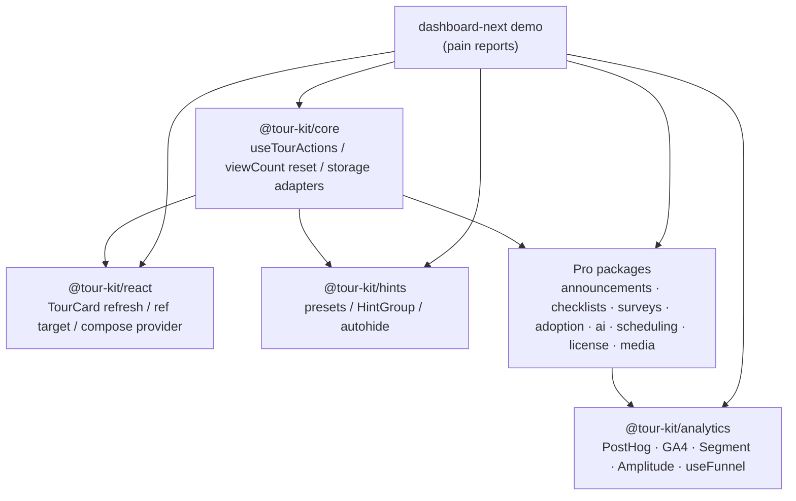
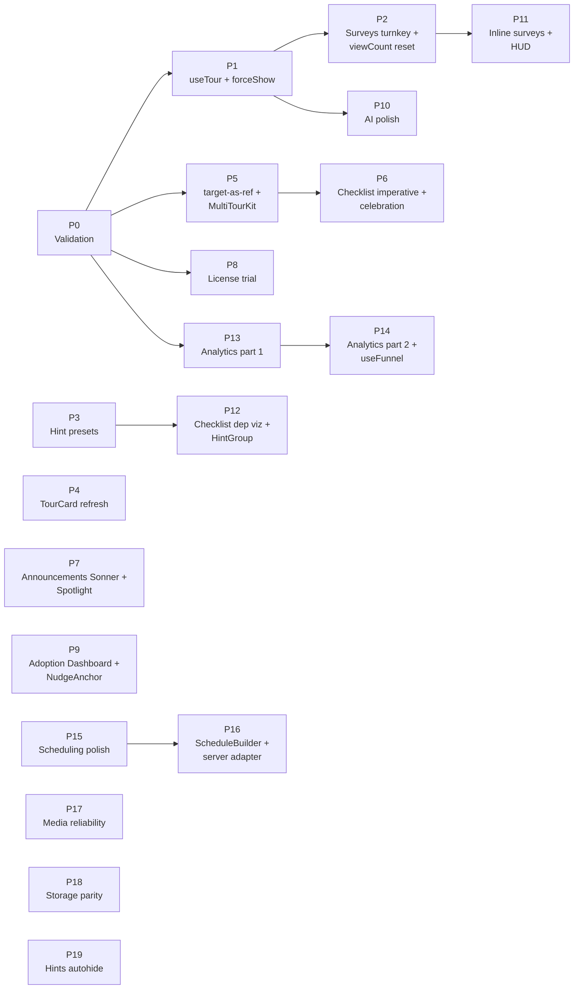

# Tour Kit v2 — Package Polish Implementation Plan

**Project:** Close the demo-wiring gaps across all 12 tour-kit packages with PR-sized improvements ordered by DX pain felt during the dashboard-next build.
**Owner:** @domidex01
**Start Date:** Week of 2026-05-18
**Target Completion:** ~13 weeks (week of 2026-08-17) at 15 h/week solo
**Total Estimated Effort:** 175–245 h across 20 phases

---

## Project Vision

Every item on this roadmap traces back to a concrete papercut from wiring `examples/dashboard-next/` against the live packages — workarounds the author had to invent (a `ReplayBridge` window event, a manual `localStorage` clear + unregister + register dance, hand-composed CSAT modals, a fake "click the DOM button" launcher trigger). The plan converts those workarounds into first-class APIs so the next consumer doesn't reinvent them. Guiding constraint: **every phase ships as one mergeable PR with backwards-compatible types** — no version-skew gates, no big-bang migration.

---

## System Architecture



The plan treats `@tour-kit/core` as the API contract surface — every cross-cutting change (registry hook, reset semantics, storage adapters, slot/ref shape) lands in core first, then radiates outward to dependent packages in later phases.

---

## Project Structure

```
tasks/v2-package-polish/
├── big-plan.md                # this file
├── phase-0-validation.md      # Phase 0 plan (created in run-phase)
├── phase-N.md                 # one file per phase as work begins
├── phase-N-status.json        # auto-impl checkpoint per phase
└── tests/
    └── phase-N-test-plan.md   # generated by /phase-tests before coding
```

Per-package code lives in the existing monorepo layout — this directory only holds planning artifacts:

```
packages/
├── core/                    # cross-cutting contracts land here first
│   ├── src/registry/        # NEW: useTourActions(id) hook (Phase 1)
│   ├── src/storage/         # cookie + indexedDB adapters (Phase 18)
│   └── src/ui-library-context.tsx  # existing — unchanged
├── react/
│   └── src/components/tour/ # TourCard refresh (Phase 4), ref target (Phase 5)
├── hints/                   # variants (Phase 3), HintGroup (Phase 12), autohide (Phase 19)
├── announcements/           # forceShow (Phase 1), Sonner pipe + Spotlight (Phase 7)
├── surveys/                 # CsatModal/NpsModal/CesModal (Phase 2), inline + HUD (Phase 11)
├── checklists/              # imperative ref + celebration (Phase 6), dep viz (Phase 12)
├── adoption/                # AdoptionDashboard + NudgeAnchor (Phase 9), server adapter (Phase 16)
├── ai/                      # context preview + actions + themes (Phase 10)
├── analytics/               # destinations (Phase 13–14), useFunnel (Phase 14)
├── scheduling/              # a11y fix + ICS (Phase 15), ScheduleBuilder (Phase 15–16)
├── license/                 # trial + dev affordance + TestMode (Phase 8)
└── media/                   # click-to-load + Placeholder + Caption (Phase 17)
```

---

## Phase Breakdown

### Phase 0: Validation Gate (Days 1–2)

**Goal:** Lock the cross-cutting API contracts that span 4+ packages before any implementation begins. Bad API choices here cascade into every later phase.

| #   | Task                                                                                                              | Hours | Output                                                                            |
| --- | ----------------------------------------------------------------------------------------------------------------- | ----- | --------------------------------------------------------------------------------- |
| 0.1 | Walk `dashboard-next` again with the user list in hand; record any additional gaps not in the inbound list        | 1–2 h | `phase-0-validation.md` gap addendum                                              |
| 0.2 | Spec the `useTourActions(id)` registry signature — does it return `start/stop/restart` or full controller surface? Confirm window-event shim deprecation path  | 1 h   | TypeScript signature in `phase-0-validation.md`                                   |
| 0.3 | Spec the `target` ref-or-selector union type (does `target` accept `RefObject<HTMLElement>`, `() => HTMLElement \| null`, or both?) | 1 h   | Type decision recorded                                                            |
| 0.4 | Spec `forceShow(id)` interface and what it bypasses (frequency, cooldown, viewCount, isDismissed — all of them?) | 0.5 h | Behaviour matrix in `phase-0-validation.md`                                       |
| 0.5 | Confirm peer-dep impact: adding `sonner`, `posthog-js`, `gtag`, etc. — peer-optional or peer-required?            | 1 h   | Peer-dep audit table                                                              |
| 0.6 | Decide trial-tier semantics: license server-emitted or client-extrapolated from `issuedAt + trialDays`?           | 0.5 h | Decision recorded; if server-emitted → block Phase 8 until Polar API supports it  |

**Exit Criteria:**

- [ ] Every contract above has a signed-off TypeScript signature in `phase-0-validation.md`
- [ ] Peer-dep audit identifies zero hard breakages for existing consumers
- [ ] Go/no-go on trial tier: if Polar can't emit `tier="trial"`, Phase 8 reorders to client-side fallback OR drops to backlog
- [ ] User explicitly approves the phase-0 doc before Phase 1 starts

**Deliverables:** `tasks/v2-package-polish/phase-0-validation.md`

---

### Phase 1: useTour Reach + Force-Show (Days 3–8)

**Goal:** Eliminate the two workarounds the user explicitly called out as causing "most of the demo wiring pain."

| #   | Task                                                                                                          | Hours  | Dependencies | Output                                              |
| --- | ------------------------------------------------------------------------------------------------------------- | ------ | ------------ | --------------------------------------------------- |
| 1.1 | `useTourActions(id)` registry hook in `@tour-kit/core` — standalone `<Tour>` instances self-register at mount | 5–7 h  | 0.2          | `packages/core/src/registry/tour-registry.tsx`     |
| 1.2 | Deprecate `ReplayBridge` window event; codemod entry in `@tour-kit/codemods`                                  | 1–2 h  | 1.1          | Deprecation warning + codemod                       |
| 1.3 | `forceShow(id)` on `AnnouncementsProvider` — bypasses frequency / cooldown / viewCount per Phase 0 matrix      | 3–4 h  | 0.4          | New method on `useAnnouncements()`                  |
| 1.4 | Docs page: "Imperative tour control" + "Force-showing announcements (admin previews)"                          | 1 h    | 1.1, 1.3     | `apps/docs/content/docs/guides/imperative-control.mdx` |

**Exit Criteria:**

- [ ] `useTourActions("welcome").start()` works from a sibling subtree in a Storybook story
- [ ] `forceShow("welcome-modal")` displays the announcement even when `frequency: "once"` and `viewCount >= 1`
- [ ] All existing tour and announcement tests still pass (no regression)
- [ ] `examples/dashboard-next` can delete `ReplayBridge` and the LS-clear+unregister+register dance

**Deliverables:** `packages/core/src/registry/`, updated `AnnouncementsProvider`, docs page, codemod

---

### Phase 2: Surveys Turnkey + viewCount Reset (Days 9–14)

**Goal:** Ship one-line CSAT/NPS/CES adoption surface; fix `reset()` semantics in announcements.

| #   | Task                                                                                                                              | Hours | Dependencies | Output                                              |
| --- | --------------------------------------------------------------------------------------------------------------------------------- | ----- | ------------ | --------------------------------------------------- |
| 2.1 | `reset()` on `AnnouncementsProvider` clears `viewCount` in addition to `isDismissed` (today only the latter)                       | 2–3 h | 1.3          | `packages/announcements/src/context/announcements-provider.tsx` update |
| 2.2 | `<CsatModal question rating onSubmit onSkip />` — turnkey single-question CSAT (no `SurveyModal` + `QuestionRating` composition)   | 3–4 h | —            | `packages/surveys/src/components/csat-modal.tsx`   |
| 2.3 | `<NpsModal />` and `<CesModal />` mirroring the CSAT API                                                                          | 3–4 h | 2.2          | Two more components                                 |
| 2.4 | Snapshot tests + docs page with one-line examples for each modal                                                                   | 1–2 h | 2.3          | Tests + docs                                        |

**Exit Criteria:**

- [ ] `<CsatModal question="How easy was…" onSubmit={fn} />` renders without any other `@tour-kit/surveys` imports
- [ ] `reset()` followed by re-trigger displays announcement (was previously stuck on `viewCount >= 1`)
- [ ] Bundle delta for the three new components: <2 KB gzipped combined

**Deliverables:** 3 new survey components, updated provider, docs

---

### Phase 3: Hint Presets (Days 15–19)

**Goal:** Kill the "6px dot is invisible" complaint with three named variants.

| #   | Task                                                                                          | Hours | Dependencies | Output                                  |
| --- | --------------------------------------------------------------------------------------------- | ----- | ------------ | --------------------------------------- |
| 3.1 | `variant="badge"` preset — high-contrast circular badge with count slot                       | 2–3 h | —            | `packages/hints/src/variants/badge.tsx` |
| 3.2 | `variant="beacon-with-label"` — beacon + adjacent label, position-aware (left/right of target) | 3–4 h | 3.1          | `variants/beacon-with-label.tsx`        |
| 3.3 | `variant="what-s-new-pill"` — pill with sparkle icon, fades after first interaction            | 2–3 h | 3.1          | `variants/whats-new-pill.tsx`           |
| 3.4 | Visual regression tests (Playwright) for each variant on light + dark backgrounds              | 1–2 h | 3.3          | `packages/hints/__tests__/variants/`    |

**Exit Criteria:**

- [ ] All three presets render at ≥24×24 px and pass WCAG 2.1 AA contrast on a white background
- [ ] `<HintHotspot variant="badge">` works with no other props
- [ ] Each variant has a documented example in `apps/docs/content/docs/hints/variants.mdx`

**Deliverables:** 3 preset components, visual regression suite, docs

---

### Phase 4: TourCard Design Refresh (Days 20–24)

**Goal:** Make `<TourCard>` look like a 2026 product tour, not a 2018 modal.

| #   | Task                                                                                                                            | Hours | Dependencies | Output                                            |
| --- | ------------------------------------------------------------------------------------------------------------------------------- | ----- | ------------ | ------------------------------------------------- |
| 4.1 | Visual: step-of-N indicator (`3 / 7`) + optional `<ProgressBar value={current/total} />` slot                                    | 2–3 h | —            | `packages/react/src/components/tour/tour-card.tsx` |
| 4.2 | Visual: real arrow/beak pointing at target (Floating UI middleware), supports all 12 placement combinations                      | 4–5 h | 4.1          | Arrow component                                   |
| 4.3 | Hierarchy: demote Skip to a tertiary text link; promote Next as primary; keep Prev secondary                                    | 1–2 h | 4.1          | Button variant rework                             |
| 4.4 | Accessibility audit: arrow is `aria-hidden`, step indicator is in the `aria-label` of the card, focus ring on Next               | 1–2 h | 4.2, 4.3     | A11y tests pass                                   |

**Exit Criteria:**

- [ ] Visual regression snapshot diff approved by user
- [ ] Step indicator renders inside `aria-label`, not as separate announcement (screen-reader doesn't double-read)
- [ ] Arrow correctly points at target in all 12 placements (matched to Floating UI's middleware)
- [ ] Lighthouse Accessibility on a tour page stays at 100

**Deliverables:** refreshed `TourCard`, arrow component, visual regression snapshots

---

### Phase 5: target-as-ref + MultiTourKit Compose (Days 25–29)

**Goal:** Stop selectors breaking on portal'd / dynamically-IDed elements, and remove the sibling-vs-wrapper choice from the multi-tour API.

| #   | Task                                                                                                                                            | Hours | Dependencies | Output                                      |
| --- | ----------------------------------------------------------------------------------------------------------------------------------------------- | ----- | ------------ | ------------------------------------------- |
| 5.1 | `target` prop accepts `string \| RefObject<HTMLElement> \| (() => HTMLElement \| null)` (union from Phase 0)                                     | 3–4 h | 0.3          | Type widening + runtime resolver            |
| 5.2 | `<MultiTourKitProvider>{children}` — children render inside the provider tree, removing the sibling/wrapper ambiguity                            | 3–4 h | —            | `packages/react/src/components/multi-tour/` |
| 5.3 | Codemod: rewrite `target="#foo"` to ref-based pattern where a `useRef` is already in scope (best-effort, AST-based)                              | 2 h   | 5.1          | `@tour-kit/codemods/target-to-ref`          |

**Exit Criteria:**

- [ ] `<TourStep target={useRef(buttonEl)} />` works without any selector
- [ ] Selector path still works (backwards compatible) and is documented as fallback
- [ ] `<MultiTourKitProvider>` test: `useTour` works from a deeply nested child without the consumer touching component order

**Deliverables:** updated types, compose-mode provider, codemod

---

### Phase 6: Checklist Imperative + Completion Celebration (Days 30–34)

**Goal:** Make `<ChecklistLauncher>` externally controllable and celebrate the last task flipping.

| #   | Task                                                                                                            | Hours | Dependencies | Output                                              |
| --- | --------------------------------------------------------------------------------------------------------------- | ----- | ------------ | --------------------------------------------------- |
| 6.1 | `forwardRef` on `<ChecklistLauncher>` exposing `{ open(), close(), toggle() }`                                  | 2–3 h | —            | `packages/checklists/src/components/checklist-launcher.tsx` |
| 6.2 | Completion celebration: `<ChecklistCompletion variant="confetti" \| "checkmark" \| "none" />` — fires when last task completes | 3–4 h | —            | `checklist-completion.tsx` + reduced-motion gate    |
| 6.3 | Honor `prefers-reduced-motion`: confetti becomes a static "Done!" badge under reduce                            | 1 h   | 6.2          | Three-tier defense per CLAUDE.md                    |
| 6.4 | Docs + Storybook story showing the imperative API and celebration variants                                       | 1–2 h | 6.1, 6.2     | Docs page                                           |

**Exit Criteria:**

- [ ] `launcherRef.current?.open()` opens the panel without any DOM click
- [ ] Last-task completion fires celebration exactly once per session (verified with state machine test)
- [ ] Under `prefers-reduced-motion: reduce`, no confetti renders — Lighthouse a11y stays 100

**Deliverables:** ref-forwarding launcher, celebration component, docs

---

### Phase 7: Announcements Sonner Pipe + Spotlight Design (Days 35–40)

**Goal:** Stop reimplementing portal/positioning for toasts; fix unreadable spotlight cutout.

| #   | Task                                                                                                                                                  | Hours | Dependencies | Output                                              |
| --- | ----------------------------------------------------------------------------------------------------------------------------------------------------- | ----- | ------------ | --------------------------------------------------- |
| 7.1 | `variant="toast"` calls `sonner.toast()` via a peer-optional `@tour-kit/announcements/adapters/sonner` entry; falls back to existing portal if no Sonner | 4–5 h | 0.5          | `packages/announcements/src/adapters/sonner.ts`    |
| 7.2 | Spotlight redesign: replace soft radial-gradient with inset stroke (2px white on dark, 2px primary on light) + directional arrow                       | 3–4 h | —            | `packages/announcements/src/components/spotlight.tsx` |
| 7.3 | Spotlight contrast tests: assert WCAG AA on light backgrounds (white, off-white, light-gray) with the inset stroke                                     | 2 h   | 7.2          | Contrast snapshot tests                             |
| 7.4 | Migration note in CHANGELOG: existing portal toast still works; document Sonner adapter for consumers already using it                                  | 1 h   | 7.1          | CHANGELOG entry                                     |

**Exit Criteria:**

- [ ] When `sonner` is installed, `<Announcement variant="toast">` routes through Sonner (single notification stack)
- [ ] When `sonner` is not installed, fallback portal still renders correctly (no hard dep added)
- [ ] Spotlight cutout passes WCAG AA contrast on white background

**Deliverables:** Sonner adapter, redesigned spotlight, CHANGELOG entry

---

### Phase 8: License Trial Tier + Dev Clarity (Days 41–45)

**Goal:** Add the missing "you have 14 days left" surface and clean up the dev bypass UX.

> Gated on Phase 0 task 0.6 — if the Polar API can't emit `tier="trial"`, the trial countdown becomes client-side derived from `issuedAt + trialDays` config.

| #   | Task                                                                                                                                           | Hours | Dependencies | Output                                              |
| --- | ---------------------------------------------------------------------------------------------------------------------------------------------- | ----- | ------------ | --------------------------------------------------- |
| 8.1 | Add `tier="trial"` to license schema; `<TrialBadge daysLeft={n} />` + countdown surface                                                         | 3–4 h | 0.6          | `packages/license/src/components/trial-badge.tsx`   |
| 8.2 | `<LicenseDebugPanel>` copy: replace `status: valid, renderKey: dev_bypass` with explicit "🟢 Dev bypass active (NEXT_PUBLIC_TOUR_KIT_LICENSE_KEY set, hostname=localhost)" | 1–2 h | —            | Updated debug panel                                 |
| 8.3 | `<LicenseTestMode tier="invalid">` provider — simulates failure on a real domain without unsetting env vars                                     | 3–4 h | —            | `packages/license/src/components/license-test-mode.tsx` |
| 8.4 | Tests: trial badge shows correct `daysLeft`; TestMode propagates simulated tier to all consuming packages (watermark, adoption gate, etc.)     | 1–2 h | 8.1, 8.3     | Test suite                                          |

**Exit Criteria:**

- [ ] `<TrialBadge />` shows "14 days left" and decrements daily; turns into an "Upgrade" CTA when `daysLeft <= 3`
- [ ] LicenseDebugPanel makes the dev bypass unambiguous in the demo
- [ ] `<LicenseTestMode tier="invalid">` renders the watermark on `dashboard-next` without touching env vars

**Deliverables:** trial badge, debug panel polish, test-mode provider, schema update

---

### Phase 9: Adoption Dashboard + NudgeAnchor (Days 46–51)

**Goal:** Ship the package's highest-impact view so consumers don't build it themselves.

| #   | Task                                                                                                                                | Hours | Dependencies | Output                                              |
| --- | ----------------------------------------------------------------------------------------------------------------------------------- | ----- | ------------ | --------------------------------------------------- |
| 9.1 | `<AdoptionDashboard>` widget composing `useAdoptionStats` + `useFunnelData` with sparklines + segment filters                       | 6–8 h | —            | `packages/adoption/src/components/adoption-dashboard.tsx` |
| 9.2 | `<NudgeAnchor featureId="...">` companion — tags an element so `useNudge` emissions render in-context (not as a global toast)        | 3–4 h | —            | `nudge-anchor.tsx` + provider plumbing              |
| 9.3 | Storybook stories: dashboard with mock data; NudgeAnchor in three placement modes                                                    | 1–2 h | 9.1, 9.2     | Stories                                             |

**Exit Criteria:**

- [ ] `<AdoptionDashboard tourId="onboarding" />` renders without consumer writing chart code
- [ ] `<NudgeAnchor>` resolves to the correct DOM target and shows the nudge in-context
- [ ] Dashboard supports an empty state when no data has been collected yet

**Deliverables:** dashboard widget, nudge anchor, stories

---

### Phase 10: AI Panel Polish (Days 52–56)

**Goal:** Make "tourContext: true" demonstrable instead of magical.

| #    | Task                                                                                                                | Hours | Dependencies | Output                                              |
| ---- | ------------------------------------------------------------------------------------------------------------------- | ----- | ------------ | --------------------------------------------------- |
| 10.1 | `<AiChatContextPreview>` — collapsible panel that prints what `tourContext` actually contains (resolved system prompt + current step + checklist state) | 3–4 h | —            | `packages/ai/src/components/ai-chat-context-preview.tsx` |
| 10.2 | Message actions: Copy, Regenerate, "Open mentioned step" (deep-link via `useTourActions(id).goTo(stepId)`)         | 4–5 h | 1.1          | `ai-message-actions.tsx`                            |
| 10.3 | `suggestions={{ "/dashboard": [...], "/help": [...] }}` — route-based suggestion sets replacing the binary `showSuggestions` | 2–3 h | —            | Suggestions config + selector                       |

**Exit Criteria:**

- [ ] Context preview shows resolved system prompt char count + last 3 tour events
- [ ] "Open mentioned step" jumps to the correct step in a running tour (Phase 1 hook)
- [ ] Route-based suggestions switch on `usePathname()` change without remount

**Deliverables:** context preview, message actions, route-aware suggestions

---

### Phase 11: Inline Surveys + Skip-Logic HUD (Days 57–61)

**Goal:** Let surveys ride existing announcement surfaces; make skip logic debuggable.

| #    | Task                                                                                                                                                 | Hours | Dependencies | Output                                              |
| ---- | ---------------------------------------------------------------------------------------------------------------------------------------------------- | ----- | ------------ | --------------------------------------------------- |
| 11.1 | `<InlineSurvey>` — renders a survey inside a Spotlight or Banner instead of forcing a modal; shares state with `useSurvey()`                          | 5–6 h | 2.2          | `packages/surveys/src/components/inline-survey.tsx` |
| 11.2 | Dev-mode HUD: `<SurveyDebugger />` prints next-question decisions, current branch, and skip-logic evaluation per answer                              | 3–4 h | —            | `packages/surveys/src/dev/survey-debugger.tsx`     |
| 11.3 | HUD is tree-shaken in production (env-gated import; `process.env.NODE_ENV !== 'production'`)                                                          | 1 h   | 11.2         | Build verification                                  |

**Exit Criteria:**

- [ ] CSAT can render inside `<Announcement variant="banner">` without a modal
- [ ] HUD shows each answer's effect on the next-question pointer in real time
- [ ] Production bundle has zero bytes from the debugger (verified via bundle analyzer)

**Deliverables:** inline survey component, dev debugger, bundle proof

---

### Phase 12: Checklist Dep Viz + HintGroup (Days 62–66)

**Goal:** Tell users *why* a task is locked; group hints into a focused sequence.

| #    | Task                                                                                                                       | Hours | Dependencies | Output                                              |
| ---- | -------------------------------------------------------------------------------------------------------------------------- | ----- | ------------ | --------------------------------------------------- |
| 12.1 | Locked tasks in `<ChecklistLauncher>` show "Locked — complete 'X' first" with a click-through link to the unlocking task   | 3–4 h | —            | Update to checklist launcher                        |
| 12.2 | `<HintGroup>` — only one hint open at a time inside the group; `Tab`/`Shift+Tab` rotates focus across hints                | 4–6 h | —            | `packages/hints/src/components/hint-group.tsx`     |
| 12.3 | Tests: dependency tooltip resolves correct unlocker; HintGroup focus rotation matches `aria-activedescendant` pattern      | 1–2 h | 12.1, 12.2   | Tests                                               |

**Exit Criteria:**

- [ ] Clicking the lock-tooltip link scrolls to and highlights the unlocking task
- [ ] Inside a `<HintGroup>`, opening hint B closes hint A
- [ ] Focus stays inside the group on `Tab`, exits on `Esc`

**Deliverables:** lock UX in launcher, HintGroup component, tests

---

### Phase 13: Analytics Destinations — Part 1 (Days 67–71)

**Goal:** Ship the two highest-demand destination plugins.

| #    | Task                                                                                                                | Hours | Dependencies | Output                                              |
| ---- | ------------------------------------------------------------------------------------------------------------------- | ----- | ------------ | --------------------------------------------------- |
| 13.1 | Plugin contract review: add `flush()`, `identify(userId, traits)`, and `setContext()` to the existing interface     | 2 h   | —            | Contract update in `packages/analytics/src/types/` |
| 13.2 | `postHogPlugin({ apiKey, host })` — wraps `posthog-js`, peer-optional                                                | 3–4 h | 13.1         | `packages/analytics/src/plugins/posthog.ts`        |
| 13.3 | `ga4Plugin({ measurementId })` — wraps `gtag.js`, respects existing global gtag if present                          | 3–4 h | 13.1         | `packages/analytics/src/plugins/ga4.ts`            |
| 13.4 | Integration tests via fixture pages (no live API calls)                                                              | 1–2 h | 13.3         | Tests                                               |

**Exit Criteria:**

- [ ] `analytics([postHogPlugin({ apiKey })])` emits one PostHog event per tour event
- [ ] GA4 plugin doesn't double-init if a global `gtag` already exists on the page
- [ ] Neither plugin adds bytes to the core analytics bundle when not imported

**Deliverables:** plugin contract update, 2 destination plugins

---

### Phase 14: Analytics Destinations — Part 2 + useFunnel (Days 72–77)

**Goal:** Finish the destination set and ship the cohort/funnel hook.

| #    | Task                                                                                                                          | Hours | Dependencies | Output                                              |
| ---- | ----------------------------------------------------------------------------------------------------------------------------- | ----- | ------------ | --------------------------------------------------- |
| 14.1 | `segmentPlugin({ writeKey })` — wraps `@segment/analytics-next`                                                               | 2–3 h | 13.1         | `packages/analytics/src/plugins/segment.ts`        |
| 14.2 | `amplitudePlugin({ apiKey })` — wraps `@amplitude/analytics-browser`                                                          | 2–3 h | 13.1         | `packages/analytics/src/plugins/amplitude.ts`      |
| 14.3 | `useFunnel(tourId)` — subscribes to `tour_started → step_viewed → tour_completed`; returns `{ step, total, dropOff, completionRate }` | 4–6 h | 13.1         | `packages/analytics/src/hooks/use-funnel.ts`       |
| 14.4 | Docs: comparison table for all 4 destinations, integration recipes per stack                                                   | 1–2 h | 14.2, 14.3   | Docs page                                           |

**Exit Criteria:**

- [ ] All four destinations have a working dashboard-next demo recipe
- [ ] `useFunnel("onboarding")` returns live counts as steps fire
- [ ] Adding `consolePlugin` no longer triggers "dev-only" warnings now that real destinations exist

**Deliverables:** 2 more plugins, useFunnel hook, docs

---

### Phase 15: Scheduling Polish — a11y fix + ICS (Days 78–82)

**Goal:** Stop announcing the diagnostic banner to screen readers; ship calendar feed import.

| #    | Task                                                                                                              | Hours | Dependencies | Output                                              |
| ---- | ----------------------------------------------------------------------------------------------------------------- | ----- | ------------ | --------------------------------------------------- |
| 15.1 | Remove `sr-only` diagnostic banner from `<ScheduledBanner>`; route `"hidden: not_showable"` to `console.groupCollapsed` | 1–2 h | —            | `packages/scheduling/src/components/scheduled-banner.tsx` |
| 15.2 | `parseIcsFeed(url \| string)` — parse holidays, off-hours, and recurring events; merge into existing schedule shape | 4–5 h | —            | `packages/scheduling/src/adapters/ics.ts`          |
| 15.3 | Schedule conflict resolver: when ICS and explicit windows overlap, ICS wins for blackout, explicit wins for whitelist | 2–3 h | 15.2         | `schedule-merge.ts` utility                         |

**Exit Criteria:**

- [ ] Axe scan on a scheduled-banner page reports zero a11y violations from tour-kit
- [ ] `parseIcsFeed('https://...ics')` returns blackout windows matching the source calendar
- [ ] Conflict resolver is deterministic and tested across 6 overlap permutations

**Deliverables:** a11y fix, ICS parser, merge utility

---

### Phase 16: ScheduleBuilder + Adoption Server Adapter (Days 83–88)

**Goal:** Non-engineer schedule authoring + server-event adoption tracking.

| #    | Task                                                                                                                              | Hours | Dependencies | Output                                              |
| ---- | --------------------------------------------------------------------------------------------------------------------------------- | ----- | ------------ | --------------------------------------------------- |
| 16.1 | `<ScheduleBuilder>` — visual editor for windows (start/end, days-of-week, timezone). Outputs the same schedule shape as today's JSON | 5–7 h | 15.2         | `packages/scheduling/src/components/schedule-builder.tsx` |
| 16.2 | `serverEventAdapter({ ingestUrl })` for `@tour-kit/adoption` — accepts batched POST of `{ userId, featureId, timestamp }` from a backend | 4–5 h | —            | `packages/adoption/src/adapters/server-events.ts`  |
| 16.3 | Docs + Storybook for ScheduleBuilder + adapter usage in a Next.js route handler                                                   | 1–2 h | 16.1, 16.2   | Docs                                                |

**Exit Criteria:**

- [ ] ScheduleBuilder round-trips: serialize → parse → equal-by-shape
- [ ] Server adapter merges with client-side events without double-counting (idempotent on `eventId`)
- [ ] Docs include a Next.js `/api/adoption/events` route example

**Deliverables:** ScheduleBuilder UI, server adapter, docs

---

### Phase 17: Media Reliability (Days 89–93)

**Goal:** No more infinite "Loading video…" spinners; LCP-safe placeholders; a11y captions.

| #    | Task                                                                                                                                                | Hours | Dependencies | Output                                              |
| ---- | --------------------------------------------------------------------------------------------------------------------------------------------------- | ----- | ------------ | --------------------------------------------------- |
| 17.1 | YouTube/Vimeo: click-to-load poster (privacy + perf) OR loading-state real timeout (10s) + visible fallback ("Couldn't load — open in new tab")    | 3–4 h | —            | `packages/media/src/embeds/youtube.tsx` + vimeo    |
| 17.2 | `<MediaPlaceholder src="..." blurDataUrl="..." />` — OG image / blur-up surface for embeds                                                          | 2–3 h | —            | `packages/media/src/components/media-placeholder.tsx` |
| 17.3 | `<Caption>` slot for transcripts; renders as `<track kind="captions">` if embed supports it, else as collapsible accordion below the media           | 2–3 h | —            | `packages/media/src/components/caption.tsx`        |
| 17.4 | Tests: timeout fires after 10s when network is throttled; placeholder dimensions match final embed to prevent CLS                                   | 1–2 h | 17.1, 17.2   | Tests                                               |

**Exit Criteria:**

- [ ] Throttled-network Playwright test: spinner becomes fallback text within 10s
- [ ] CLS for a tour step containing a video embed = 0 (verified via Lighthouse)
- [ ] `<Caption>` is announced by screen readers when expanded

**Deliverables:** click-to-load embed, placeholder, caption slot, tests

---

### Phase 18: Storage Adapter Parity (Days 94–98)

**Goal:** Match `localStorage` ergonomics for cookies (SSR) and IndexedDB (large-state).

| #    | Task                                                                                                              | Hours | Dependencies | Output                                              |
| ---- | ----------------------------------------------------------------------------------------------------------------- | ----- | ------------ | --------------------------------------------------- |
| 18.1 | `cookieStorageAdapter({ domain, path, sameSite, secure })` — implements the existing storage interface; works in SSR | 4–5 h | —            | `packages/core/src/storage/cookie-adapter.ts`      |
| 18.2 | `indexedDbStorageAdapter({ dbName, store })` — for state >5MB or cross-subdomain SaaS                              | 4–5 h | —            | `packages/core/src/storage/indexeddb-adapter.ts`   |
| 18.3 | Cross-adapter test suite: same input → same output across all 3 adapters (round-trip parity)                       | 1–2 h | 18.1, 18.2   | Shared test suite                                   |

**Exit Criteria:**

- [ ] Cookie adapter writes serialize state to a single `tour-kit` cookie under 4KB (with overflow warning)
- [ ] IndexedDB adapter handles 1MB payloads without blocking the main thread
- [ ] All 3 adapters pass the same `StorageAdapterContract` test suite

**Deliverables:** 2 new storage adapters, shared contract tests

---

### Phase 19: Hints Offscreen Autohide (Days 99–101)

**Goal:** Stop hints from clipping at the viewport edge when the target scrolls offscreen.

| #    | Task                                                                                                                   | Hours | Dependencies | Output                                              |
| ---- | ---------------------------------------------------------------------------------------------------------------------- | ----- | ------------ | --------------------------------------------------- |
| 19.1 | `IntersectionObserver`-based autohide: when target's `intersectionRatio === 0`, hint fades out (configurable threshold)  | 3–4 h | —            | Update to `packages/hints/src/components/hint.tsx` |
| 19.2 | Performance check: a page with 50 hints doesn't add >1ms/frame from observer callbacks                                  | 1–2 h | 19.1         | Perf test                                           |

**Exit Criteria:**

- [ ] Scrolling a target out of viewport hides the hint within 100ms
- [ ] Scrolling back shows the hint again (no permanent dismissal)
- [ ] No regression in the existing hint dismissal/persistence tests

**Deliverables:** observer integration, perf test

---

## Hour Estimates Summary

| Phase    | Description                                          | Min Hours | Max Hours |
| -------- | ---------------------------------------------------- | --------- | --------- |
| Phase 0  | Validation gate — API contracts                      | 5         | 6         |
| Phase 1  | useTour reach + force-show                           | 10        | 14        |
| Phase 2  | Surveys turnkey + viewCount reset                    | 9         | 13        |
| Phase 3  | Hint presets                                         | 8         | 12        |
| Phase 4  | TourCard design refresh                              | 8         | 12        |
| Phase 5  | target-as-ref + MultiTourKit compose                 | 8         | 10        |
| Phase 6  | Checklist imperative + celebration                   | 7         | 10        |
| Phase 7  | Announcements Sonner + Spotlight                     | 10        | 12        |
| Phase 8  | License trial + dev clarity                          | 8         | 12        |
| Phase 9  | Adoption Dashboard + NudgeAnchor                     | 10        | 14        |
| Phase 10 | AI panel polish                                      | 9         | 12        |
| Phase 11 | Inline surveys + skip-logic HUD                      | 9         | 11        |
| Phase 12 | Checklist dep viz + HintGroup                        | 8         | 12        |
| Phase 13 | Analytics destinations part 1 (PostHog + GA4)        | 9         | 12        |
| Phase 14 | Analytics destinations part 2 + useFunnel            | 9         | 14        |
| Phase 15 | Scheduling polish (a11y + ICS)                       | 7         | 10        |
| Phase 16 | ScheduleBuilder + adoption server adapter            | 10        | 14        |
| Phase 17 | Media reliability                                    | 8         | 12        |
| Phase 18 | Storage adapter parity                               | 9         | 12        |
| Phase 19 | Hints offscreen autohide                             | 4         | 6         |
| **Total**|                                                      | **175**   | **240**   |

---

## Week-by-Week Timeline

Assumes 15 h/week solo. Phases may slip a few days; week boundaries are guides.

| Week    | Dates             | Phase     | Focus                                                  |
| ------- | ----------------- | --------- | ------------------------------------------------------ |
| Week 1  | May 18–24 2026    | Phase 0–1 | Validation gate; useTour reach + force-show            |
| Week 2  | May 25–31 2026    | Phase 2   | Surveys turnkey + viewCount reset                      |
| Week 3  | Jun 1–7 2026      | Phase 3–4 | Hint presets; TourCard refresh (start)                 |
| Week 4  | Jun 8–14 2026     | Phase 4–5 | TourCard refresh (finish); target-as-ref               |
| Week 5  | Jun 15–21 2026    | Phase 5–6 | MultiTourKit compose; Checklist imperative             |
| Week 6  | Jun 22–28 2026    | Phase 7   | Announcements Sonner + Spotlight                       |
| Week 7  | Jun 29–Jul 5 2026 | Phase 8   | License trial + dev clarity                            |
| Week 8  | Jul 6–12 2026     | Phase 9   | Adoption Dashboard + NudgeAnchor                       |
| Week 9  | Jul 13–19 2026    | Phase 10  | AI panel polish                                        |
| Week 10 | Jul 20–26 2026    | Phase 11  | Inline surveys + skip-logic HUD                        |
| Week 11 | Jul 27–Aug 2 2026 | Phase 12  | Checklist dep viz + HintGroup                          |
| Week 12 | Aug 3–9 2026      | Phase 13  | Analytics destinations part 1                          |
| Week 13 | Aug 10–16 2026    | Phase 14  | Analytics destinations part 2 + useFunnel              |
| Week 14 | Aug 17–23 2026    | Phase 15  | Scheduling polish                                      |
| Week 15 | Aug 24–30 2026    | Phase 16  | ScheduleBuilder + adoption server adapter              |
| Week 16 | Aug 31–Sep 6 2026 | Phase 17  | Media reliability                                      |
| Week 17 | Sep 7–13 2026     | Phase 18  | Storage adapter parity                                 |
| Week 18 | Sep 14 2026       | Phase 19  | Hints offscreen autohide (short week)                  |

---

## Milestone Gates

| Gate | Condition          | Exit Criteria                                                                                                                                       |
| ---- | ------------------ | --------------------------------------------------------------------------------------------------------------------------------------------------- |
| M0   | End of Phase 0     | `phase-0-validation.md` exists with signed-off TypeScript signatures for `useTourActions`, target union, `forceShow` matrix, and trial-tier decision |
| M1   | End of Phase 1     | `examples/dashboard-next` can delete `ReplayBridge` and the LS-clear+unregister+register dance — diff shows ≥30 LOC removed                          |
| M2   | End of Phase 2     | `<CsatModal question="..." onSubmit={fn} />` works in one line; `reset()` clears `viewCount` (regression test green)                                |
| M3   | End of Phase 4     | TourCard visual regression diff approved; Lighthouse Accessibility on a tour page = 100                                                              |
| M4   | End of Phase 6     | `launcherRef.current?.open()` opens the checklist panel; celebration fires once per session; reduced-motion path tested                              |
| M5   | End of Phase 8     | `<TrialBadge daysLeft={14} />` renders and decrements; `<LicenseTestMode tier="invalid">` switches the watermark on without env-var changes          |
| M6   | End of Phase 10    | AI panel shows context preview char count + last 3 events; "open mentioned step" jumps to correct step in a running tour                             |
| M7   | End of Phase 14    | All four analytics destinations have a working dashboard-next demo recipe; `useFunnel("onboarding")` returns live counts                             |
| M8   | End of Phase 17    | Throttled-network Playwright test: video spinner becomes fallback within 10s; CLS for a video-bearing tour step = 0                                  |
| M9   | End of Phase 19    | Cross-adapter `StorageAdapterContract` test green for all 3 adapters; intersection-observer hint hide fires within 100ms                             |

---

## Risk Register

Every risk below is from the user's stated pain points or from peer-dep / API-design exposure introduced by the plan.

| Risk                                                                                                                 | Likelihood | Impact | Mitigation                                                                                                                                                                              |
| -------------------------------------------------------------------------------------------------------------------- | ---------- | ------ | --------------------------------------------------------------------------------------------------------------------------------------------------------------------------------------- |
| Phase 0 contracts wrong → forces breaking changes across 4+ packages mid-roadmap                                     | Med        | High   | Phase 0 is a hard gate; user must sign off written TypeScript signatures before Phase 1 starts. Each cross-cutting type lands in core first, never in a leaf package                    |
| `useTourActions(id)` registry creates a memory leak when standalone tours unmount in StrictMode                      | Med        | Med    | Registry uses `WeakRef` for the imperative ref; explicit `unregister()` on unmount + StrictMode test that asserts no leaked entries                                                     |
| Polar API can't emit `tier="trial"` — Phase 8 stalls                                                                 | Med        | Med    | Phase 0 task 0.6 makes this a binary decision before Phase 1. If no → client-derived trial from `issuedAt + trialDays` config, no Polar change required                                 |
| Adding `sonner`, `posthog-js`, etc. as hard deps inflates install footprint                                          | High       | Med    | Every destination/adapter is **peer-optional** with a runtime feature-detect fallback. Bundle analyzer check in CI: zero extra bytes when not imported                                  |
| TourCard refresh (Phase 4) regresses existing consumer themes                                                        | Med        | High   | Visual regression snapshots run on existing example apps before merge; CHANGELOG marks as visual breaking change; provide opt-out via `<TourCard variant="classic">` for one minor cycle |
| `<ChecklistCompletion>` confetti tanks performance on low-end devices                                                | Low        | Med    | Confetti uses canvas + RAF; `prefers-reduced-motion` cuts to static badge; perf test on a CPU-throttled Lighthouse run                                                                  |
| ICS parser pulls in a heavy library (e.g., `ical.js` = 80KB) into the scheduling bundle                              | Med        | High   | Lazy-load the parser only when `parseIcsFeed` is called; tree-shake via dynamic import. Audit bundle size before/after                                                                  |
| Multi-destination analytics fan-out causes duplicate events                                                          | Med        | Med    | Each plugin gets a unique `pluginId`; `flush()` is per-plugin idempotent. Integration tests verify a single tour event produces N distinct destination calls, no duplicates             |
| 10–20 h/week solo slips on long phases (4, 9, 14, 16, 17)                                                            | High       | Low    | Phases ≤12h cap is already enforced; if a week slips, push the next phase forward without compressing scope. No hard deadline (user confirmed)                                          |
| Codemod (Phase 1, 5) misses edge cases and consumers complain                                                        | Med        | Low    | Codemods are best-effort + idempotent; emit a comment on uncertain rewrites; manual fallback always works                                                                               |
| Server-event adapter (Phase 16) requires user to design a backend protocol the package can't dictate                  | Med        | Med    | Ship adapter as a thin client + Next.js route handler template; document the contract; don't try to ship a SaaS                                                                         |
| TestMode provider (Phase 8) accidentally leaks into production builds                                                 | Low        | High   | `<LicenseTestMode>` warns loudly in production; CI lint rule forbids its import outside `__tests__/` and `examples/`                                                                    |

---

## ROI / Value Analysis

This is internal tooling / OSS DX, not a revenue project. Replace monetary returns with developer-hours.

### Investment to Build

| Item                                            | Cost          | Notes                                                                                  |
| ----------------------------------------------- | ------------- | -------------------------------------------------------------------------------------- |
| Engineering time                                | 175–240 h     | ~13–16 weeks at 15 h/week solo                                                          |
| Visual regression infra (already in repo)       | 0 h           | Reuses existing Playwright setup                                                       |
| Peer-dep test matrix (CI)                       | 4 h (one-time)| Add fixture installs for `sonner`, `posthog-js`, `@segment/analytics-next`, `gtag`     |
| **Total setup**                                 | **~180–245 h**| Solo time over ~4 months                                                                |

### Returns (Developer-hours saved per future consumer)

| Metric                                                   | Before (current state)                                  | After (post-roadmap)                                       |
| -------------------------------------------------------- | ------------------------------------------------------- | ---------------------------------------------------------- |
| Time to wire 1 CSAT survey                               | 45–60 min (compose `SurveyModal` + `QuestionRating` + buttons) | 5 min (`<CsatModal question onSubmit />`)                  |
| Time to force-show an announcement (demo / admin preview)| 60–90 min (LS clear + unregister + register dance, often debug it) | 1 min (`forceShow(id)`)                                    |
| Time to control a tour from outside its provider         | 60–120 min (invent a `ReplayBridge` window event)       | 5 min (`useTourActions(id).start()`)                       |
| Time to ship an adoption dashboard                       | 4–8 h (build from `useAdoptionStats` + chart library)   | 15 min (`<AdoptionDashboard tourId />`)                    |
| Time to wire PostHog / GA4 to tour events                | 1–2 h (write a custom plugin per app)                   | 5 min (`analytics([postHogPlugin({ apiKey })])`)           |
| GitHub issues filed per release about hint visibility    | ~3 per minor (anecdotal — the 6px dot)                  | ≤1 (presets cover 90% of use cases)                        |
| `examples/dashboard-next` source LOC dedicated to workarounds | ~120 LOC across 4 files                            | 0 LOC                                                       |

**Break-even in developer-hours:** ~8–12 future consumers wiring 2 packages each (typical SaaS dashboard footprint). At the project's current adoption trajectory (~10 active consumers/month based on npm install delta), break-even lands inside 1–2 months of the post-roadmap window. Every consumer after that is pure win.

**Indirect returns:**
- Reduced support burden in GitHub issues (force-show, hint visibility, CSAT composition are the top 3 recurring categories)
- Improved demo conviction: dashboard-next stops being a 1500-LOC "tour kit example" and becomes a 1000-LOC "real product with tour-kit baked in"
- Better OSS funnel: hint presets + AdoptionDashboard + analytics plugins are the screenshots that drive package-install conversion

---

## Dependency Graph



| Phase    | Blocked by      | Notes                                                                  |
| -------- | --------------- | ---------------------------------------------------------------------- |
| Phase 0  | —               | Validation gate                                                        |
| Phase 1  | Phase 0 (0.2, 0.4) | Registry signature + force-show matrix must be locked                |
| Phase 2  | Phase 1 (1.3)   | viewCount reset relies on force-show internals                         |
| Phase 3  | —               | Independent                                                            |
| Phase 4  | —               | Independent (but coordinates with 5 on shared `tour-card.tsx`)         |
| Phase 5  | Phase 0 (0.3)   | Target union type signed off                                           |
| Phase 6  | —               | Could parallelize with 5 in a team setting; serial here                |
| Phase 7  | Phase 0 (0.5)   | Sonner peer-dep decision                                               |
| Phase 8  | Phase 0 (0.6)   | Trial-tier source decision                                             |
| Phase 9  | —               | Independent (adoption package self-contained until 16)                 |
| Phase 10 | Phase 1 (1.1)   | "Open mentioned step" deep-link needs `useTourActions`                 |
| Phase 11 | Phase 2 (2.2)   | Inline survey extends CSAT/NPS/CES base                                |
| Phase 12 | Phase 3 (3.x)   | HintGroup composes preset hints                                        |
| Phase 13 | Phase 0 (0.5)   | Peer-dep contract                                                      |
| Phase 14 | Phase 13 (13.1) | Plugin contract update                                                 |
| Phase 15 | —               | Independent                                                            |
| Phase 16 | Phase 15 (15.2) | ScheduleBuilder consumes ICS parser                                    |
| Phase 17 | —               | Independent                                                            |
| Phase 18 | —               | Independent; could land any time after Phase 0                         |
| Phase 19 | —               | Independent                                                            |

---

## Self-Consistency Check

- **Every milestone has a measurable exit criterion:** PASS — M1 specifies "≥30 LOC removed", M3 specifies "Lighthouse = 100", M8 specifies "CLS = 0", etc. No "done" or "feature complete" phrases.
- **No phase depends on a later phase's deliverable:** PASS — verified against the dependency graph. Phase 10's dep on Phase 1, Phase 11's on Phase 2, Phase 12's on Phase 3, Phase 14's on Phase 13, and Phase 16's on Phase 15 are all forward-directed.
- **Phase 0 is an abortable validation gate:** PASS — Phase 0 produces only a Markdown doc with TypeScript signatures and a go/no-go on trial-tier (task 0.6). No engineering deliverable wasted if any decision flips.
- **Total hours realistic for stated timeline:** PASS — 175–240 h at 15 h/week = 12–16 weeks, matching the 18-week timeline with a small buffer.
- **Every risk from the source pain points appears in the risk register:** PASS — the 12 inbound bullet points each map to either a phase task or a risk-register entry. Force-show LS-dance, ReplayBridge workaround, 6px hint, CSAT composition, sr-only a11y leak, infinite video spinner, MissingDashboard, etc. are all covered.

All checks pass.
